# AI Native OS 技术分享 PPT 生成 Brief

> 用途：把本文完整提供给 PPT 生成 AI，用于生成一份面向研发团队的技术分享 PPT。
>
> 参考来源：
> - `docs/project-function-architecture-overview.md`
> - `docs/project-technical-sharing-deep-dive.md`
>
> 生成目标：不是产品宣传 PPT，而是一份“从系统设计到实现原理”的技术分享 Deck。重点解释为什么这样设计、前后端如何协同、Agent Harness 如何管控模型、Browser/Memory/Knowledge/MCP/Terminal/多 Agent 等能力如何落地。

## 1. PPT 生成总要求

### 1.1 受众

- 团队内部研发、架构师、AI 应用开发同学。
- 他们理解 Web、后端、LLM、工具调用，但不一定熟悉本项目。
- PPT 需要兼顾“项目全貌”和“关键实现原理”，避免只做功能列表。

### 1.2 建议规格

- 画幅：16:9 横屏。
- 页数：建议 28 页；如生成工具页数受限，可压缩到 22 页，但必须保留核心链路页。
- 语言：中文。
- 风格：技术杂志风 / 工程架构风。可以使用深色封面、浅色内容页、代码片段、架构图、流程图、矩阵表。
- 图表：必须包含架构图、请求链路图、Agent Loop 图、多 Agent 图、Browser Runtime 图、Memory/Knowledge 图、部署图。
- 每页尽量一个核心观点，避免把长段文档原文塞进页面。

### 1.3 视觉风格建议

- 主色：深靛蓝、冷白、浅灰、少量亮蓝或青绿色强调。
- 字体感觉：标题可偏杂志感，正文偏清晰工程文档感。
- 布局：优先使用架构图、流程图、分层图、矩阵表、左右对照、时间线。
- 避免：营销式大空话、过多装饰图标、纯渐变背景、泛泛而谈的 AI 机器人插画。

### 1.4 必须避免的误讲

- 不要把本项目讲成“一个 Chatbot”。它是 Web Desktop + Agent Harness + 本地数据/工具运行时组成的 AI Native OS。
- 不要说 Browser 是 iframe 里打开网页。真实实现是独立 browser-runtime，用户看到的 noVNC 画面和 Playwright 控制的是同一个 Chromium。
- 不要说 API 后端直接 `connect_over_cdp` 到浏览器容器。当前实现中 Playwright 控制逻辑收敛在 `infra/browser-runtime/server.py`，API 后端通过 HTTP client 调 runtime。
- 不要把 Terminal 讲成真实 Bash/CMD。它是终端风格 App，确定性文件命令走 Files API，AI 命令走 Agent Harness。
- 不要把 SOUL.md 讲成已完整落地模块。当前已落地的是 Settings/Avatar/persona 配置、系统 prompt、App Skill、Memory Recall 等组合。
- 不要把 Memory 和 Knowledge 混为一谈。Memory 是用户长期偏好和跨会话上下文；Knowledge 是用户文档/网页内容的 RAG 检索库。

## 2. 核心叙事

### 2.1 一句话定位

AI Native OS 是一个运行在浏览器中的 AI 原生工作台：它用 Web Desktop 组织用户工作流，用 Agent Harness 管控模型执行，用 Markdown Memory 和 Knowledge Base 沉淀上下文，用 MCP/Skill/Browser Runtime 扩展行动能力。

### 2.2 主线故事

从“模型会回答”升级到“模型能在系统里行动”，需要四层基础设施：

1. 工作台：Web Desktop、窗口、应用、文件、浏览器、办公套件。
2. 控制层：Agent Harness、工具策略、结果校验、HITL、Checkpoint。
3. 上下文：App Skill、Markdown Memory、Knowledge Base、Handoff Context。
4. 行动运行时：Browser Runtime、Files API、MCP、User Skills、多 Agent。

### 2.3 推荐开场金句

> 项目真正想解决的不是“再做一个聊天助手”，而是把 Agent 从聊天框放回工作流，让它能理解当前 App、文件、浏览器页面、记忆和外部工具，并在可观测、可约束的 Harness 中执行。

## 3. 推荐 PPT 目录

1. 封面：AI Native OS，把 Agent 从聊天框放回工作流
2. 为什么它不是一个 Chatbot
3. 项目全景：四层架构
4. 一次请求如何穿过全栈
5. Web Desktop Shell：为什么先做桌面
6. 前端窗口、AppRenderer 与性能收尾
7. AI Chat 如何驱动 Agent
8. WebSocket 流式协议
9. Agent Harness 核心循环
10. ToolPolicyGuard 与结果校验
11. Human-in-the-loop
12. Handoff Context、StateGraph 与 Checkpoint
13. 工具系统：function schema 到真实副作用
14. 多 Agent：Lead Agent 与 Sub-Agent
15. EvidenceBundle 与多 Agent 指标
16. Memory：Markdown-first 长期记忆
17. Knowledge Base：混合检索 RAG
18. Browser Runtime：真实浏览器控制
19. Browser Persistence：登录态、历史会话、细粒度操作
20. Terminal：终端风格控制台，不是真 shell
21. Office Suite 与文件系统
22. MCP / Skill / Extension Center
23. Settings、Avatar、External Channels
24. 数据所有权与存储矩阵
25. 部署与运行时服务
26. 可观测性、Trace 与 Eval
27. 一条复杂任务的完整 Demo
28. 架构取舍与总结

## 4. Slide-by-slide 生成说明

### Slide 1. 封面

标题：AI Native OS

副标题：把 Agent 从聊天框放回工作流

页面内容：

- 团队技术分享
- Web Desktop / Agent Harness / Local-first AI
- 关键词：Apps、Memory、Knowledge、Browser Runtime、MCP、Multi-Agent

视觉建议：

- 深色技术杂志封面。
- 背景可以是抽象系统拓扑、窗口层叠、网络节点，但不要使用卡通机器人。

讲者备注：

- 先定调：这不是介绍一个聊天 UI，而是介绍一个 AI 原生操作环境。

### Slide 2. 为什么它不是一个 Chatbot

核心观点：Chatbot 只负责回答；AI Native OS 负责把回答变成可执行的工作流。

建议用对照表：

| 维度 | 普通 Chatbot | AI Native OS |
| --- | --- | --- |
| 入口 | 单一聊天框 | 桌面 + 应用 + AI Chat |
| 上下文 | 对话历史 | App、文件、浏览器、记忆、知识库、Skill |
| 工具 | 固定函数 | 内置工具 + Browser + MCP + User Skills |
| 执行 | 直接回答 | Harness 管控执行、校验、确认 |
| 复杂任务 | 单线程推理 | 多 Agent 并行委派 |

视觉建议：

- 左右对照，左边简单聊天框，右边是桌面系统分层。

### Slide 3. 项目全景：四层架构

核心观点：AI Native OS = Web Desktop + Agent Harness + Context Infrastructure + Runtime Extensions。

建议图：

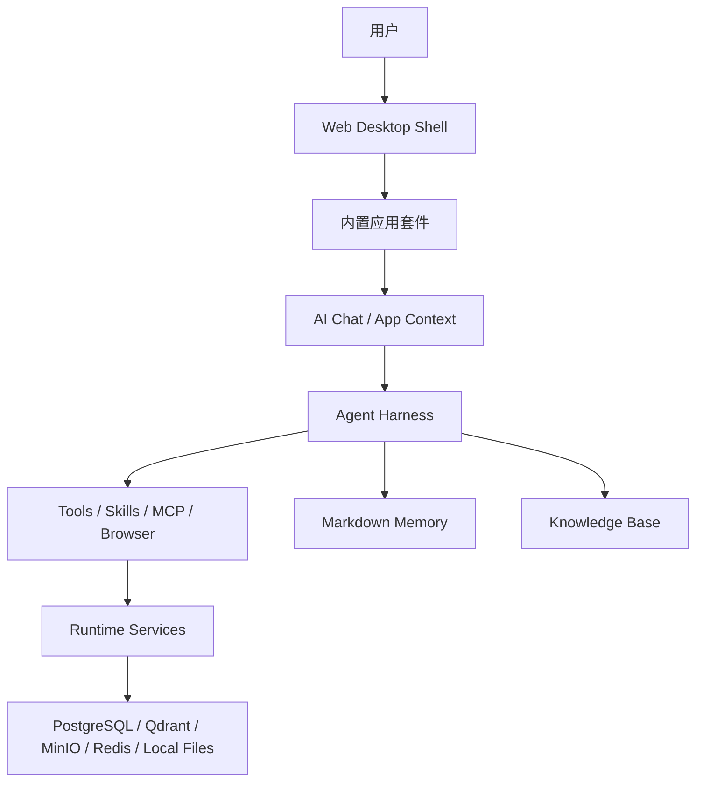

讲者备注：

- 这页只讲总体分层，不展开细节。

### Slide 4. 一次请求如何穿过全栈

核心观点：一次 AI 请求不是直接打模型，而是先构建上下文、召回记忆、构造工具面，再进入 Harness loop。

建议图：

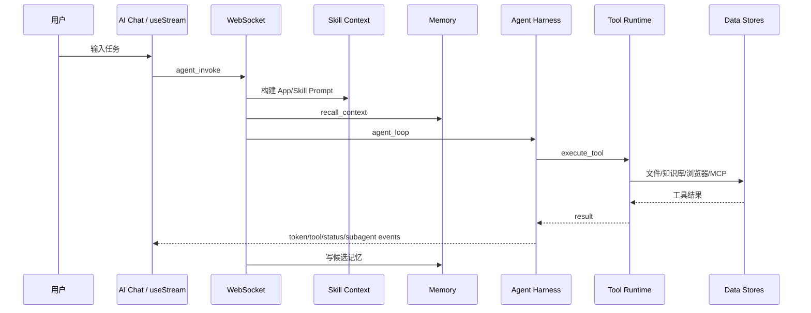

讲者备注：

- 强调：前端看到的工具卡片、状态、子 Agent 输出都来自这条事件流。

### Slide 5. Web Desktop Shell：为什么先做桌面

核心观点：桌面不是 UI 花活，而是为了给 Agent 提供稳定的工作上下文。

页面要点：

- 多应用并存：Chat、Browser、Files、Mail、Docs、Calendar、Whiteboard。
- 每个 App 都可以成为 Agent 的上下文入口。
- Window/App 状态让系统更像 OS，而不是单页面工具。

建议图：

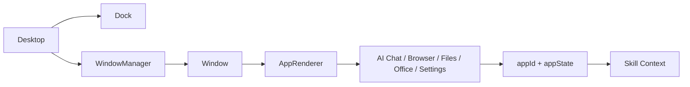

### Slide 6. 前端窗口、AppRenderer 与性能收尾

核心观点：Web Desktop 要能长期运行，必须处理懒加载、主题和窗口虚拟化。

页面要点：

- `AppRenderer.tsx` 用 `next/dynamic` 拆分 App chunk。
- `ThemeProvider.tsx` 通过 `<html data-theme>` 驱动 Light/Dark。
- 自定义强调色写入 CSS 变量。
- 窗口虚拟化：状态敏感 App keep-alive，可重建 App 可降载。
- `useStream.ts` 提供 WebSocket 重连和 heartbeat。

视觉建议：

- 用“性能收尾矩阵”展示：代码分割、主题、虚拟化、WebSocket 稳定性。

### Slide 7. AI Chat 如何驱动 Agent

核心观点：AI Chat 在发送前会把历史消息整理成符合 tool calling 协议的结构。

页面要点：

- 恢复已完成的 `assistant.tool_calls`。
- 追加对应 `tool` result message。
- 跳过 streaming 中的 assistant。
- 跳过子 Agent 内部 tool calls，避免 Lead Agent 误读。
- 发送 `agent_invoke`。

视觉建议：

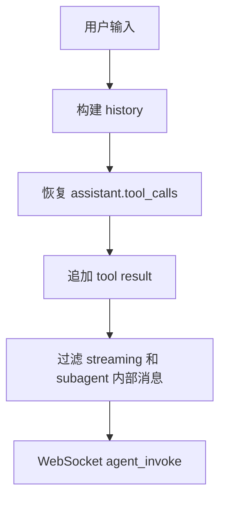

### Slide 8. WebSocket 流式协议

核心观点：系统把 AI 执行过程拆成多个可观察事件。

建议表格：

| 事件 | UI 行为 |
| --- | --- |
| `status` | 展示计划、记忆召回、压缩、校验状态 |
| `token` | 追加回答文本 |
| `reasoning_token` | 展示推理内容 |
| `tool_call` | 新增工具卡片 |
| `tool_result` | 工具卡片完成/失败 |
| `agent_confirm_required` | 弹出确认 |
| `subagent_token` | 展示子 Agent 输出 |
| `subagent_result` | 展示子 Agent 结果 |
| `agent_done` | 收尾保存 |

### Slide 9. Agent Harness 核心循环

核心观点：Harness 是让模型可控执行的核心，不是简单转发 LLM API。

建议图：

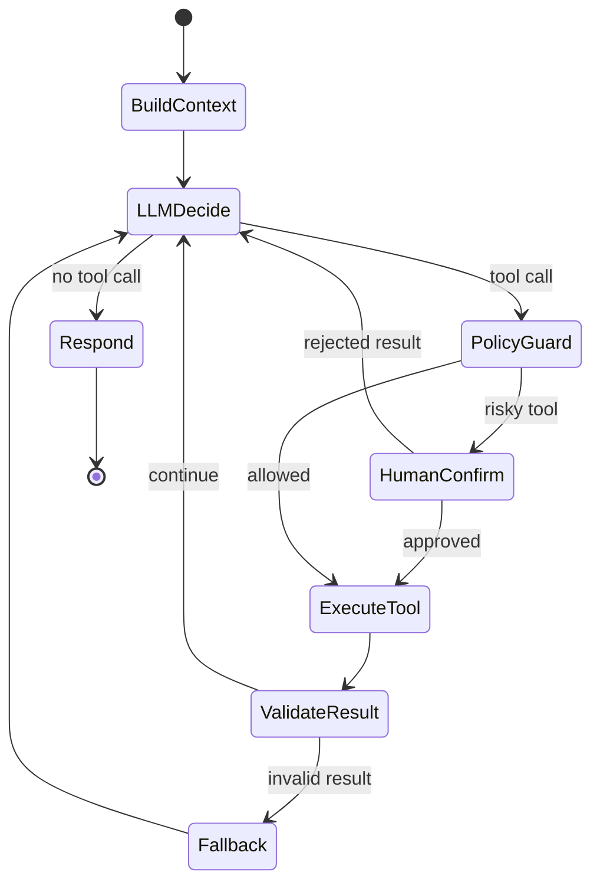

讲者备注：

- 用 Harness Engineering 的四个词串起来：Constrain、Inform、Verify、Correct。

### Slide 10. ToolPolicyGuard 与结果校验

核心观点：不是所有工具调用都应该执行，执行完也不是所有结果都可信。

页面要点：

- 策略拦截：Skill 本地路径不可误传文件工具；文件工具只能访问虚拟路径；calculator 只处理数学表达式。
- 防重复调用：重复搜索/抓取会被软跳过或硬停止。
- 时间归一化：实时查询按当前日期修正过期年份。
- 结果校验：空结果、异常、缺 Key、脚本失败、搜索空结果都会回灌模型走修正路径。

视觉建议：

- 做成“调用前”和“调用后”两道闸门。

### Slide 11. Human-in-the-loop

核心观点：危险或关键操作必须把控制权交还给用户确认。

页面要点：

- 后端发出 `agent_confirm_required`。
- 前端展示确认 UI。
- 用户通过 `POST /api/v1/agents/confirm` 返回 approved/rejected。
- 工具调用暂停在 `asyncio.Future` 上。
- 用户拒绝时，模型收到“用户已拒绝该操作”的工具结果，可继续降级处理。

建议图：

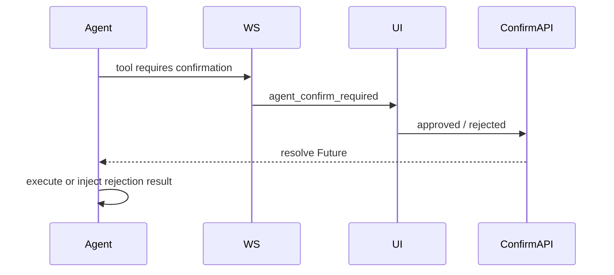

### Slide 12. Handoff Context、StateGraph 与 Checkpoint

核心观点：多 Agent 场景下最怕上下文污染；Handoff 和 Checkpoint 是稳定运行的底座。

页面要点：

- `build_handoff_context()` 清理历史消息。
- 过滤子 Agent 内部 tool calls。
- 保证 `assistant.tool_calls` 和 `tool` message 成对。
- `memory_user_id_for_agent()` 区分 Lead 和非 Lead 记忆归属。
- `AgentGraphRuntime` 记录 `build_context -> route -> llm_decide -> policy_guard -> execute_tool -> delegate -> validate_result -> evaluate -> synthesize -> respond`。
- `AsyncPostgresSaver` 可用则持久化 checkpoint，否则回退 `InMemorySaver`。

视觉建议：

```mermaid
flowchart TB
  history["历史消息"] --> handoff["build_handoff_context"]
  handoff --> clean["合法 Lead Context"]
  clean --> graph["AgentGraphRuntime"]
  graph --> nodes["Harness 节点状态"]
  nodes --> saver{"Checkpoint"}
  saver --> pg["PostgresSaver"]
  saver --> mem["InMemory fallback"]
```

### Slide 13. 工具系统：function schema 到真实副作用

核心观点：模型看到的是 function schema，真实副作用由 Tool Runtime 统一托管。

建议表格：

| 工具来源 | 示例 |
| --- | --- |
| 内置工具 | `calculator`, `fetch_url`, `python_exec` |
| 文件工具 | `list_files`, `read_file`, `write_file` |
| 知识库工具 | `retrieve_knowledge` |
| 浏览器工具 | navigate/click/type/wheel/screenshot/extract |
| User Skill | `skill_{id}`, `load_skill_context` |
| MCP 工具 | stdio 或 streamable-http 暴露的工具 |
| 多 Agent 工具 | `delegate_task` |

讲者备注：

- 强调工具返回统一字符串，是为了让 LLM 能直接消费，也方便前端展示。

### Slide 14. 多 Agent：Lead Agent 与 Sub-Agent

核心观点：多 Agent 不是多个聊天窗口，而是 Lead Agent 把边界清晰的子任务委派给 specialist。

页面要点：

- Lead Agent 保留最终回答权。
- Sub-Agent 作为工具执行，不直接接管用户对话。
- 角色：research、coder、system、writer。
- 并发上限：最多 4 个子任务。
- 子 Agent 独立上下文、独立工具面、禁止递归委派。

建议图：

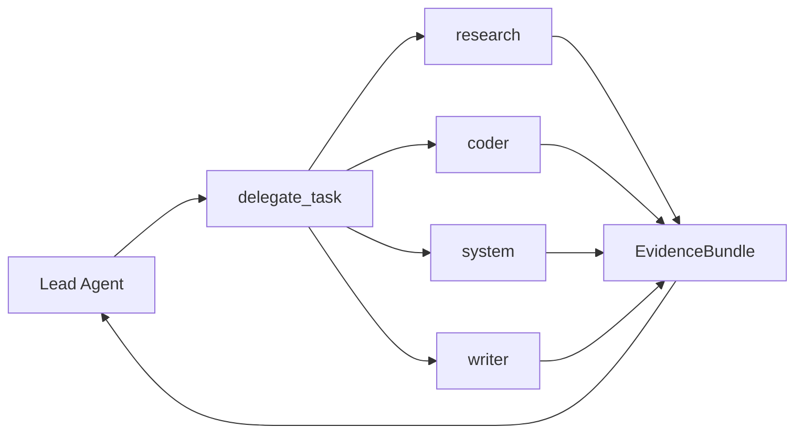

### Slide 15. EvidenceBundle 与多 Agent 指标

核心观点：Lead Agent 不能只读子 Agent 的自然语言 answer，必须消费结构化证据。

页面要点：

- EvidenceBundle 包含：facts、sources、missingFields、capabilitiesUsed、toolEvidence、mergedToolResults。
- 搜索结果会被确定性提升为 `news_item`、`weather_result`、`market_result`、`search_result` 等事实。
- 预算耗尽用 `maxToolCallsReached` / `stopReason` 表示，不混进自然语言。
- 指标：delegationAccuracy、subagentToolSuccessRate、taskCompletionRate。

视觉建议：

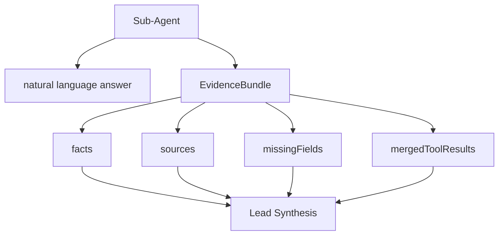

### Slide 16. Memory：Markdown-first 长期记忆

核心观点：Memory 是本地优先的用户长期上下文，不是纯向量库。

页面要点：

- 源文件：`MEMORY.md`。
- 短期候选：`daily/YYYY-MM-DD.md`。
- 整理报告：`DREAMS.md`。
- 整理阶段：Light / REM / Deep。
- Memory Recall 注入 Agent Prompt。

建议图：

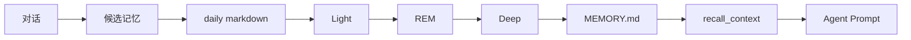

### Slide 17. Knowledge Base：混合检索 RAG

核心观点：Knowledge 是用户上传文档和网页内容的可检索知识库。

页面要点：

- 支持 TXT/MD/PDF、粘贴文本、Browser 页面保存。
- 文档入库：提取文本 -> chunk -> embedding -> Qdrant upsert。
- 元数据和文档状态保存在 PostgreSQL。
- 原始文件可进入 MinIO。
- Agent 通过 `retrieve_knowledge` 使用知识库。

建议图：

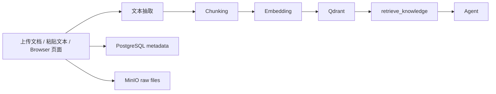

### Slide 18. Browser Runtime：真实浏览器控制

核心观点：AI 和用户操作的是同一个真实 Chromium 实例。

页面要点：

- `infra/browser-runtime/Dockerfile` 构建 Chromium/Xvfb/x11vnc/websockify/noVNC 环境。
- `entrypoint.sh` 启动 Xvfb、x11vnc、websockify、runtime server。
- `server.py` 用 `async_playwright` 控制 headed Chromium。
- Browser App 通过 noVNC iframe 看实时画面。
- API 后端通过 `BrowserSessionManager` 调 runtime REST API。

建议图：

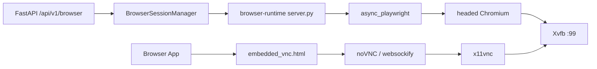

讲者备注：

- 明确：当前不是 iframe 直接打开目标网站，也不是 API 进程直接持有浏览器。

### Slide 19. Browser Persistence：登录态、历史会话、细粒度操作

核心观点：浏览器模块支持持续会话、登录态迁移和复杂页面交互。

页面要点：

- `BrowserSessionRecord`：保存 session 历史、URL、标题、tab 数、action_log、错误。
- `BrowserLoginProfile`：保存某站点过滤后的 storage state。
- Cookie 导入：支持 Cookie 字符串和 JSON。
- Storage state 导入导出。
- 保存页面到知识库：`/sessions/{id}/save-page`。
- 细粒度操作：click-at、mouse-down/move/up、drag、wheel、type-text、screenshot。

视觉建议：

- 用三列卡片：Session History / Login Profile / Precise Control。

### Slide 20. Terminal：终端风格控制台，不是真 shell

核心观点：Terminal 是受控系统 App，而不是把真实 shell 暴露给浏览器。

页面要点：

- 前端状态：命令历史、cwd、输出行、工具日志、AI 模式。
- 内置命令：`pwd`、`ls`、`cd`、`cat`、`mkdir`、`touch`、`rm`、`cp`、`mv`、`write`、`clear`。
- 文件操作走 Files API。
- AI 命令模式走 Agent Harness。
- 默认 `enableMemory=false`，避免终端命令写入长期记忆。
- 真实代码执行使用受控 `python_exec` 工具，而不是任意 shell。

建议图：

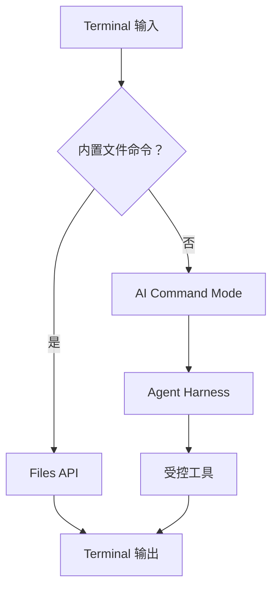

### Slide 21. Office Suite 与文件系统

核心观点：应用套件不是 demo UI，而是围绕本地文件和 AI 能力构建的工作流。

页面要点：

- File Manager：虚拟路径、文件 CRUD、上传下载、预览和打开链路。
- Notes：Markdown 编辑、预览、AI 辅助写作，保存到 `/Notes`。
- Text Editor：普通文本编辑。
- Document Editor：TipTap 富文本，AI 改写/翻译/扩写，DOCX/PDF/Markdown 导出。
- Spreadsheet Editor：Univer Sheets，支持 xlsx/xls/xlsm/ods/csv。
- Calendar：事件 CRUD，AI 日程生成。
- Mail：IMAP/SMTP、同步、草稿、附件、AI 摘要/回复。
- Whiteboard：节点、连线、本地白板文件、AI 生成结构图。

视觉建议：

- 做成 App 网格，每个 App 一句话能力。

### Slide 22. MCP / Skill / Extension Center

核心观点：扩展系统由 App Manifest、SKILL.md 和 MCP Server 三层组成。

建议表格：

| 概念 | 给谁用 | 职责 |
| --- | --- | --- |
| App Manifest | 系统/前端 | 描述 App、权限、工具、MCP transport |
| SKILL.md | Agent | 描述何时使用、如何使用、行为边界 |
| MCP Server | Tool Runtime | 暴露标准化工具 |
| User Skill | 用户扩展 | 脚本型或知识型技能 |

建议图：

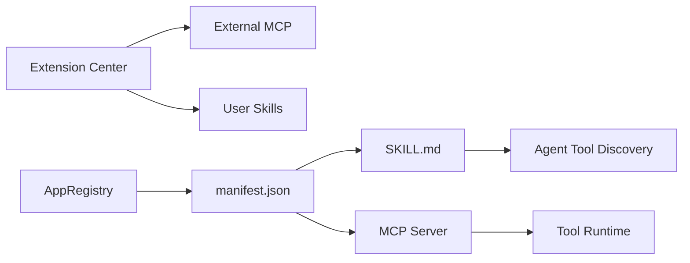

### Slide 23. Settings、Avatar、External Channels

核心观点：Settings 是控制面，Avatar 和外部渠道是系统体验层的延伸。

页面要点：

- Settings：API Keys、Provider、Embedding、Memory、Knowledge、Channels、Extensions、Theme、Avatar、About。
- 配置导入导出：本地优先配置可备份迁移。
- Avatar：Live2D 模型、情绪解析、人格预设、位置大小。
- External Channels：QQ Bot 配置、状态、重启。
- 外部渠道复用 `AgentTurnRunner`，共享模型、记忆、Skill、工具策略。

边界提醒：

- SOUL.md 是早期架构设计/未来方向，不要讲成完整已落地模块。

### Slide 24. 数据所有权与存储矩阵

核心观点：项目强调 local-first 和用户拥有自己的 Key 与数据。

建议表格：

| 数据 | 位置 |
| --- | --- |
| Provider/API Key | 前端 localStorage / 配置导出 |
| Desktop/Settings | PostgreSQL + 前端 store |
| Conversation/Message | PostgreSQL |
| Markdown Memory | `AI_NATIVE_OS_HOME/memory` |
| MCP/Skills 配置 | `AI_NATIVE_OS_HOME` |
| Knowledge metadata | PostgreSQL |
| Knowledge vector | Qdrant |
| Knowledge raw files | MinIO |
| Browser sessions/profiles | PostgreSQL + browser-runtime storage state |
| User files | 宿主文件系统映射 |

视觉建议：

- 中心写“User Owns Keys & Data”，周围环绕数据存储。

### Slide 25. 部署与运行时服务

核心观点：项目是 monorepo，但运行时由多个服务协同。

页面要点：

- Web：Next.js。
- API：FastAPI。
- Browser Runtime：Chromium + Xvfb + noVNC + Playwright runtime。
- PostgreSQL：主业务数据和 checkpoint。
- Redis：运行时辅助。
- MinIO：对象存储。
- Qdrant：向量检索。

建议图：

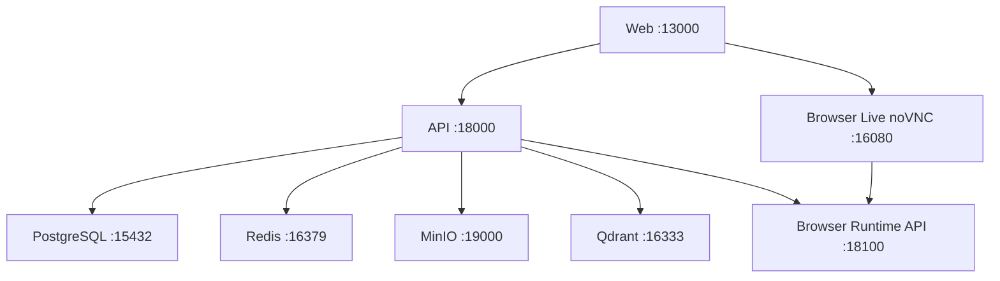

### Slide 26. 可观测性、Trace 与 Eval

核心观点：Agent 的执行过程既给用户看，也给研发分析。

页面要点：

- 前端可见：status、tool_call、tool_result、workflow_plan、subagent_token、subagent_result、usage_estimate。
- 后端可见：Tool policy events、Tool validation events、Browser action_log、MCP health、Knowledge job status。
- Trace：Phoenix / LangSmith。
- Traffic Metrics：`/api/v1/agents/metrics/traffic`。
- Eval：Harness eval、多 Agent eval、memory eval。

建议图：

```mermaid
flowchart TB
  turn["Agent Turn"] --> stream["Streaming Events"]
  turn --> graph["Checkpoint Nodes"]
  turn --> traffic["AgentTrafficRecord"]
  turn --> trace["Phoenix / LangSmith"]
  stream --> ui["用户时间线"]
  graph --> diagnose["节点诊断"]
  traffic --> metrics["routeAccuracy / delegatedRequests / completion"]
  trace --> analysis["调用链分析"]
```

### Slide 27. 一条复杂任务的完整 Demo

建议任务：

> 帮我打开浏览器搜索某个技术主题，把网页保存到知识库，再结合我的记忆总结成一份笔记。

建议流程图：

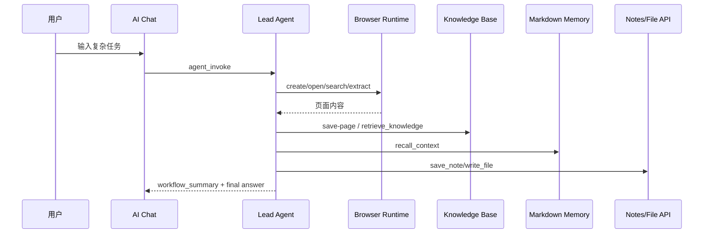

讲者备注：

- 用这页把前面所有模块串起来：Browser、Knowledge、Memory、Files、Harness、工具卡片、状态事件。

### Slide 28. 架构取舍与总结

核心观点：项目的关键不是堆功能，而是用 Harness 把模型、工具、上下文和运行时组织成可控系统。

建议列出五个取舍：

1. App-first，而不是 Chat-first。
2. Markdown Memory，而不是纯向量库 Memory。
3. Browser Runtime 独立进程，而不是前端 iframe 或 API 内嵌浏览器。
4. Harness 约束模型，而不是相信模型自己永远会正确使用工具。
5. MCP/Skill 双扩展，而不是把所有能力写死在后端。

结尾句：

> AI Native OS 的价值不是让模型说得更多，而是让模型在系统里更可靠地行动。

## 5. 必须出现的图

生成 PPT 时至少包含以下 8 张图：

1. 顶层架构图：Web Desktop、API、Harness、Memory、Knowledge、Browser Runtime、Runtime Services。
2. 一次请求时序图：AI Chat -> WebSocket -> Skill Context -> Memory -> Harness -> Tool Runtime。
3. Web Desktop 组件图：Desktop、WindowManager、AppRenderer、Stores。
4. Agent Loop 状态机：LLM decide、policy guard、execute tool、validate、fallback、respond。
5. Handoff/Checkpoint 图：history cleanup、active_agent、Graph nodes、PostgresSaver。
6. 多 Agent 图：Lead -> delegate_task -> specialist -> EvidenceBundle。
7. Browser Runtime 图：Browser App/noVNC/API/runtime/Playwright/Chromium/Xvfb。
8. Memory + Knowledge 对比图：Memory 走 Markdown recall，Knowledge 走 chunk/embedding/retrieve。

## 6. 重点代码清单

PPT 中可以在“现场打开代码”或“关键代码”页展示这些路径：

| 模块 | 代码 |
| --- | --- |
| Web Desktop | `apps/web/src/components/desktop/Desktop.tsx` |
| Window Manager | `apps/web/src/components/desktop/WindowManager.tsx` |
| App 懒加载 | `apps/web/src/apps/AppRenderer.tsx` |
| AI Chat | `apps/web/src/apps/ai-chat/AiChat.tsx` |
| WebSocket Hook | `apps/web/src/hooks/useStream.ts` |
| WebSocket 后端 | `apps/api/app/api/websocket.py` |
| Agent 主循环 | `apps/api/app/core/llm_provider.py` |
| Harness 策略 | `apps/api/app/core/agent_harness.py` |
| Handoff | `apps/api/app/core/agent_handoff.py` |
| Graph Checkpoint | `apps/api/app/core/agent_graph.py` |
| 多 Agent | `apps/api/app/core/subagent.py` |
| EvidenceBundle | `apps/api/app/core/evidence_bundle.py` |
| 工具系统 | `apps/api/app/core/tools.py` |
| Skill Context | `apps/api/app/core/skill_context.py` |
| Memory | `apps/api/app/core/markdown_memory.py` |
| Knowledge | `apps/api/app/core/knowledge.py` |
| Browser App | `apps/web/src/apps/browser/Browser.tsx` |
| Browser API | `apps/api/app/api/v1/browser.py` |
| Browser Client | `apps/api/app/core/browser_session.py` |
| Browser Persistence | `apps/api/app/core/browser_persistence.py` |
| Browser Runtime | `infra/browser-runtime/server.py` |
| Browser Entrypoint | `infra/browser-runtime/entrypoint.sh` |
| Terminal | `apps/web/src/apps/terminal/Terminal.tsx` |
| Settings | `apps/web/src/apps/settings` |
| Channel Runtime | `apps/api/app/core/channel_runtime.py` |
| Avatar Store | `apps/web/src/stores/avatarStore.ts` |

## 7. 生成 AI 的最终提示词

可把下面这段作为 PPT 生成 AI 的正式指令：

```text
请根据本文生成一份面向研发团队的中文技术分享 PPT。

要求：
1. 主题是 AI Native OS 的项目架构和实现原理，不是产品宣传。
2. 默认生成 28 页 16:9 横屏 PPT。
3. 风格为技术杂志风 / 工程架构风，使用深靛蓝、冷白、浅灰和少量高亮色。
4. 每页只表达一个核心观点，配合架构图、流程图、矩阵表或代码路径。
5. 必须覆盖：Web Desktop、AI Chat/WebSocket、Agent Harness、ToolPolicyGuard、HITL、Conversation Handoff、StateGraph/Checkpoint、多 Agent、EvidenceBundle、Memory、Knowledge Base、Browser Runtime、Browser Persistence、Terminal、Office Suite、MCP/Skill、Settings/Avatar/Channels、数据所有权、部署、可观测性和复杂任务 Demo。
6. 必须明确边界：Terminal 不是真 shell；Browser 不是 iframe；当前 API 后端通过 HTTP 调 browser-runtime，不直接持有浏览器；SOUL.md 不作为当前完整落地模块讲。
7. 图要比文字重要。每个大模块至少给一张结构图或流程图。
8. 输出需要包含每页标题、正文要点、视觉设计建议和讲者备注。
```

## 8. 可压缩版本

如果只能做 18-20 页，请按以下优先级压缩：

1. 保留：定位、顶层架构、请求链路、Desktop、AI Chat/WebSocket、Harness、Handoff/Checkpoint、多 Agent、Memory、Knowledge、Browser Runtime、Browser Persistence、Terminal、MCP/Skill、数据/部署、观测/Eval、Demo、总结。
2. 合并：Office Suite + 文件系统；Settings + Avatar + Channels；ToolPolicyGuard + HITL。
3. 删除：Monorepo 细节、API 路由总览、过细的 App 功能枚举。

## 9. 讲述节奏建议

30 分钟版本：

| 时间 | 内容 |
| --- | --- |
| 0-3 分钟 | 项目定位：不是 Chatbot，而是 AI Native OS。 |
| 3-7 分钟 | Web Desktop 和 App 工作台。 |
| 7-13 分钟 | AI Chat、WebSocket、Agent Harness、HITL。 |
| 13-18 分钟 | Handoff、Checkpoint、多 Agent、EvidenceBundle。 |
| 18-23 分钟 | Memory、Knowledge、Browser Runtime。 |
| 23-26 分钟 | Terminal、Office、MCP/Skill、Settings/Channels。 |
| 26-29 分钟 | 数据所有权、部署、可观测性。 |
| 29-30 分钟 | 复杂任务 Demo 和总结。 |

45 分钟版本：

- 在 Browser Runtime、Memory/Knowledge、多 Agent 和可观测性部分各增加 3-4 分钟细讲代码。
- 现场可以打开 `Browser.tsx`、`server.py`、`llm_provider.py`、`agent_graph.py`、`markdown_memory.py` 做代码 walkthrough。

