# AI Native OS 项目功能与架构全景

> 面向团队技术分享的详细梳理。本文基于仓库中的设计文档、阶段进展文档、部署文档以及前后端代码整理，适合作为分享讲稿、架构评审材料或后续拆成 PPT 的底稿。

生成日期：2026-06-22

## 1. 项目定位

AI Native OS 是一个运行在浏览器中的“AI 原生操作系统”原型。它把传统桌面系统的窗口、Dock、文件管理、设置中心、办公应用和浏览器体验，与一个可流式交互、可调用工具、可接入 MCP、可委派多 Agent、具备长期记忆和知识库能力的 Agent Harness 组合在一起。

从产品视角看，它不是单个聊天框，而是一个以 App 为第一入口的个人 AI 工作台：

- 用户通过桌面、窗口、应用、文件和浏览器完成日常工作。
- AI 不是孤立的聊天助手，而是可以感知当前 App、当前文件、当前网页、当前技能上下文的系统级协作者。
- 用户自己的 API Key、Embedding 配置、MCP 服务、技能目录、记忆和文件都尽量保持本地优先和可迁移。
- 后端把模型调用、工具执行、权限确认、结果校验、记忆召回、知识检索、浏览器自动化、多 Agent 委派统一收束在一个 Agent Harness 中。

一句话总结：

> AI Native OS = Web Desktop Shell + App Framework + Agent Harness + Local-first Memory/Knowledge + MCP/Skill Extension Runtime + Office/Browser Productivity Suite。

## 2. 证据来源

本文主要参考以下仓库资料和代码：

- `PROGRESS.md`：六个阶段的功能完成记录。
- `ARCHITECTURE.md`：产品理念、分层架构和 Agent Harness 设计。
- `DEPLOYMENT_MODES.md`：本地开发、Docker Compose、环境变量和运行时说明。
- `SKILL_ARCHITECTURE.md`：App Manifest 与 `SKILL.md` 的分层设计。
- `docs/superpowers/specs/2026-04-28-markdown-memory-design.md`：Markdown Memory 的设计说明。
- `apps/api/app/main.py`：FastAPI 入口和路由装配。
- `apps/api/app/core/*`：Agent、工具、文件、记忆、知识库、MCP、浏览器、应用注册中心等后端核心实现。
- `apps/api/app/api/*`：REST 与 WebSocket API。
- `apps/web/src/*`：Next.js 前端桌面、应用、状态管理、WebSocket 流式交互和设置中心。
- `apps/api/apps_registry/*`：后端内置 App Manifest 与 Skill 文档。
- `docker/docker-compose.yml`：完整运行依赖和端口映射。

## 3. 功能总览

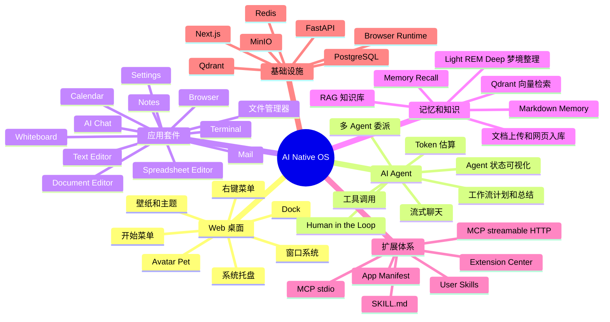

### 3.1 已实现的核心能力

| 模块 | 主要能力 | 关键代码位置 |
| --- | --- | --- |
| Web 桌面 Shell | 桌面图标、窗口管理、Dock、开始菜单、系统托盘、右键菜单、窗口吸附、最小化、最大化、主题和壁纸 | `apps/web/src/components/desktop`, `apps/web/src/stores/windowStore.ts`, `apps/web/src/stores/desktopStore.ts` |
| AI Chat | 流式聊天、模型选择、会话管理、工具调用可视化、推理内容展示、记忆召回、知识来源、确认弹窗、多 Agent 事件 | `apps/web/src/apps/ai-chat`, `apps/web/src/hooks/useStream.ts`, `apps/api/app/api/websocket.py` |
| Agent Harness | LiteLLM 统一模型调用、工具循环、策略防护、工具结果校验、Fallback、上下文压缩、工作流状态、LangGraph 检查点、多 Agent 委派 | `apps/api/app/core/llm_provider.py`, `apps/api/app/core/agent_graph.py`, `apps/api/app/core/agent_runner.py` |
| Memory | Markdown 长期记忆、daily 候选记忆、Light/REM/Deep 整理、回忆注入、候选回填、评估接口 | `apps/api/app/core/markdown_memory.py`, `apps/api/app/core/memory_consolidation.py`, `apps/api/app/api/memory.py` |
| Knowledge Base | 文档上传、文本抽取、Chunk、Embedding、Qdrant 混合检索、知识工具 `retrieve_knowledge`、浏览器网页入库 | `apps/api/app/core/knowledge.py`, `apps/api/app/api/knowledge.py` |
| 文件系统 | Windows 盘符映射、虚拟目录、上传下载、文本读写、移动复制重命名删除、树形列表、特殊目录 Notes/Documents/Whiteboards | `apps/api/app/core/file_manager.py`, `apps/api/app/api/files.py` |
| App Framework | 前端内置应用注册、后端 App Manifest、App Skill 注入、应用生命周期、工具暴露、外部 MCP 应用安装 | `apps/web/src/lib/app-registry.ts`, `apps/api/app/core/app_registry.py`, `apps/api/apps_registry` |
| MCP Manager | builtin、stdio、streamable-http/remote-http MCP 服务生命周期、工具发现、工具调用、健康检查 | `apps/api/app/core/mcp_manager.py` |
| Skills | 用户技能扫描、`SKILL.md`/`workflow.md` 解析、脚本技能执行、知识技能上下文加载、Skill API Key 注入 | `apps/api/app/core/app_registry.py`, `apps/api/app/core/tools.py`, `apps/web/src/apps/settings/components/SkillManager.tsx` |
| Browser | 真实浏览器 Session、标签页、导航、截图、文本抽取、点击输入滚动、Cookie/Profile、人工接管、AI 浏览器步骤执行 | `apps/api/app/core/browser_session.py`, `apps/api/app/api/browser.py`, `infra/browser-runtime`, `apps/web/src/apps/browser` |
| Office Suite | Notes、Text Editor、Document Editor、Spreadsheet Editor、Calendar、Mail、Whiteboard | `apps/web/src/apps/*`, `apps/api/app/api/calendar.py`, `apps/api/app/api/mail.py`, `apps/api/app/api/office.py` |
| Settings | API Key、模型列表、Embedding、记忆、知识库、渠道、扩展中心、主题、Avatar、导入导出本地配置 | `apps/web/src/apps/settings` |
| External Channels | QQ Bot 配置、运行时、消息存储、外部渠道复用 AgentTurnRunner | `apps/api/app/api/channels.py`, `apps/api/app/core/channel_runtime.py`, `apps/api/app/channels/qqbotpy_adapter.py` |

## 4. 顶层架构

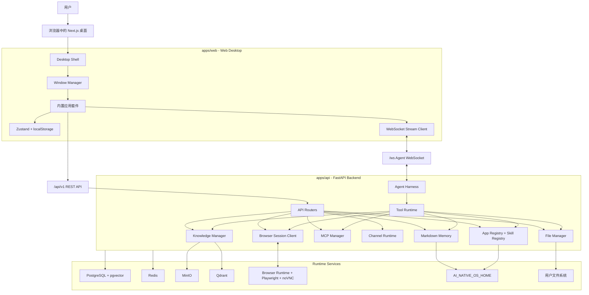

### 4.1 分层说明

| 层级 | 职责 |
| --- | --- |
| 交互层 | 浏览器中渲染一个桌面 OS，用户通过窗口、应用、文件和浏览器进行操作。 |
| 应用层 | AI Chat、文件管理器、浏览器、办公应用、设置中心等具体工作流。 |
| 状态层 | 前端 Zustand 维护窗口状态、桌面偏好、API Key、模型配置、Avatar 等本地状态。 |
| API 层 | FastAPI 暴露 REST 和 WebSocket，负责会话、文件、记忆、知识、MCP、浏览器、邮件、日历等接口。 |
| Agent Harness 层 | 统一处理模型调用、工具计划、权限确认、工具执行、结果校验、多 Agent 委派和流式事件。 |
| 工具和扩展层 | 内置工具、App 工具、浏览器工具、知识检索工具、用户 Skill 工具、外部 MCP 工具。 |
| 数据和运行时层 | PostgreSQL、Redis、MinIO、Qdrant、Browser Runtime、本地 Memory/Skill/MCP 配置和用户文件。 |

## 5. Monorepo 结构

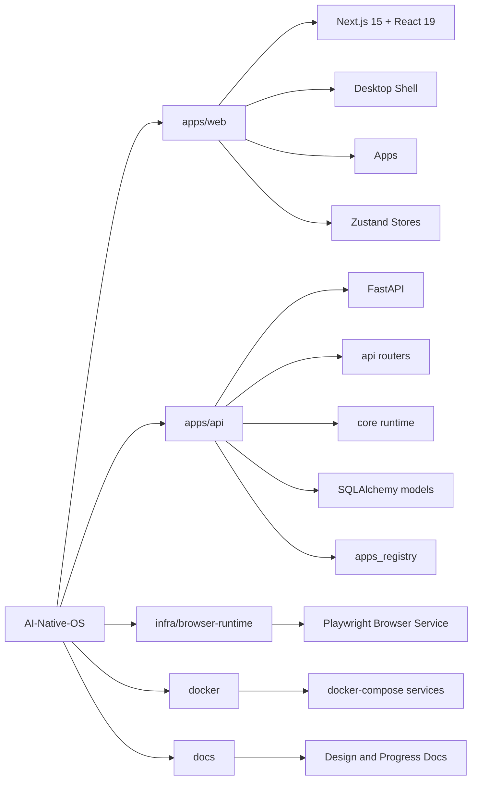

### 5.1 主要包和技术选型

| 位置 | 技术 |
| --- | --- |
| 根目录 | pnpm workspace + Turborepo |
| `apps/web` | Next.js 15、React 19、Tailwind CSS v4、Zustand、react-rnd、lucide-react、TipTap、Univer、SheetJS、Pixi/Live2D、Vitest |
| `apps/api` | FastAPI、SQLAlchemy async、Alembic、LiteLLM、LangGraph、Redis、MinIO、Qdrant、RestrictedPython、mem0ai 兼容依赖、python-docx、QQ botpy |
| `infra/browser-runtime` | 浏览器自动化运行时，给后端 Browser API 提供真实浏览器 Session 能力 |
| `docker` | Web、API、browser-runtime、PostgreSQL、Redis、MinIO、Qdrant 一键编排 |

## 6. 前端桌面与应用框架

### 6.1 Web 桌面 Shell

前端入口是一个浏览器中的桌面环境。`Desktop.tsx` 负责加载应用注册表、初始化内存/知识库、渲染壁纸、图标、Dock、窗口、右键菜单、系统托盘和 Avatar。

核心能力：

- 桌面图标：显示已注册内置应用，支持双击打开。
- Window Manager：统一管理窗口创建、聚焦、关闭、最小化、最大化、吸附和 z-index。
- Dock：常驻快捷入口；当存在最大化窗口时隐藏，避免干扰应用内容。
- Start Menu：应用启动入口。
- Context Menu：桌面右键菜单。
- System Tray：系统状态区域。
- Theme/Wallpaper：通过 `desktopStore` 持久化到 localStorage。
- Avatar Pet：桌面浮动 Live2D 伙伴，可打开对话。

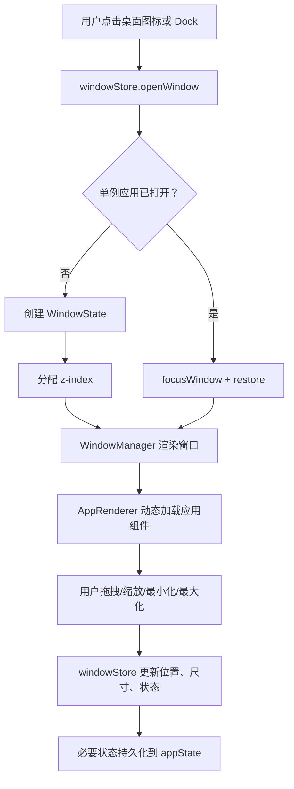

### 6.2 前端应用注册

前端的 `BUILTIN_APPS` 定义了主要可见 App：

| App | 说明 | 前端组件 |
| --- | --- | --- |
| AI Chat | 系统级 AI 助手，支持模型选择、记忆、工具调用、多 Agent、知识来源 | `apps/ai-chat` |
| File Manager | 浏览、上传、下载、预览、移动、复制、删除文件 | `apps/file-manager` |
| Settings | API Key、Embedding、Memory、Knowledge、Extensions、Avatar、渠道等配置 | `apps/settings` |
| Terminal | 类终端 UI，支持文件命令和 AI 命令模式 | `apps/terminal` |
| Browser | 真实浏览器 Session、AI 浏览器自动化、网页入库、登录 Profile | `apps/browser` |
| Notes | Markdown 笔记，保存到 `/Notes` | `apps/notes` |
| Document Editor | TipTap 富文本编辑、AI 改写、导出 Markdown/PDF/DOCX | `apps/document-editor` |
| Calendar | 日历事件 CRUD、月/周/日视图、AI 日程生成 | `apps/calendar` |
| Mail | IMAP/SMTP 账户、同步、收发、草稿、附件、AI 摘要和回复 | `apps/mail` |
| Whiteboard | 白板节点和连线、AI 生成结构图、保存到 `/Whiteboards` | `apps/whiteboard` |

另外，`AppRenderer` 还支持：

- `text-editor`：文本文件编辑器。
- `spreadsheet-viewer`：基于 Univer 和 SheetJS 的表格编辑器。

这些应用通常由文件管理器根据文件类型打开。

### 6.3 前端状态管理

| Store | 职责 |
| --- | --- |
| `windowStore` | 窗口生命周期、位置、尺寸、焦点、吸附、最大化、最小化、应用内部状态。 |
| `desktopStore` | 桌面主题、壁纸、应用注册、Dock/桌面应用状态。 |
| `settingsStore` | LLM Provider、API Key、Base URL、启用模型、默认模型、Embedding 配置、语言、工具 Key。 |
| `avatarStore` | Avatar 可见性、位置、尺寸、模型来源、Live2D 模型、情绪、人格预设。 |

需要注意的是，API Key、模型配置和 Embedding 配置主要保存在浏览器 localStorage 中，后端请求时由前端带到 API。

## 7. AI Chat 与 WebSocket 流式协议

AI Chat 通过 WebSocket `/ws` 与后端交互。前端 `useStream.ts` 维护单例 WebSocket、心跳、自动重连和事件分发。后端 `websocket.py` 处理 `agent_invoke` 请求，构建上下文并进入 Agent Loop。

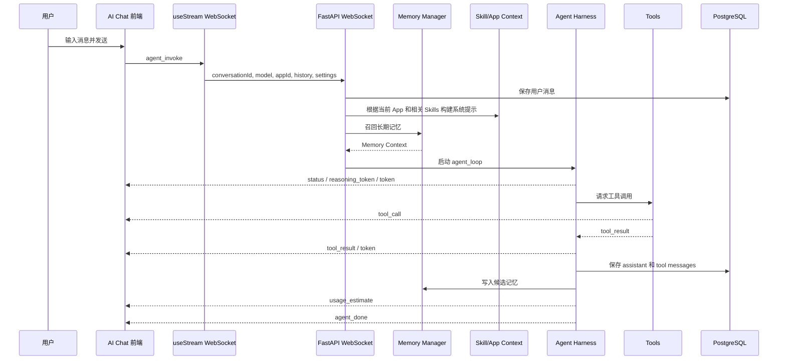

### 7.1 WebSocket 事件类型

| 事件 | 说明 |
| --- | --- |
| `status` | Agent 阶段状态，例如召回记忆、构建上下文、执行工具、生成总结。 |
| `token` | 模型输出的可见文本 token。 |
| `reasoning_token` | 模型推理内容，前端可以折叠展示。 |
| `tool_call` | 工具调用开始，包含工具名和参数。 |
| `tool_result` | 工具调用结果。 |
| `agent_confirm_required` | 高风险工具执行前的人工确认请求。 |
| `subagent_token` | 子 Agent 的流式输出。 |
| `subagent_result` | 子 Agent 完成后的结构化结果。 |
| `agent_done` | 本轮完成。 |
| `agent_error` | 本轮失败。 |

### 7.2 AI Chat 前端体验

AI Chat 不只是简单展示文本，还会渲染：

- 会话列表和历史消息。
- 模型选择器和 Provider 配置。
- 工具调用卡片。
- 知识库来源。
- 记忆召回状态。
- 推理内容。
- 工作流计划和工作流总结。
- 多 Agent 子任务时间线。
- 人工确认弹窗。
- Token 使用量估算。

## 8. Agent Harness

后端的 Agent Harness 是项目最核心的能力之一。它把“模型输出工具调用”变成一个可控、可观测、可恢复的执行循环。

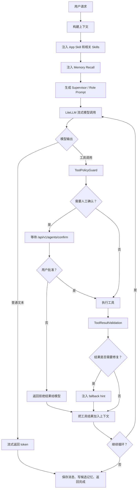

### 8.1 模型调用层

`llm_provider.py` 通过 LiteLLM 适配多种 Provider：

- OpenAI
- Anthropic
- Google
- DeepSeek
- Qwen
- Zhipu
- Moonshot/Kimi
- Doubao
- OpenAI-compatible 自定义 Provider

前端 Provider 配置包括：

- API Key
- Base URL
- 启用模型列表
- 自定义模型
- 兼容类型
- 默认模型
- Avatar 模型

后端会根据 Provider 和模型名构造 LiteLLM 使用的模型标识，并统一处理流式输出、推理内容、工具调用和错误。

### 8.2 工具运行时

工具来源分为六类：

| 工具来源 | 代表工具 |
| --- | --- |
| 内置工具 | `calculator`, `fetch_url`, `python_exec` |
| 文件工具 | `list_files`, `read_file`, `write_file` |
| 笔记工具 | `list_notes`, `save_note` |
| 记忆工具 | `memory_search`, `memory_get` |
| 知识库工具 | `retrieve_knowledge` |
| 浏览器工具 | 导航、点击、输入、截图、抽取页面文本等 |
| 外部 MCP 工具 | stdio 或 streamable-http 服务暴露的工具 |
| 用户 Skill 工具 | `skill_{id}` 脚本技能、`load_skill_context` 知识技能 |
| 多 Agent 工具 | `delegate_task` |

工具选择会考虑：

- 当前入口 App。
- Agent 模式：单 Agent 或多 Agent。
- 当前角色：research、coder、system、writer。
- 外部 MCP 服务是否启用。
- 用户 Skill 是否启用。
- 知识库是否已初始化。
- Browser App 是否为当前入口。

### 8.3 Human in the Loop

部分工具执行前需要人工确认。后端通过 WebSocket 发出 `agent_confirm_required`，前端弹出确认界面，然后调用：

```text
POST /api/v1/agents/confirm?request_id=...&approved=true|false
```

后端等待确认结果，默认超时时间约 120 秒。这个机制适合文件写入、外部调用、浏览器操作等需要用户明确授权的动作。

### 8.4 多 Agent 委派

多 Agent 能力通过 `delegate_task` 工具暴露。顶层 Agent 可以把独立子任务委派给不同角色的子 Agent，并并行执行。

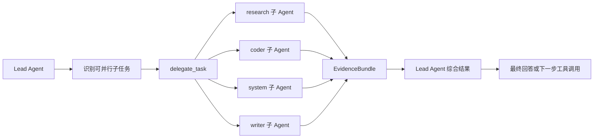

角色能力大致如下：

| 角色 | 适合任务 |
| --- | --- |
| `research` | 信息收集、网页检索、知识库查询、资料归纳。 |
| `coder` | 代码阅读、修改方案、实现细节分析。 |
| `system` | 文件系统、配置、环境、运行时排查。 |
| `writer` | 文档、总结、表达优化、结构化输出。 |

项目中限制并行子任务最大数量为 4，并通过角色工具白名单、事件流和 EvidenceBundle 让多 Agent 过程更可控。

### 8.5 Agent 可观测性

Agent Harness 会向前端暴露：

- 工具调用和结果。
- 策略防护状态。
- 结果校验状态。
- 工作流计划。
- 工作流总结。
- 子 Agent token 和结果。
- Token 估算。
- 交通/调用指标。
- 可选 Phoenix / LangSmith trace 配置。

这使得用户看到的不只是答案，而是答案背后的执行过程。

### 8.6 Conversation Handoff、StateGraph 与 Checkpoint

当前实现已经不只是“普通 ReAct 循环”。Agent Harness 外围还有三层工程化能力：

| 能力 | 关键代码 | 作用 |
| --- | --- | --- |
| Handoff Context | `apps/api/app/core/agent_handoff.py` | 清理历史消息，保证当前 `active_agent` 只看到属于自己的上下文。 |
| LangGraph Runtime | `apps/api/app/core/agent_graph.py` | 把 Harness 节点状态写入图运行时，形成可 checkpoint 的执行轨迹。 |
| Persistent Checkpoint | `init_checkpointer()` | 优先使用 `AsyncPostgresSaver`，不可用时回退到 `InMemorySaver`。 |

Handoff 的核心不是让 Specialist 接管所有对话，而是解决多 Agent 场景下的上下文污染问题：

- `normalize_active_agent()` 把空值、`main`、`supervisor` 等归一为 `lead`。
- `memory_user_id_for_agent()` 为非 Lead Agent 生成 `user::agent:{name}` 形式的记忆归属。
- `build_handoff_context()` 会过滤子 Agent 内部工具消息，保留合法配对的 `assistant.tool_calls` 和 `tool` result。
- 对 OpenAI-compatible provider 来说，工具调用和工具结果必须成对出现，否则下一轮模型调用会报错或产生错误上下文。

```mermaid
flowchart TB
  history["前端历史消息"] --> handoff["build_handoff_context"]
  handoff --> active["active_agent 归一化"]
  active --> filter["过滤过期/跨 Agent tool messages"]
  filter --> paired["保留成对 tool_calls/tool result"]
  paired --> lead["Lead Agent 上下文"]
  paired --> memory_owner["记忆 owner: default 或 default::agent:name"]

  lead --> graph["AgentGraphRuntime.status"]
  graph --> nodes["build_context -> route -> llm_decide -> policy_guard -> execute_tool -> delegate -> validate_result -> evaluate -> synthesize -> respond"]
  nodes --> saver{"PostgresSaver 可用？"}
  saver -- 是 --> pg["PostgreSQL checkpoint"]
  saver -- 否 --> mem["InMemorySaver"]
```

这部分能力对分享很重要：它解释了为什么项目能做多 Agent，又不会让并行子任务的工具消息污染主对话。

## 9. Memory：Markdown 长期记忆系统

项目的记忆系统已经从“纯数据库记忆”演进为 Markdown-first 的本地优先架构。

### 9.1 存储布局

默认根目录由 `AI_NATIVE_OS_HOME` 决定；未设置时使用用户目录下的 `.ai-web-os`。

典型结构：

```text
~/.ai-web-os/
  memory/
    MEMORY.md
    DREAMS.md
    daily/
      2026-06-22.md
    .dreams/
      state.json
      short-term.json
      phase-signals.json
      backups/
      migrations/
      locks/
```

| 文件 | 作用 |
| --- | --- |
| `MEMORY.md` | 长期记忆的源文件。 |
| `daily/YYYY-MM-DD.md` | 每日候选记忆和短期记录。 |
| `DREAMS.md` | 记忆整理报告。 |
| `.dreams/*` | 整理状态、短期缓存、阶段信号、备份、迁移和锁文件。 |

### 9.2 记忆生命周期

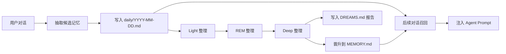

### 9.3 记忆相关 API

| API | 说明 |
| --- | --- |
| `POST /api/v1/memory/init` | 初始化 Memory Manager，传入 LLM 和 Embedding 配置。 |
| `GET /api/v1/memory/status` | 获取记忆系统状态。 |
| `GET /api/v1/memory` | 列出长期记忆。 |
| `GET /api/v1/memory/search` | 搜索记忆。 |
| `GET /api/v1/memory/candidates` | 查看候选记忆。 |
| `POST /api/v1/memory/consolidate` | 手动整理候选记忆。 |
| `POST /api/v1/memory/dreaming/sweep` | 运行 Light/REM/Deep 整理。 |
| `GET/PUT /api/v1/memory/files/{kind}` | 读取或写入 Memory Markdown 文件。 |
| `POST /api/v1/memory/backfill/stage` | 从历史会话回填候选记忆。 |
| `POST /api/v1/memory/backfill/rollback` | 回滚回填。 |
| `POST /api/v1/memory/eval` | 记忆评估。 |

### 9.4 召回注入

当 AI Chat 启用 Memory：

1. 后端根据用户消息和用户 ID 召回相关记忆。
2. 把最近 daily notes 和长期记忆组合成 Memory Context。
3. 将 Memory Context 注入系统提示。
4. 前端收到 `status: recalled` 一类的状态提示。
5. 本轮完成后，后端异步抽取候选记忆写入 daily 文件。

## 10. Knowledge Base：RAG 知识库

Knowledge Base 面向文档和网页内容，而 Memory 面向用户偏好、长期事实和交互历史。两者都可以进入 Agent 上下文，但职责不同。

### 10.1 知识库流水线

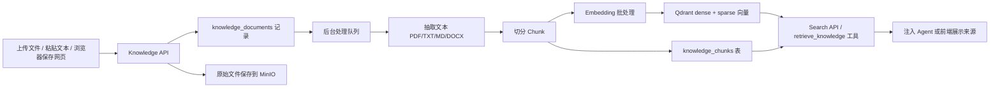

### 10.2 检索设计

`KnowledgeManager` 使用 Qdrant 集合存储：

- dense vector：Embedding 模型生成的语义向量。
- sparse vector：基于 token 的稀疏向量。
- RRF fusion：融合 dense 和 sparse 的检索结果。

文档处理特性：

- 支持 `PDF`、`TXT`、`MD`、`DOCX`。
- Chunk 大小约 500，overlap 约 100。
- 上传原文可进入 MinIO。
- 文档和 Chunk 元数据进入 PostgreSQL。
- 支持后台恢复未完成文档处理。
- Embedding 支持 OpenAI-compatible `/embeddings` 或 LiteLLM embedding。

### 10.3 知识库入口

| 入口 | 能力 |
| --- | --- |
| Settings -> Knowledge | 初始化、上传文档、粘贴文本、搜索、删除文档、查看状态。 |
| Browser | 抽取当前网页并保存到 Knowledge Base。 |
| AI Chat | 通过 `retrieve_knowledge` 工具检索，前端展示来源。 |

## 11. 文件系统与本地文档

后端 `file_manager.py` 把真实文件系统包装成统一 API。

### 11.1 Windows 路径模型

在 Windows 上：

- 虚拟根 `/` 表示“此电脑”。
- `/C/foo/bar.txt` 映射到 `C:\foo\bar.txt`。
- `/D/...` 映射到 D 盘。
- 特殊根目录：
  - `/Notes` -> `~/Documents/AI Web OS/Notes`
  - `/Documents` -> `~/Documents/AI Web OS/Documents`
  - `/Whiteboards` -> `~/Documents/AI Web OS/Whiteboards`

在非 Windows 环境中：

- `/` 映射到 `FS_ROOT`，默认是用户 home。
- 路径解析会防止越界访问。

### 11.2 文件 API

| API | 能力 |
| --- | --- |
| `GET /api/v1/files` | 列目录。 |
| `GET /api/v1/files/tree` | 树形目录。 |
| `GET /api/v1/files/content` | 读取文本内容。 |
| `PUT /api/v1/files/content` | 保存文本内容。 |
| `PUT /api/v1/files/binary-content` | 保存二进制内容。 |
| `POST /api/v1/files/upload` | 上传文件。 |
| `GET /api/v1/files/download` | 下载文件。 |
| `POST /api/v1/files/folders` | 创建文件夹。 |
| `POST /api/v1/files/text-files` | 创建文本文件。 |
| `PATCH /api/v1/files/entry` | 重命名。 |
| `POST /api/v1/files/move` | 移动。 |
| `POST /api/v1/files/copy` | 复制。 |
| `DELETE /api/v1/files/entry` | 删除。 |

### 11.3 文件与应用联动

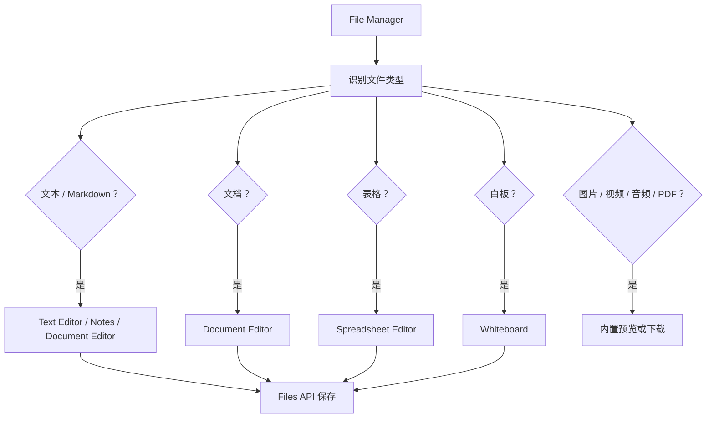

## 12. 应用套件详解

### 12.1 AI Chat

能力：

- 多会话管理。
- 流式输出。
- 模型选择和 Provider 切换。
- Memory Recall。
- Knowledge Sources 展示。
- 工具调用可视化。
- Reasoning 内容折叠展示。
- 多 Agent 结果展示。
- 人工确认工具执行。
- 工作流计划和总结。
- Usage Estimate。

后端关键点：

- 会话和消息存储在 PostgreSQL。
- 工具消息会恢复到上下文中。
- 支持 handoff context，避免 stale 或不完整的 subagent/tool 消息污染上下文。
- 本轮结束后写候选记忆。

### 12.2 File Manager

能力：

- 文件树和列表视图。
- 上传、下载、删除、重命名、移动、复制。
- 新建文件夹和文本文件。
- 文本、图片、PDF、音频、视频、表格预览。
- 根据文件类型打开对应 App。

### 12.3 Terminal

能力：

- 终端式交互界面。
- 内置命令：`ls`/`ll`、`cd`、`pwd` 等。
- 通过 Files API 模拟目录访问。
- AI 命令模式：将自然语言转换成可执行命令或解释。
- 工具日志展示。

### 12.4 Browser

能力：

- 创建和恢复浏览器 Session。
- 多标签页。
- 导航、刷新、后退、前进。
- 当前页文本抽取。
- 截图。
- Cookie/Header/JSON 导入。
- 登录 Profile 保存和应用。
- 历史 Session 管理。
- AI 总结网页。
- 当前网页保存到 Knowledge Base。
- AI 浏览器自动化：根据页面上下文返回 JSON action，并执行导航、点击、输入、按键、滚动、等待等步骤。
- 人工接管：请求用户在真实浏览器中完成登录或复杂操作。

浏览器运行时不是前端假浏览器，而是后端连接 `browser-runtime` 服务中的真实浏览器。

### 12.5 Notes

能力：

- Markdown 笔记列表。
- 新建、打开、保存笔记。
- 自动保存。
- AI 辅助：润色、扩写、摘要。
- 文件保存在 `/Notes`。

### 12.6 Text Editor

能力：

- 打开普通文本文件。
- 编辑并保存。
- 通过 File Manager 按文件类型唤起。
- 后端 `text-editor` manifest 暴露 `read_file` 和 `write_file` 工具。

### 12.7 Document Editor

能力：

- 基于 TipTap 的富文本编辑。
- 文档保存在 `/Documents`。
- 新建、打开、重命名、删除、保存。
- 未保存关闭提醒。
- AI 操作：改写、翻译、扩写、调整语气、续写、生成提纲等。
- 导出：
  - Markdown。
  - PDF：通过浏览器打印。
  - DOCX：调用 `/api/v1/office/document/export-docx`。

### 12.8 Spreadsheet Editor

能力：

- 支持 `xlsx`、`xls`、`xlsm`、`ods`、`csv`。
- 使用 SheetJS 读取文件。
- 使用 Univer 渲染和编辑表格。
- 保存时序列化 workbook 并通过 Files API 写回。
- 支持单元格值、公式、合并单元格等基础结构。

### 12.9 Calendar

能力：

- 月/周/日视图。
- 事件 CRUD。
- AI 日程助手：自然语言生成事件 JSON，再写入日历。
- 后端 API：`/api/v1/calendar/events`。

### 12.10 Mail

能力：

- IMAP/SMTP 账户管理。
- 测试连接。
- 邮件同步。
- 邮件列表和详情。
- 标记已读。
- 草稿。
- 发送邮件。
- 附件下载。
- AI 摘要和 AI 回复。

### 12.11 Whiteboard

能力：

- 白板文件列表。
- 节点和连线编辑。
- 缩放、适配视图。
- AI 生成结构图。
- 保存为 `/Whiteboards` 下的 JSON 文件。

### 12.12 Settings

Settings 是系统控制台，包含：

- API Keys：Provider、API Key、Base URL、启用模型、自定义模型、模型拉取和连接测试。
- Embedding：Embedding Provider、模型、Base URL、API Key、连接测试。
- Appearance：主题、壁纸。
- Avatar：Live2D 模型和行为配置。
- Memory：记忆列表、候选记忆、dreaming sweep、回填、Markdown 文件查看。
- Knowledge：文档上传、搜索、删除、状态。
- Channels：QQ Bot 等外部渠道配置。
- Extensions：MCP 服务和 Skill 管理。
- About：本地配置导入导出、数据所有权说明。

### 12.13 Avatar Pet

能力：

- 桌面浮动 Live2D 角色。
- 可打开 Avatar 对话。
- 使用 Avatar 专属或默认模型。
- 支持情绪标记，例如模型输出中包含情绪提示时映射到 Live2D expression。
- 支持本地 zip 模型上传，后端保存并重写资源路径。
- 可以触发应用启动意图确认。

## 13. App Manifest、Skill 与 MCP 扩展体系

项目把“应用是什么”和“Agent 如何使用应用”分成两层：

- `manifest.json`：给系统读，描述 App 元数据、权限、工具、MCP 配置、窗口默认值。
- `SKILL.md`：给 Agent 读，描述什么时候使用这个 App、怎么使用、注意事项、工具策略。

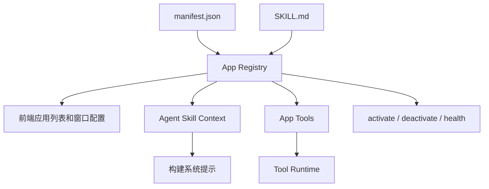

### 13.1 后端内置 App Manifest

后端 `apps/api/apps_registry` 中包含：

- `ai-chat`
- `avatar-pet`
- `browser`
- `calendar`
- `file-manager`
- `notes`
- `settings`
- `terminal`
- `text-editor`

这些 manifest 主要给后端 App Registry、Skill 注入和工具暴露使用。前端实际可见应用更多，包括文档、表格、邮件、白板等，它们主要通过前端 App Registry 和对应 API 支撑。

### 13.2 Skill 注入策略

当用户在某个 App 中与 AI 交互时，后端会：

1. 获取当前入口 App 的 Skill。
2. 根据用户消息语义匹配 1 到 2 个相关 Skills。
3. 处理 primary/secondary/conflict 关系。
4. 把 Skill 内容注入系统提示。
5. 在工具列表中加入对应 App 工具、MCP 工具或用户技能工具。

这使得同一个 Agent 在不同 App 中拥有不同的行为边界。例如在 Browser 中更关注网页导航和页面抽取，在 File Manager 中更关注文件操作，在 Notes 中更关注 Markdown 笔记。

### 13.3 User Skills

用户技能目录位于：

```text
~/.ai-web-os/skills/user
```

支持两类：

- 脚本技能：变成 `skill_{id}` 工具。第一次调用返回 Skill 使用说明，模型按说明二次调用时执行脚本。
- 知识技能：通过 `load_skill_context` 加载上下文，不一定执行脚本。

Skill Manager 能力：

- 扫描用户技能目录。
- 解析 `SKILL.md` / `workflow.md`。
- 推断或读取技能所需的主 API Key 环境变量。
- 保存或清除技能级 API Key。
- 展示技能路径、状态和说明。

### 13.4 MCP 服务生命周期

```mermaid
flowchart LR
  ui["Extension Center / App Manager"] --> add["添加 MCP 服务"]
  add --> config["写入 AI_NATIVE_OS_HOME/mcp.json"]
  config --> activate["激活服务"]
  activate --> manager["MCP Manager"]
  manager --> init["initialize"]
  init --> list["tools/list"]
  list --> cache["缓存工具路由"]
  cache --> agent["Agent 工具列表"]
  agent --> call["模型发起工具调用"]
  call --> invoke["tools/call"]
  invoke --> result["返回工具结果"]
  result --> agent
```

支持的 MCP 类型：

| 类型 | 说明 |
| --- | --- |
| `builtin` | 内置工具或内置应用工具。 |
| `stdio` | 启动本地命令，通过 stdin/stdout 进行 MCP JSON-RPC 通信。 |
| `streamable-http` / `remote-http` | 通过 HTTP/SSE 连接远程 MCP 服务。 |

Extension Center 会展示：

- 服务状态。
- 启用/禁用。
- 连接/断开。
- 健康检查。
- 工具数量。
- 权限。
- Transport。
- Source path。
- 错误信息。

## 14. Browser Runtime 架构

浏览器能力通过独立 `browser-runtime` 服务承载。API 后端只是 Browser Session Client，真正的 Playwright 浏览器操作在 runtime 中执行。

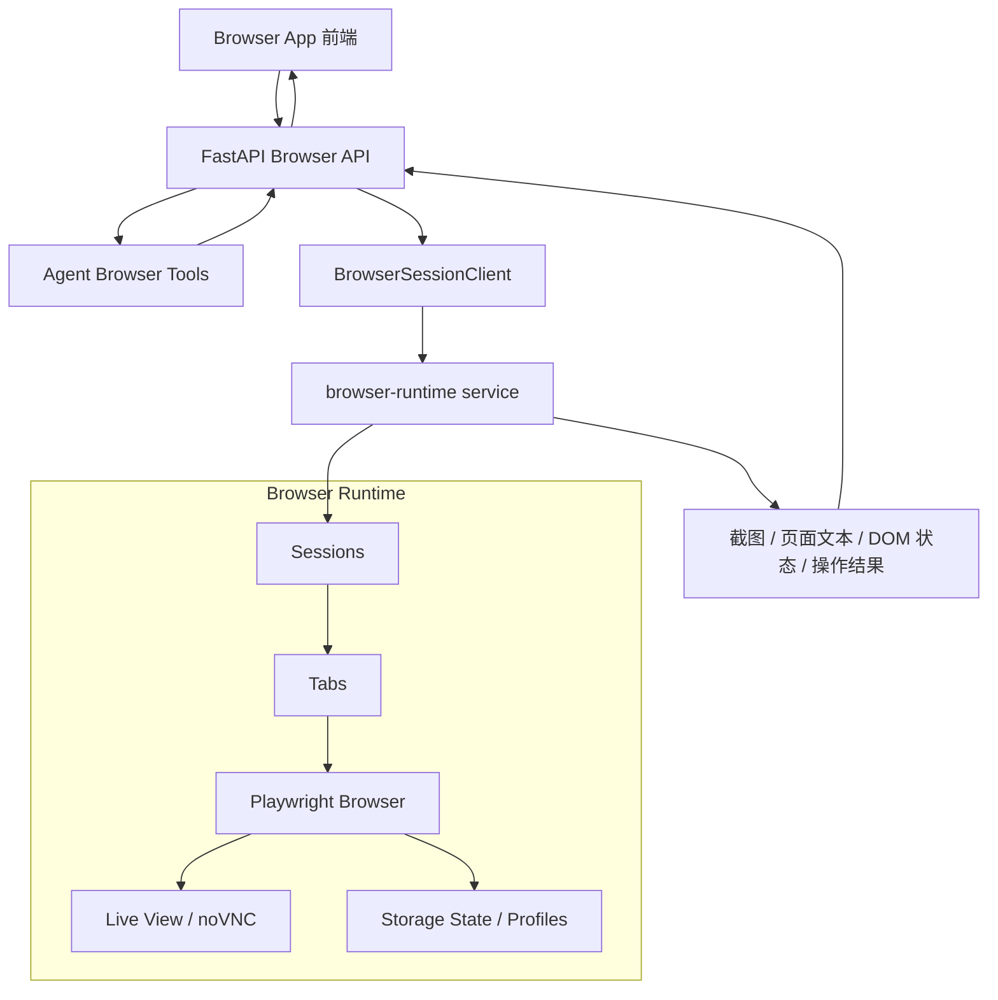

### 14.1 典型 AI 浏览器流程

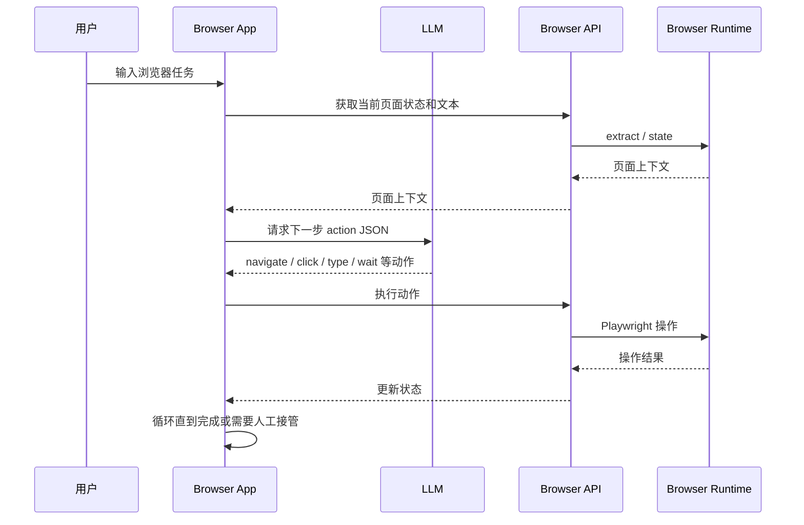

### 14.2 Browser Runtime 启动链

当前实现中的 Browser Runtime 位于 `infra/browser-runtime`，已经从早期“API 进程直接编排 Docker/Playwright”的设想演进为一个独立容器服务：

| 文件 | 职责 |
| --- | --- |
| `infra/browser-runtime/Dockerfile` | 构建带 Chromium、Xvfb、x11vnc、websockify、noVNC、Playwright 依赖的镜像。 |
| `infra/browser-runtime/entrypoint.sh` | 启动 Xvfb、x11vnc、websockify，再启动 FastAPI runtime。 |
| `infra/browser-runtime/server.py` | 暴露 Browser Session REST API，并通过 Playwright 控制同一个可见 Chromium。 |
| `infra/browser-runtime/embedded_vnc.html` | 前端 Browser App 嵌入的 noVNC 页面。 |
| `apps/api/app/core/browser_session.py` | API 后端的 Browser Runtime HTTP client。 |
| `apps/api/app/api/v1/browser.py` | 对前端和 Agent 暴露统一 `/api/v1/browser` 接口。 |

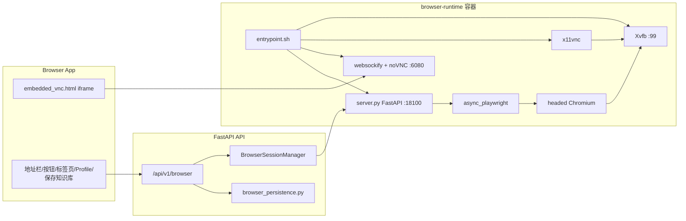

这条链路的关键点是：用户通过 noVNC 看到的画面，和 Playwright 控制的 Chromium 是同一个浏览器实例。AI 的点击、输入、滚轮、拖拽和用户接管动作共享页面状态。

### 14.3 Browser Persistence 与增强操作

浏览器能力已经不止一阶段的“打开 URL、点击、输入、抽取文本”。当前代码还包含持久化和更细粒度的人机协作能力：

| 能力 | API/代码 | 说明 |
| --- | --- | --- |
| Session 历史 | `BrowserSessionRecord`, `/history-sessions` | 记录历史会话、最后 URL、标题、标签数、动作日志和错误。 |
| 登录 Profile | `BrowserLoginProfile`, `/profiles` | 保存某站点过滤后的 storage state，后续可应用到新/当前会话。 |
| Storage State | `/sessions/{id}/storage-state` | 导出/导入 Playwright storage state。 |
| Cookie 导入 | `/sessions/{id}/cookies` | 支持 Cookie 字符串和 Cookie JSON。 |
| 网页入库 | `/sessions/{id}/save-page` | 抽取当前页正文，清洗标题，写入 Knowledge Base。 |
| 截图 | `/sessions/{id}/screenshot` | 返回当前页 PNG。 |
| 坐标控制 | `click-at`, `mouse-down`, `mouse-move`, `mouse-up` | 处理选择器无法稳定定位的页面。 |
| 拖拽/滚轮 | `drag`, `wheel` | 覆盖滚动、拖动滑块、画布交互等场景。 |
| 多标签页 | `tabs`, `activate-tab`, `close-tab` | 一个 Session 内管理多个 BrowserTab。 |

因此分享 Browser 模块时建议分三层讲：

1. Runtime 层：Xvfb/noVNC/Playwright/Chromium 如何共享同一浏览器。
2. API 层：后端用 `BrowserSessionManager` 把 runtime REST API 包成工具和前端接口。
3. Product 层：Browser App 提供地址栏、实时视图、Cookie/Profile、历史会话、保存页面到知识库。

## 15. 后端 API 总览

FastAPI 入口在 `apps/api/app/main.py`，统一挂载在 `/api/v1` 下，WebSocket 为 `/ws`。

| 路由模块 | 前缀 | 能力 |
| --- | --- | --- |
| `settings` | `/api/v1/settings` | 用户设置和桌面布局等。 |
| `agents` | `/api/v1/agents` | 模型列表拉取、确认请求、会话 CRUD、消息读取、Chat、一次性 completion、流量指标。 |
| `apps` | `/api/v1/apps` | App 列表、安装、编辑、删除、激活、禁用、工具列表、Skill、健康检查、工具调用。 |
| `files` | `/api/v1/files` | 文件列表、树、上传、下载、内容读写、移动、复制、删除、重命名。 |
| `memory` | `/api/v1/memory` | Memory 初始化、状态、搜索、候选、整理、dreaming、Markdown 文件、回填、评估、删除。 |
| `knowledge` | `/api/v1/knowledge` | 知识库初始化、状态、文档上传、文本入库、检索、删除。 |
| `browser` | `/api/v1/browser` | 浏览器运行时、Session、导航、标签页、抽取、截图、点击输入、Profile、Cookie、人工接管。 |
| `calendar` | `/api/v1/calendar` | 日历事件 CRUD。 |
| `mail` | `/api/v1/mail` | 邮箱账户、同步、消息、草稿、发送、附件。 |
| `office` | `/api/v1/office` | 文档导出 DOCX。 |
| `skills` | `/api/v1/skills` | Skill 列表、读取、创建、更新、删除、API Key 管理。 |
| `extensions` | `/api/v1/extensions` | 扩展中心统一列表。 |
| `avatar` | `/api/v1/avatar` | Live2D 资产和 zip 模型上传。 |
| `channels` | `/api/v1/channels` | QQ Bot 等外部渠道配置、重启、状态。 |
| `test` | `/api/v1/test` | 连接测试等辅助接口。 |
| WebSocket | `/ws` | Agent 流式对话和事件。 |

## 16. 数据模型与存储

### 16.1 简化 ER 图

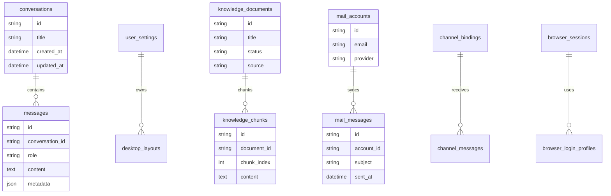

### 16.2 存储矩阵

| 数据 | 存储位置 |
| --- | --- |
| 会话、消息、桌面布局、知识文档元数据、邮件、日历、渠道消息 | PostgreSQL |
| 知识库原始文件 | MinIO |
| 知识库向量 | Qdrant |
| 后台缓存和运行时依赖 | Redis |
| API Key、Provider、Embedding 配置、主题、Avatar 偏好 | 浏览器 localStorage |
| 长期记忆、每日候选、dreaming 状态 | `AI_NATIVE_OS_HOME/memory` |
| 外部 MCP 配置 | `AI_NATIVE_OS_HOME/mcp.json` |
| 用户 Skills | `AI_NATIVE_OS_HOME/skills/user` |
| Notes/Documents/Whiteboards 文件 | 用户文档目录下的 `AI Web OS` 文件夹 |
| 浏览器 Session/Profile | browser-runtime 相关存储 |

## 17. 外部渠道：QQ Bot

项目不只支持浏览器内 AI Chat，还具备外部渠道接入能力。目前代码中包含 QQ Bot 相关运行时。

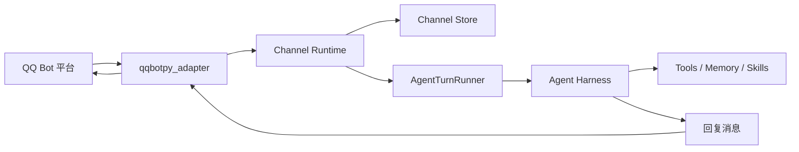

关键点：

- 渠道配置通过 `/api/v1/channels` 管理。
- 启动时 `main.py` 会调用 `startup_channel_runtimes`。
- 外部渠道复用 `AgentTurnRunner`，因此可共享模型、记忆、Skill 和工具体系。
- 渠道消息和绑定关系有独立的数据表。

## 18. 部署与运行

### 18.1 本地开发模式

后端：

```bash
cd apps/api
uv run uvicorn app.main:app --reload --host 0.0.0.0 --port 8000
```

前端：

```bash
cd apps/web
pnpm dev
```

前端默认 API 地址：

```text
http://localhost:8000/api/v1
```

可通过 `NEXT_PUBLIC_API_BASE` 覆盖。

### 18.2 Docker Compose 模式

```bash
docker compose -f docker/docker-compose.yml up -d --build
```

默认端口：

| 服务 | 端口 |
| --- | --- |
| Web | `13000` |
| API | `18000` |
| Browser Runtime API | `18100` |
| Browser Runtime noVNC | `16080` |
| PostgreSQL | `15432` |
| Redis | `16379` |
| MinIO | `19000` / `19001` |
| Qdrant | `16333` / `16334` |

### 18.3 关键环境变量

| 变量 | 说明 |
| --- | --- |
| `DATABASE_URL` | PostgreSQL 连接。 |
| `REDIS_URL` | Redis 连接。 |
| `MINIO_ENDPOINT` | MinIO endpoint。 |
| `MINIO_ACCESS_KEY` | MinIO access key。 |
| `MINIO_SECRET_KEY` | MinIO secret key。 |
| `MINIO_BUCKET` | 知识库原始文件 bucket。 |
| `SECRET_KEY` | 后端加密/签名密钥。 |
| `AI_NATIVE_OS_HOME` | 本地记忆、MCP、Skill 配置根目录。 |
| `NEXT_PUBLIC_API_BASE` | 前端调用 API 的基础地址。 |
| `BROWSER_RUNTIME_URL` | API 访问 browser-runtime 的地址。 |
| `BROWSER_SESSION_ENABLED` | 是否启用浏览器 Session 能力。 |

API 镜像中包含 Node/npm/npx、Python、uv 等基础运行时，便于 stdio MCP 服务和脚本类 Skill 执行。

## 19. 可观测、测试与评估

项目已经在多个层面提供验证和评估能力。

### 19.1 后端测试和评估

仓库中存在多类测试和评估脚本：

- Agent Harness 测试。
- 工具策略防护测试。
- 工具结果校验测试。
- 多 Agent 指标测试。
- Memory 解析、整理、评估测试。
- Knowledge 和 Browser 相关测试。
- Mail、Calendar、Files、Office 等 API 测试。

相关目录：

- `apps/api/tests`
- `apps/api/scripts`

典型评估脚本包括：

- `eval_agent_harness.py`
- `eval_agent_metrics.py`
- `eval_multi_agent_metrics.py`

### 19.2 前端测试

前端使用 Vitest，测试文件分布在 `apps/web/src/**/*.test.ts` / `*.test.tsx`。

已覆盖方向包括：

- App Registry。
- Browser parsing。
- Desktop stores。
- File Manager helpers。
- Agent event handling。
- Memory settings。
- Avatar zip loader。

### 19.3 Trace 与指标

后端配置包含：

- Phoenix trace endpoint。
- LangSmith tracing。
- Agent traffic metrics。
- Token usage estimate。
- Tool policy and validation events。

这些能力支持后续做 Agent 行为分析、模型调用对比和工具可靠性评估。

### 19.4 Agent 指标与前端性能收尾

`PROGRESS.md` 和当前代码中还包含一组容易被忽略、但适合技术分享收尾的工程化能力。

Agent 指标侧：

| 能力 | 关键代码 | 说明 |
| --- | --- | --- |
| 真实流量统计 | `agent_traffic_metrics.py`, `/api/v1/agents/metrics/traffic` | 记录工具调用数、路由问题、委派请求、完成状态等滚动指标。 |
| 多 Agent 评估 | `agent_multi_eval_metrics.py` | 汇总委派准确率、子 Agent 工具成功率、任务完成率。 |
| Harness Eval | `apps/api/scripts/eval_agent_harness.py` | 覆盖工具策略、防重复搜索、EvidenceBundle、FallbackPolicy、LangGraph 节点等回归。 |
| Token 估算 | `agent_usage.py` | 在不同 provider 计费不统一的前提下，只做本地估算展示。 |

前端性能和产品收尾侧：

| 能力 | 关键代码 | 说明 |
| --- | --- | --- |
| 主题系统 | `ThemeProvider.tsx`, `desktopStore.ts` | 通过 `<html data-theme>` 和 CSS 变量切换 Light/Dark。 |
| 自定义强调色 | Settings 外观页 + desktop store | 用户选择强调色后实时写入 CSS 变量。 |
| App 代码分割 | `AppRenderer.tsx` | 使用 `next/dynamic` 按需加载大型 App。 |
| 窗口虚拟化 1.0 | Window 层可见性计算 | 被遮挡或屏幕外的可重建 App 保留窗口壳，降低前端负载。 |
| WebSocket 稳定性 | `useStream.ts` | 指数退避重连和 30 秒心跳。 |
| 配置导入导出 | Settings About 页 | 本地优先配置可备份迁移，包含 API Keys 等敏感配置。 |

```mermaid
flowchart LR
  request["Agent 请求"] --> traffic["AgentTrafficRecord"]
  request --> graph["AgentGraphRuntime checkpoint"]
  request --> trace["Phoenix / LangSmith"]

  traffic --> summary["traffic summary API"]
  graph --> replay["节点状态回放/诊断"]
  trace --> debug["调用链分析"]

  desktop["Web Desktop"] --> theme["ThemeProvider"]
  desktop --> chunks["next/dynamic App chunks"]
  desktop --> virtual["窗口虚拟化"]
  desktop --> settings["配置导入导出"]
```

## 20. 技术分享建议讲法

可以按“从产品到架构，再到 Agent 内核”的顺序讲：

1. 先展示桌面：窗口、Dock、应用和 Settings，让听众理解它不是聊天框，而是一个工作台。
2. 展示 AI Chat：流式输出、工具调用、记忆召回、知识来源、人工确认。
3. 展示 Browser：真实浏览器 Session 和 AI 操作网页，说明 browser-runtime 的价值。
4. 展示 Memory 和 Knowledge：解释“用户长期记忆”和“文档知识库”的边界。
5. 展示 Extension Center：MCP 和 User Skill 如何扩展工具能力。
6. 回到后端架构：讲 Agent Harness 如何约束模型、执行工具、校验结果、多 Agent 委派。
7. 最后讲部署和数据所有权：用户 Key 在本地、Memory/Skill/MCP 配置本地优先，核心依赖可 Docker Compose 运行。

推荐 30 分钟分享结构：

| 时间 | 内容 |
| --- | --- |
| 0-5 分钟 | 项目定位和桌面 Demo。 |
| 5-10 分钟 | 应用套件和文件/办公能力。 |
| 10-18 分钟 | AI Chat、Agent Harness、工具调用和 HITL。 |
| 18-23 分钟 | Memory、Knowledge、Browser Runtime。 |
| 23-27 分钟 | App/Skill/MCP 扩展机制。 |
| 27-30 分钟 | 部署、数据所有权、后续演进。 |

## 21. 当前实现边界和注意点

结合代码和文档，分享时建议明确这些边界：

- 前端可见应用和后端 `apps_registry` manifest 不是一一对应。文档、表格、邮件、白板等前端应用已经可用，但并非都拥有独立的后端 manifest/Skill。
- Token usage 是估算展示，不等同于精确费用核算。
- Calendar 的后端 manifest 文案相对保守，但前端和 API 已经具备事件 CRUD 与 AI 日程助手。
- Browser 能力依赖 `browser-runtime` 服务；未启动该服务时浏览器自动化能力不可用。
- User Skill 脚本执行依赖 API 运行环境和用户本地技能目录，需要注意安全边界和依赖安装。
- stdio MCP 服务运行在后端部署节点，不是在前端浏览器中运行。
- API Key、模型和 Embedding 配置主要由前端 localStorage 保存，换浏览器或清理站点数据会影响配置。
- Memory Markdown 是源文件，向量索引或其他索引应被看作可重建缓存。
- `ARCHITECTURE.md` 中的 SOUL.md / 人格系统更像早期规划；当前代码中更明确可见的是 Avatar 人格预设、Settings 配置和 Agent Prompt 注入，不建议把 SOUL.md 作为已完整落地模块来讲。
- `ARCHITECTURE.md` 对 Conversation Handoff 和完整 StateGraph 的描述偏保守，`PROGRESS.md` 和当前代码显示相关实现已经进入 `agent_handoff.py`、`agent_graph.py` 和 checkpoint runtime。

### 21.1 最新实现覆盖矩阵

对照 `ARCHITECTURE.md`、`BROWSER_AUTOMATION_PLAN.md`、`PROGRESS.md` 和当前代码，本项目最新能力可以按下表收口：

| 能力域 | 当前状态 | 文档中建议讲法 |
| --- | --- | --- |
| Desktop Shell | 已实现 | 桌面、窗口、Dock、主题、懒加载和窗口虚拟化共同组成 Web OS 外壳。 |
| AI Chat / WebSocket | 已实现 | 流式 token、工具卡片、确认事件、子 Agent 事件都走同一条可观察通道。 |
| Agent Harness | 已实现 | function calling + policy guard + result validation + fallback + checkpoint。 |
| Conversation Handoff | 已实现基础版 | 重点讲上下文清理、tool message 配对、active agent 和记忆 owner。 |
| LangGraph / Checkpoint | 已实现 runtime facade | 当前不是完全替代 LLM loop，而是在 Harness 节点上提供可 checkpoint 的状态层。 |
| Multi Agent | 已实现 2.0 能力 | Lead Agent 保留最终回答权，Sub-Agent 作为工具，EvidenceBundle 结构化交接。 |
| Memory | 已实现 Markdown-first | 源文件是 Markdown，索引和整理结果可重建。 |
| Knowledge Base | 已实现 | 支持文档入库、检索、AI 引用，Browser 页面可一键保存到知识库。 |
| Browser Runtime | 已实现独立容器 | 讲清楚 Xvfb/noVNC/Playwright/Chromium 共享同一浏览器实例。 |
| Browser Persistence | 已实现 | Cookie、storage state、Profile、历史 Session、动作日志。 |
| Office Suite | 已实现首个完整版本 | Notes/Text/Doc/Sheet/Calendar/Mail/Whiteboard 均可作为独立 App 讲。 |
| Terminal | 已实现受控终端风格 App | 不是直接暴露真实 shell，而是 Files API + Agent Harness 的组合。 |
| MCP / Skills / Extensions | 已实现 | App Skill、User Skill、本地 MCP、外部 MCP 共同扩展工具面。 |
| Channels / QQ Bot | 已实现 | 外部渠道复用 `AgentTurnRunner`。 |
| Avatar | 已实现 | Live2D 资产、情绪解析、人格预设和位置状态由 Avatar Store 管理。 |
| Metrics / Trace / Eval | 已实现 | Agent traffic metrics、multi-agent eval、Phoenix/LangSmith、Harness eval。 |
| SOUL.md | 未看到完整独立落地 | 作为早期设计或未来人格系统方向说明，不作为当前核心已实现功能。 |

## 22. 一张图总结

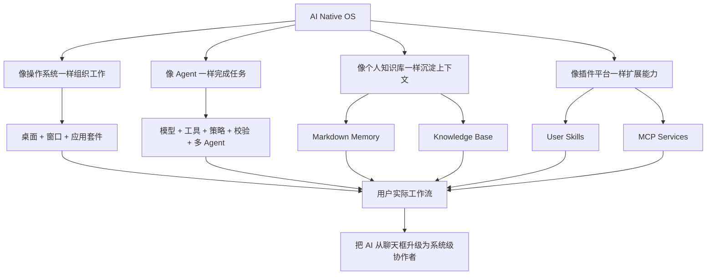
