# AI Native OS 技术分享深度解析：从原理到实现

> 这是一份面向团队技术分享的“实现原理版”文档。它保留上一份全景文档的覆盖面，但叙事方式换成技术链路：一次用户请求如何穿过前端、WebSocket、Agent Harness、工具系统、Memory、Knowledge、MCP、Browser Runtime 和各个 App，最终变成可观察、可确认、可恢复的执行结果。

生成日期：2026-06-22

## 0. 如何使用这份文档

建议把这份文档当成 45 到 60 分钟技术分享的讲稿底稿。

推荐讲法：

1. 先讲项目不是“聊天应用”，而是“桌面工作台 + Agent Runtime”。
2. 用一条 AI Chat 请求打通前后端链路。
3. 深入 Agent Harness，解释为什么需要策略、确认、校验、上下文压缩和状态事件。
4. 分别讲 Memory、Knowledge、多 Agent、Browser Runtime、MCP/Skill 的实现。
5. 最后讲文件/办公应用如何接入，以及部署和数据所有权。

本文重点不是“有哪些功能”，而是：

- 每个模块解决什么工程问题。
- 请求在模块之间怎么流动。
- 前端如何组织状态和展示过程。
- 后端如何构建上下文、选择工具、执行工具和保存结果。
- 数据最终落在哪里。
- 代码中哪些文件最值得现场打开讲。

## 1. 项目技术定位

AI Native OS 的核心抽象可以拆成三层：

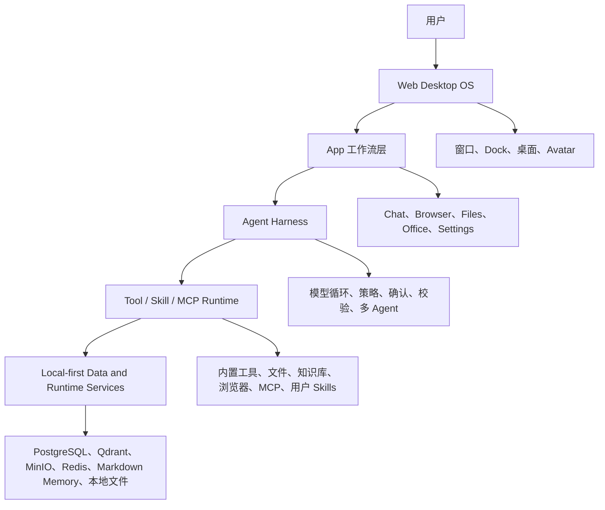

和常见 Chatbot 的差异在于：

| 维度 | 普通 Chatbot | AI Native OS |
| --- | --- | --- |
| 入口 | 一个聊天框 | 桌面 + 多 App + 聊天框 |
| 上下文 | 对话历史 | 当前 App、Skill、文件、浏览器页面、记忆、知识库 |
| 工具 | 少量固定函数 | 内置工具 + Browser + MCP + 用户 Skills + App 工具 |
| 执行过程 | 模型直接回答 | Harness 约束工具执行，流式暴露状态 |
| 数据 | 平台侧会话 | 本地 Key、本地 Markdown Memory、本地 MCP/Skill 配置 |
| 复杂任务 | 模型单线程推理 | Lead Agent 可委派多个子 Agent 并行处理 |

## 2. 全栈请求总览

先用一条 AI Chat 请求看完整链路。

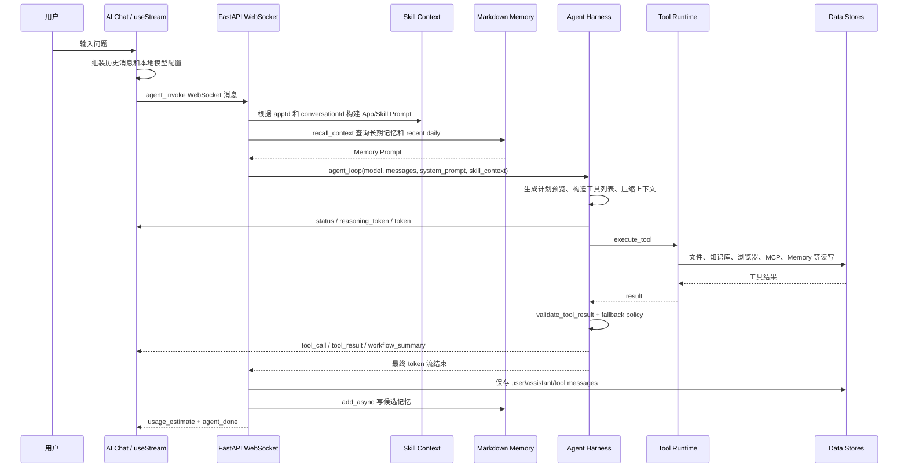

关键文件：

| 层 | 文件 |
| --- | --- |
| 前端 WebSocket 客户端 | `apps/web/src/hooks/useStream.ts` |
| AI Chat 前端 | `apps/web/src/apps/ai-chat/AiChat.tsx` |
| WebSocket 后端入口 | `apps/api/app/api/websocket.py` |
| Skill 上下文构建 | `apps/api/app/core/skill_context.py` |
| Agent 主循环 | `apps/api/app/core/llm_provider.py` |
| 工具系统 | `apps/api/app/core/tools.py` |
| Harness 策略和校验 | `apps/api/app/core/agent_harness.py` |
| 多 Agent | `apps/api/app/core/subagent.py` |
| 记忆 | `apps/api/app/core/markdown_memory.py` |
| 知识库 | `apps/api/app/core/knowledge.py` |

## 3. 前端桌面 Shell 的实现原理

### 3.1 为什么先做桌面

项目的前端不是普通页面路由，而是一个 Web Desktop。这样做的好处是：

- 多应用可以并存，而不是每次跳转页面。
- AI 可以绑定“当前 App”上下文。
- 文件、文档、邮件、浏览器、聊天可以互相打开和协作。
- 状态模型更像 OS：窗口、应用、布局、主题、本地配置各司其职。

### 3.2 组件分层

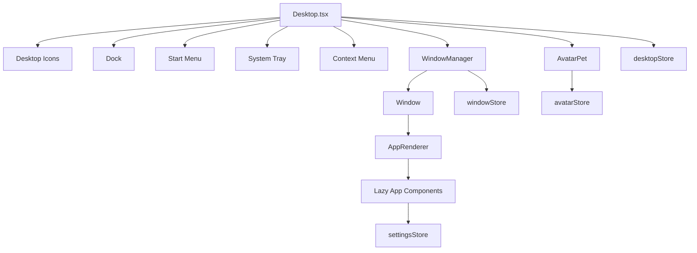

核心代码：

- `apps/web/src/components/desktop/Desktop.tsx`
- `apps/web/src/components/desktop/WindowManager.tsx`
- `apps/web/src/apps/AppRenderer.tsx`
- `apps/web/src/lib/app-registry.ts`
- `apps/web/src/stores/windowStore.ts`
- `apps/web/src/stores/desktopStore.ts`

### 3.3 窗口生命周期

前端通过 Zustand 的 `windowStore` 管理窗口。

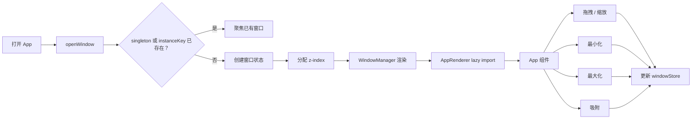

这里的关键点是：App 组件只关心自己的业务逻辑，窗口的尺寸、层级、最大化和关闭都由 Shell 统一处理。这样 Browser、Mail、Document Editor、AI Chat 等应用都可以复用同一个窗口模型。

### 3.4 AppRenderer 的动态加载

`AppRenderer.tsx` 用 dynamic import/lazy loading 把大型 App 拆成独立 chunk：

- AI Chat
- Browser
- Calendar
- Document Editor
- File Manager
- Mail
- Notes
- Settings
- Spreadsheet Editor
- Terminal
- Text Editor
- Whiteboard

这个设计的技术意义是：桌面首屏不会一次加载所有办公和浏览器依赖，尤其是 TipTap、Univer、SheetJS、Browser UI 这类较重模块。

### 3.5 主题系统、代码分割与窗口虚拟化

桌面 Shell 除了“能打开窗口”，还做了几个产品级收尾：

| 能力 | 关键代码 | 实现原理 |
| --- | --- | --- |
| Light/Dark 主题 | `apps/web/src/components/ThemeProvider.tsx` | 从 `desktopStore` 读取主题，写入 `<html data-theme="light|dark">`，CSS 变量统一响应。 |
| 自定义强调色 | Settings 外观页 + `desktopStore` | 用户选择颜色后写入持久化 store，再同步到 CSS 变量。 |
| App 代码分割 | `apps/web/src/apps/AppRenderer.tsx` | `next/dynamic` 让每个大型 App 独立 chunk，打开时再加载。 |
| 窗口虚拟化 1.0 | Window/WindowManager 可见性计算 | 对完全遮挡或屏幕外、且可安全重建的 App，只保留窗口壳或占位，降低渲染压力。 |
| WebSocket 稳定性 | `apps/web/src/hooks/useStream.ts` | 指数退避重连、30 秒 heartbeat、requestId 到 handler 的映射。 |

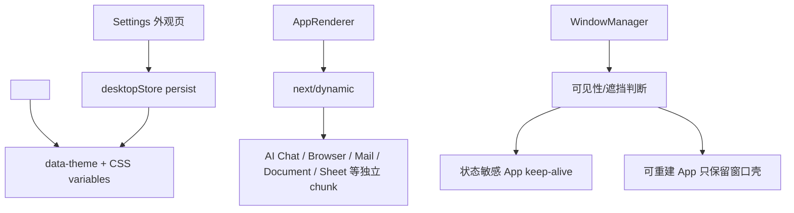

这里有一个架构取舍：Browser、AI Chat、编辑器这类状态敏感 App 默认更保守，不轻易卸载；文件预览、部分可重建面板则可以更激进地虚拟化。这样既能优化性能，又不会让用户正在编辑或登录的状态突然丢失。

## 4. AI Chat 前端如何驱动 Agent

### 4.1 前端发送前做了什么

AI Chat 在发送消息前不只是把用户输入传给后端。它会先构建一份符合 OpenAI/Anthropic tool calling 结构的历史消息。

关键代码：`apps/web/src/apps/ai-chat/AiChat.tsx`

重要逻辑：

1. 用户输入变成一条 `user` 消息。
2. UI 插入一条 streaming 状态的 assistant 消息。
3. 遍历历史消息。
4. 对已经完成的工具调用，恢复成：
   - assistant message with `tool_calls`
   - 对应的 `tool` message
5. 跳过正在 streaming 的 assistant。
6. 跳过子 Agent 内部 tool calls，避免 Lead Agent 下回合误以为这些工具是自己直接调用的。
7. 调用 `streamChat`。

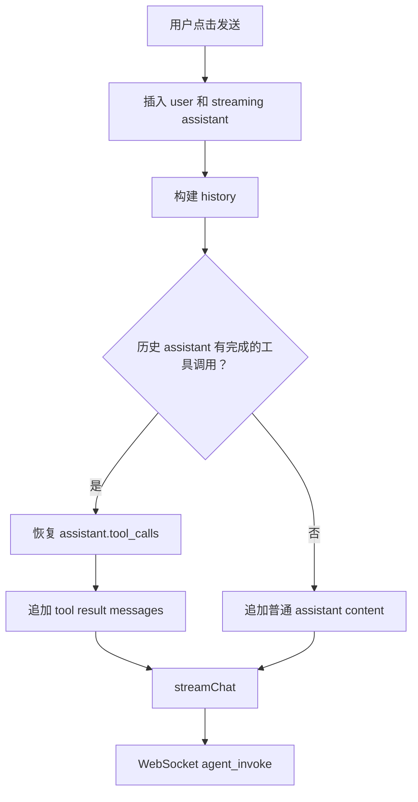

这一步非常关键：如果不恢复 tool_calls 和 tool result，下一轮模型会丢失工具调用上下文，容易重复调用工具或无法解释之前的结果。

### 4.2 useStream 的职责

关键代码：`apps/web/src/hooks/useStream.ts`

`useStream` 负责：

- 建立单例 WebSocket。
- 指数退避重连。
- 心跳 ping/pong。
- requestId 到 handler 的映射。
- idle timeout，防止模型或工具长时间无响应。
- 将后端事件派发给 UI 回调。

后端事件对应前端回调：

| 后端事件 | 前端回调 | UI 行为 |
| --- | --- | --- |
| `status` | `onStatus` | 展示计划、记忆召回、校验、压缩、usage 等状态。 |
| `token` | `onToken` | 追加 assistant 文本。 |
| `reasoning_token` | `onReasoningToken` | 追加 reasoning 内容。 |
| `tool_call` | `onToolCall` | 新增工具卡片。 |
| `tool_result` | `onToolResult` | 更新工具卡片为完成或错误。 |
| `agent_confirm_required` | `onConfirmRequired` | 弹出确认对话框。 |
| `subagent_token` | `onSubagentToken` | 更新子 Agent 输出。 |
| `subagent_result` | `onSubagentResult` | 展示子 Agent 结果。 |
| `agent_done` | resolve promise | 收尾并保存 UI 状态。 |

### 4.3 前端为什么要做工具卡片

工具调用不是隐藏实现细节，而是用户信任 Agent 的关键：

- 用户能看到 Agent 正在读文件、查知识库、控制浏览器还是调用 MCP。
- 对危险工具可以阻断确认。
- 多 Agent 任务可以显示每个子任务是否完成。
- 失败时可以知道是模型失败、工具失败还是结果校验失败。

## 5. WebSocket 后端入口

关键代码：`apps/api/app/api/websocket.py`

WebSocket 后端做的是“请求编排”，不是直接调用模型。

### 5.1 输入解析

`agent_invoke` payload 包含：

- conversationId
- message
- model
- appId
- providerId
- history
- systemPrompt
- apiKey
- apiBase
- enableMemory
- userId
- compatType
- activeAgent
- embeddingConfig
- llmApiKey
- llmApiBase

这些字段体现了一个重要设计：模型配置和 Key 主要来自前端本地设置，后端只在本轮请求中使用。

### 5.2 后端编排流程

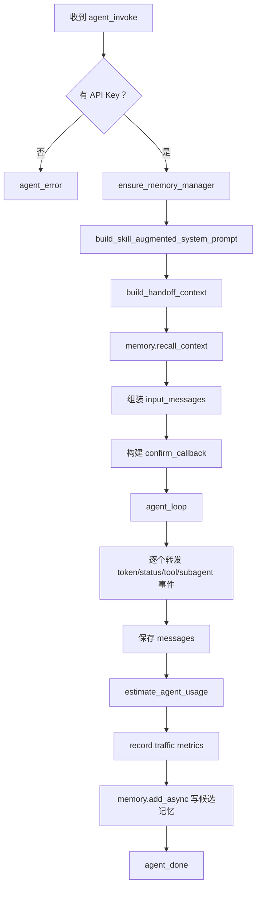

### 5.3 Skill 和 Memory 的注入顺序

顺序很重要：

1. 先构建基础系统提示。
2. 注入当前时间规则。
3. 注入当前 App 和 Skill 上下文。
4. 再注入 Memory Recall。

这样模型先知道自己是谁、在哪个 App、有哪些工具和规则，再知道用户相关的长期上下文。

### 5.4 Handoff Context

`build_handoff_context` 用来清理历史中不适合传给当前 Lead Agent 的内容，尤其是：

- 已过期的 tool calls。
- tool result 缺失的调用。
- 子 Agent 内部工具调用。

原因是多 Agent 场景下，子 Agent 也会产生 tool calls。如果这些消息原样喂回 Lead Agent，模型可能误以为自己直接发起过那些工具调用，导致上下文错乱。

### 5.5 Conversation Handoff 与 Checkpoint 的真实职责

这部分容易被误解成“把对话控制权交给另一个 Agent”。当前实现更准确的说法是：**在单用户对话体验不变的前提下，给不同 Agent Owner 建立干净、可恢复的上下文边界**。

关键代码：

- `apps/api/app/core/agent_handoff.py`
- `apps/api/app/core/agent_graph.py`
- `apps/api/app/main.py`

`agent_handoff.py` 处理三件事：

1. `normalize_active_agent()`：把空值、`main`、`supervisor`、`lead_agent` 都归一为 `lead`。
2. `memory_user_id_for_agent()`：Lead Agent 继续使用原始 `user_id`；非 Lead Agent 使用 `user_id::agent:{agent}`，避免跨 Agent 记忆互相污染。
3. `build_handoff_context()`：遍历历史消息，只保留当前 owner 合法可见的消息；同时保证 assistant 的 `tool_calls` 和后续 `tool` message 成对出现。

为什么 ToolMessage 配对很重要？

OpenAI-compatible 的工具调用协议要求：

```text
assistant(tool_calls=[call_1, call_2])
tool(tool_call_id=call_1)
tool(tool_call_id=call_2)
```

如果历史中留下了孤立的 `tool` message，或者 assistant 声称发起了工具调用但没有对应结果，下一轮模型调用就可能报协议错误。多 Agent 并发时最容易产生这类污染，因为子 Agent 的工具调用也会进入前端调试流。

`agent_graph.py` 的职责不是把整个 LLM loop 一次性重写成 LangGraph，而是给现有 Harness 加一层可 checkpoint 的状态 facade：

```mermaid
flowchart LR
  ws["WebSocket 请求"] --> handoff["build_handoff_context"]
  handoff --> input["组装模型输入"]
  input --> graph["AgentGraphRuntime"]

  graph --> c1["build_context"]
  c1 --> c2["route"]
  c2 --> c3["llm_decide"]
  c3 --> c4["policy_guard"]
  c4 --> c5["execute_tool"]
  c5 --> c6["delegate"]
  c6 --> c7["validate_result"]
  c7 --> c8["evaluate"]
  c8 --> c9["synthesize"]
  c9 --> c10["respond"]

  graph --> saver{"checkpoint backend"}
  saver --> pg["AsyncPostgresSaver"]
  saver --> mem["InMemorySaver fallback"]
```

启动时 `main.py` 调用 `init_checkpointer()`：

- 如果 `langgraph-checkpoint-postgres`、`psycopg_pool` 和数据库连接可用，使用 `AsyncPostgresSaver`。
- 如果 PostgresSaver 初始化失败，回退 `InMemorySaver`。
- checkpoint 写入失败不能影响聊天主链路，所以 `AgentGraphRuntime.status()` 会把 checkpoint 错误放进事件，而不是中断请求。

分享时可以这样讲：这套设计先保留稳定的 streaming/tool event 合约，再把状态节点逐步挂到 LangGraph 上。它不是大爆炸式重构，而是一条可迁移、可回滚的演进路径。

## 6. Skill Context：让 Agent 感知当前 App

关键代码：`apps/api/app/core/skill_context.py`

Skill Context 的任务是把“用户当前在哪个 App”转换成模型能理解的系统提示。

### 6.1 入口 App 的解析

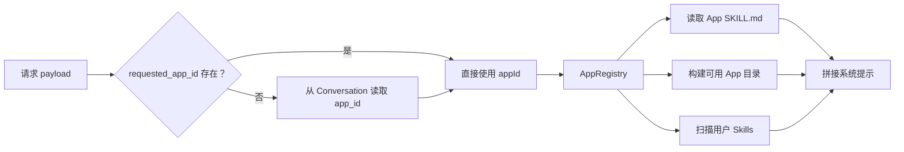

### 6.2 注入内容

Skill Context 会注入：

- 当前时间和相对时间解析规则。
- 当前 App 名称、ID、描述。
- 如果 manifest 配置 `inject_full_prompt`，注入完整 SKILL.md。
- 可用 App 一览和它们的工具。
- 工具调用规则。
- 用户自定义 Skills 的摘要。

### 6.3 为什么不总是注入所有 Skill 全文

这是一个上下文成本和准确率的平衡：

- 全量注入会让 prompt 变长，容易稀释当前任务。
- 大多数 Skill 只需要摘要用于发现。
- 脚本型 Skill 通过 function tool 暴露，首次调用再返回具体 SKILL.md 指南。
- 知识型 Skill 通过 `load_skill_context` 按需加载。

## 7. Agent Harness：核心执行循环

关键代码：

- `apps/api/app/core/llm_provider.py`
- `apps/api/app/core/agent_harness.py`
- `apps/api/app/core/agent_graph.py`
- `apps/api/app/core/context_manager.py`
- `apps/api/app/core/agent_plan.py`

### 7.1 Harness 解决的问题

直接让模型调用工具会遇到这些问题：

- 工具选错。
- 重复调用。
- 工具失败后模型胡编。
- 工具结果太大，撑爆上下文。
- 高风险操作没有用户确认。
- 多步骤任务没有可视化状态。
- 多 Agent 产生的结果难以汇总。

Agent Harness 的设计目标是：模型负责推理和选择，Harness 负责约束、执行、校验和观测。

### 7.2 Agent Loop 状态机

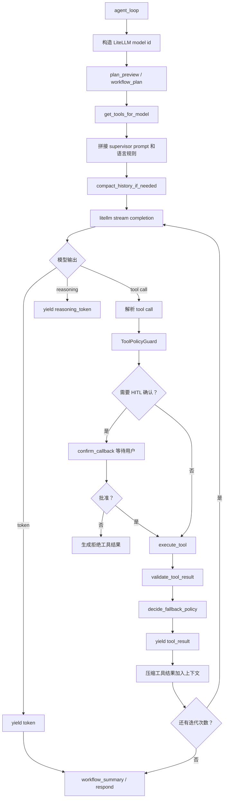

### 7.3 LiteLLM 适配层

`agent_loop` 首先把用户选择的 Provider 和模型转换成 LiteLLM 可识别的模型名。

支持的来源包括：

- OpenAI-compatible
- Anthropic
- Google Gemini
- DeepSeek
- Qwen
- Zhipu
- Moonshot/Kimi
- Doubao

这个转换层让前端可以统一处理 Provider 配置，而后端用 LiteLLM 统一发起 completion。

### 7.4 工具列表的动态构造

`get_tools_for_model` 会根据上下文动态拼出工具列表。

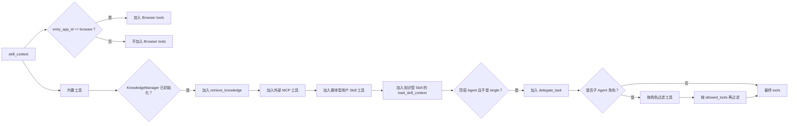

这解释了为什么 Browser 工具不是任何场景都可用：只有当前入口 App 是 Browser 时才加入，避免普通聊天误操作浏览器。

### 7.5 ToolPolicyGuard 和结果校验

Harness 中的关键防线：

- `ToolPolicyGuard`：在执行前判断工具调用是否合规。
- `tool_requires_confirmation`：根据配置判断是否需要人工确认。
- `validate_tool_result`：执行后检查工具结果是否有明显错误或不可用。
- `decide_fallback_policy`：如果结果不可用，给模型注入修正提示。
- `compact_tool_result_for_context`：把大结果压缩后再放回上下文。

这种设计不是为了替代模型，而是把模型置于一个更稳定的执行协议中。

### 7.6 Human in the Loop

高风险工具执行前，后端通过 WebSocket 发给前端：

```text
agent_confirm_required
```

前端展示确认弹窗，然后调用：

```text
POST /api/v1/agents/confirm?request_id=...&approved=true|false
```

后端 `confirmation_store` 保存 pending Future，`confirm_callback` 等待这个 Future 被 REST API resolve。这个机制让 WebSocket 流和 REST 确认可以协同工作。

## 8. 工具系统：从 function schema 到真实副作用

关键代码：`apps/api/app/core/tools.py`

### 8.1 工具分层

```mermaid
flowchart TB
  schema["Function Schema"] --> model["LLM 选择工具"]
  model --> call["tool call"]
  call --> execute["execute_tool"]

  execute --> builtin["内置工具"]
  execute --> files["文件工具"]
  execute --> memory["Memory 工具"]
  execute --> knowledge["Knowledge 工具"]
  execute --> browser["Browser 工具"]
  execute --> mcp["MCP 工具"]
  execute --> skill["User Skill 工具"]

  builtin --> result["统一字符串结果"]
  files --> result
  memory --> result
  knowledge --> result
  browser --> result
  mcp --> result
  skill --> result
```

### 8.2 内置工具

内置工具包括：

- `calculator`：安全数学表达式。
- `fetch_url`：抓取 URL 文本。
- `python_exec`：沙箱子进程执行 Python。
- `list_files` / `read_file` / `write_file`：虚拟文件系统。
- `list_notes` / `save_note`：笔记 App 工具。
- `memory_search` / `memory_get`：Markdown Memory。
- `retrieve_knowledge`：知识库检索。
- `browser_*`：浏览器工具，按当前 App 注入。
- `delegate_task`：多 Agent 委派。

### 8.3 工具返回为什么统一成字符串

`execute_tool` 最终倾向返回字符串，因为它要被放进 LLM 的 tool result message 中。复杂对象会用 JSON 格式化，这样模型可以继续读取和推理。

### 8.4 User Skill 的两阶段执行

脚本型用户 Skill 有一个非常实用的两阶段机制：

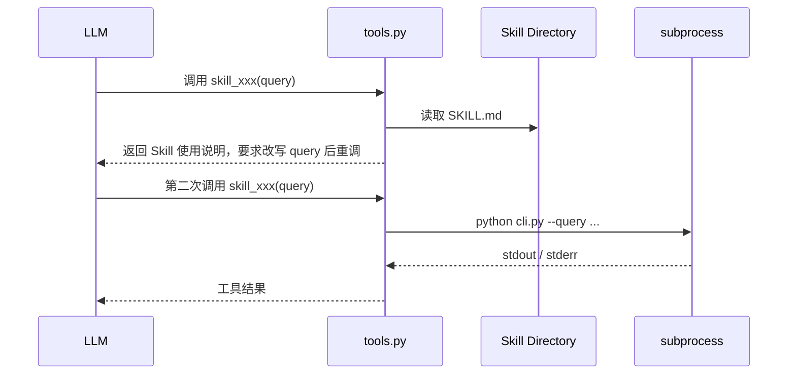

这个设计解决了一个问题：模型第一次不知道该技能的精确输入格式，所以第一次调用先把 SKILL.md 作为操作手册返回，第二次再真正执行脚本。

## 9. 多 Agent：Lead Agent 如何并行委派

关键代码：

- `apps/api/app/core/subagent.py`
- `apps/api/app/core/llm_provider.py`
- `apps/api/app/core/agent_types.py`
- `apps/api/app/core/evidence_bundle.py`

### 9.1 多 Agent 不是多开聊天

这里的多 Agent 是工具调用协议的一部分。Lead Agent 仍然拥有最终回答权，子 Agent 是一种特殊工具。

```mermaid
flowchart TB
  lead["Lead Agent"] --> detect["识别独立子任务"]
  detect --> call["调用 delegate_task"]
  call --> normalize["normalize_subagent_specs"]
  normalize --> parallel["run_subagents_parallel"]
  parallel --> q["asyncio.Queue 合并事件流"]

  parallel --> a1["research agent"]
  parallel --> a2["coder agent"]
  parallel --> a3["system agent"]
  parallel --> a4["writer agent"]

  a1 --> ev["subagent_token / tool_call / tool_result"]
  a2 --> ev
  a3 --> ev
  a4 --> ev
  ev --> ui["前端实时展示"]

  a1 --> bundle["EvidenceBundle"]
  a2 --> bundle
  a3 --> bundle
  a4 --> bundle
  bundle --> result["build_subagent_tool_result"]
  result --> lead
  lead --> final["综合最终回答"]
```

### 9.2 子 Agent 的运行机制

`run_subagent` 会：

1. 根据 role 获取角色定义。
2. 生成唯一 `subagent_id`。
3. 在 `skill_context` 中写入：
   - `agent_depth`
   - `is_subagent`
   - `agent_role`
   - `parent_request_id`
   - `allowed_tools`
4. 构造子任务 prompt。
5. 再次调用同一个 `agent_loop`。
6. 把 token 改成 `subagent_token`。
7. 给 tool_call/tool_result 的 ID 加 namespace，避免并行工具 ID 冲突。
8. 收集 tool evidence。
9. 输出 `subagent_result`。

### 9.3 并发模型

`run_subagents_parallel` 使用：

- `asyncio.create_task` 启动每个子 Agent。
- `asyncio.Queue` 合并事件流。
- `MAX_PARALLEL_SUBAGENTS` 限制最大并发，当前最多 4 个。
- 超出数量的任务直接返回 skipped result。

这是一种“并发执行，流式归并”的模式。前端可以看到多个子 Agent 同时产出 token 和工具事件。

### 9.4 EvidenceBundle 的意义

对子 Agent，尤其是 research 类型，不能只信自然语言 answer。它还会收集工具证据，并可提炼成 EvidenceBundle：

- facts
- sources
- missingFields
- toolEvidence
- mergedToolResults

Lead Agent 在综合时应优先参考结构化证据，而不是只读子 Agent 的自然语言总结。

### 9.5 多 Agent 2.0：预算、指标与交接质量

`PROGRESS.md` 中的多 Agent 2.0 可以概括为：不只让子 Agent 并行跑，还要让 Lead Agent 能判断“这些子任务到底有没有完成、证据够不够、失败在哪里”。

关键补充代码：

- `apps/api/app/core/agent_multi_eval_metrics.py`
- `apps/api/app/core/agent_traffic_metrics.py`
- `apps/api/scripts/eval_multi_agent_metrics.py`
- `apps/api/scripts/eval_agent_harness.py`

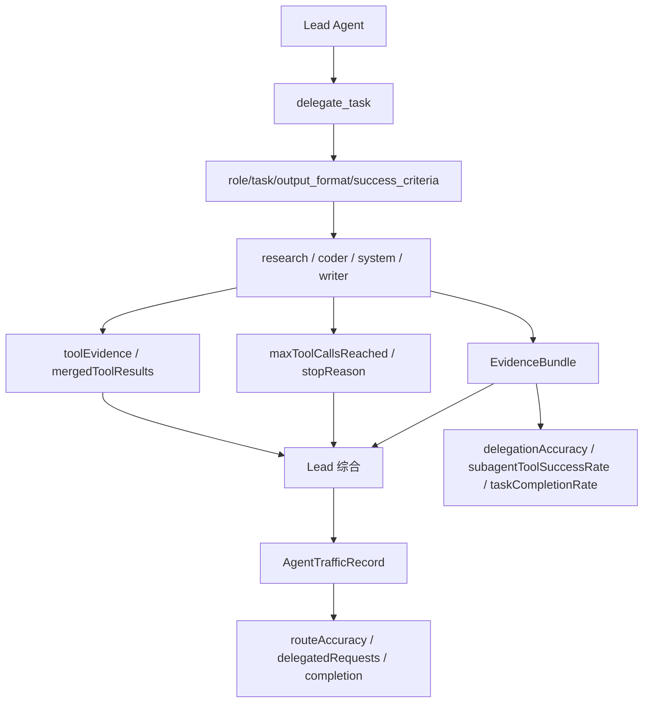

这里有几个实现点值得展开：

1. `delegate_task` 要求角色化输入，不再只是一个自由文本任务。`role`、`task`、`agent_name`、`output_format`、`success_criteria` 会共同定义子任务边界。
2. 子 Agent 禁止递归委派，避免“Agent 生 Agent”的失控结构。
3. 每类角色有工具面裁剪，例如 research 更偏搜索、抓取、知识库，coder 更偏代码和文件。
4. 子 Agent 预算耗尽不会被写进自然语言 answer，而是变成 `maxToolCallsReached` / `stopReason` 这样的结构化状态。
5. `mergedToolResults` 让 Lead Agent 不只看到子 Agent 摘要，还能看到压缩后的原始工具证据。
6. `agent_traffic_metrics.py` 会把真实请求中的工具调用、策略问题、委派状态变成滚动统计，为后续优化工具描述和路由策略提供数据。

技术分享时可以把这部分讲成“多 Agent 的可控性三件套”：

- 工具面隔离：不同角色只能用适合自己的工具。
- 证据结构化：EvidenceBundle 让 Lead 消费事实而不是只消费总结。
- 指标闭环：eval 和 traffic metrics 让委派准确率、工具成功率和任务完成率可度量。

## 10. Memory：Markdown-first 长期记忆

关键代码：

- `apps/api/app/core/markdown_memory.py`
- `apps/api/app/core/memory_paths.py`
- `apps/api/app/core/memory_consolidation.py`
- `apps/api/app/core/memory_backfill.py`
- `apps/api/app/api/v1/memory.py`

### 10.1 设计原则

Memory 模块的核心不是“把所有对话塞进向量库”，而是 Markdown-first：

- `MEMORY.md` 是长期记忆源文件。
- `daily/YYYY-MM-DD.md` 是每日候选和短期上下文。
- `DREAMS.md` 是整理报告。
- 索引只是可重建缓存。
- 用户可以直接打开 Markdown 文件检查和修改。

### 10.2 目录结构

```text
AI_NATIVE_OS_HOME/
  memory/
    default/
      MEMORY.md
      DREAMS.md
      daily/
        2026-06-22.md
      .dreams/
        state.json
        short-term.json
        phase-signals.json
        backups/
        locks/
```

### 10.3 召回原理

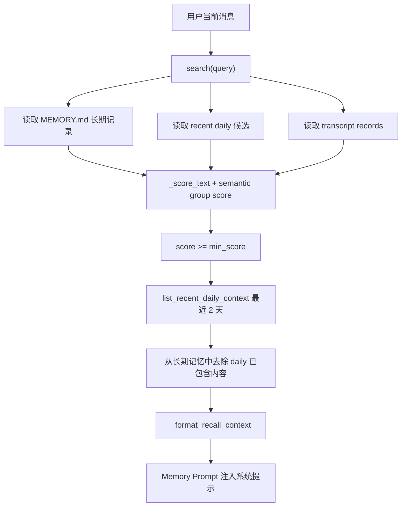

关键实现：

- `MarkdownMemoryManager.search` 读取长期、候选、transcript 三类记录并打分。
- `recall_context` 默认 `min_score=0.45`。
- `list_recent_daily_context` 默认读取最近 2 天 daily。
- `_dedupe_recalled_against_daily` 避免同一事实重复注入。
- `_format_recall_context` 生成“关于用户的已知信息”和“近期记忆上下文”。

### 10.4 写入候选记忆

一轮对话结束后，WebSocket 后端调用：

```text
memory_mgr.add_async(user_id, messages=[history[-6:], user, assistant])
```

`add_async` 做的事情：

1. 从最近消息中抽取候选记忆。
2. 生成 candidate id。
3. 打开当天 daily 文件。
4. 检查是否已存在相同 candidate id。
5. 插入一行 Markdown bullet。
6. 在 HTML comment 中记录 metadata：

```md
- 用户喜欢用中文输出技术文档 <!-- candidate:id=...; status=pending; user_id=default -->
```

这样既保持 Markdown 可读，又能机器解析状态。

### 10.5 Light / REM / Deep 整理

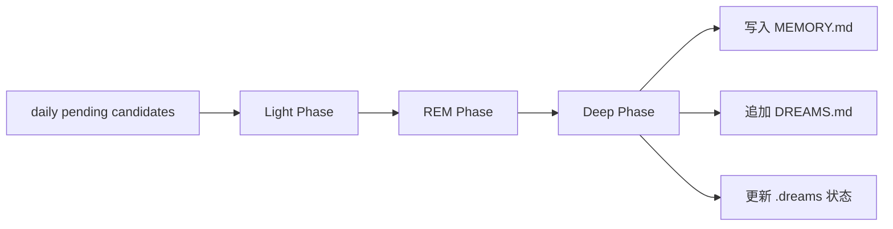

整理逻辑大致分为：

- Light：读取候选，做基础筛选和打分。
- REM：聚合、去重、计算信号。
- Deep：决定哪些候选晋升为长期记忆，写入 `MEMORY.md`，生成整理报告。

Settings 中的 Memory Manager 提供手动触发：

- `memory/consolidate`
- `memory/dreaming/sweep`
- `memory/backfill/stage`
- `memory/backfill/rollback`
- `memory/eval`

### 10.6 为什么 Memory 不等于 Knowledge

| 模块 | 内容 | 更新方式 | 主要用途 |
| --- | --- | --- | --- |
| Memory | 用户偏好、长期事实、交互中沉淀的个人上下文 | 对话后候选写入，定期整理 | 个性化和上下文连续性 |
| Knowledge | 用户上传文档、网页、资料片段 | 用户上传或浏览器保存页面 | RAG 检索和事实依据 |

Memory 更像“用户画像和长期上下文”，Knowledge 更像“文档资料库”。

## 11. Knowledge Base：混合检索 RAG

关键代码：

- `apps/api/app/core/knowledge.py`
- `apps/api/app/api/v1/knowledge.py`
- `apps/api/app/core/tools.py`

### 11.1 知识库初始化

Settings 中配置 Embedding 后，前端调用：

```text
POST /api/v1/knowledge/init
```

后端创建 `KnowledgeManager`，关键参数：

- `embedder_model`
- `embedder_api_key`
- `embedder_api_base`
- `qdrant_url`
- `max_concurrent_jobs`

`KnowledgeManager` 内部维护：

- Qdrant async client。
- 任务队列。
- worker tasks。
- collection ready event。
- active jobs 和 pending doc ids。

### 11.2 入库流程

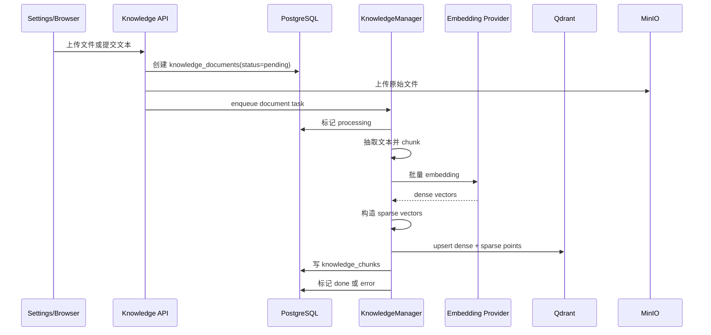

### 11.3 Chunking

`_chunk_text` 的策略：

- 默认 size 500。
- overlap 100。
- 优先在换行或空格处断开。
- 如果文本短于 size，则一个 chunk。

这个实现简单但实用，适合中文/英文混合文档的基础切分。

### 11.4 Hybrid Search

Qdrant collection：

- collection name：`ai_os_kb_hybrid_v1`
- dense vector name：`dense`
- sparse vector name：`sparse`

Sparse vector 通过：

1. 正则分词：英文 token 或单个中文字符。
2. blake2b hash 映射到 sparse index。
3. `1 + log(count)` 作为权重。
4. Qdrant `SparseVectorParams(modifier=IDF)`。

检索时：

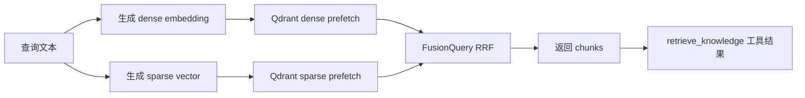

如果 sparse query 为空，则退化为纯 dense 检索。

### 11.5 Agent 如何使用知识库

当 KnowledgeManager 已初始化，`get_tools_for_model` 会加入 `retrieve_knowledge` schema。

模型调用后：

1. `execute_tool("retrieve_knowledge", {"query": ...})`
2. `manager.search(query, limit=5)`
3. 返回标题、相关度、chunk 内容。
4. AI Chat 前端用 ToolCallDisplay 展示知识来源。

## 12. Browser Runtime：真实浏览器控制

关键代码：

- 前端：`apps/web/src/apps/browser/Browser.tsx`
- API：`apps/api/app/api/v1/browser.py`
- 后端客户端：`apps/api/app/core/browser_session.py`
- 工具桥接：`apps/api/app/core/browser_tools.py`
- Runtime：`infra/browser-runtime/server.py`

### 12.1 为什么单独做 browser-runtime

浏览器控制需要真实浏览器进程、Playwright、持久化 storage state、截图、鼠标键盘事件和可视化接管。这些不适合塞进 Next.js 前端，也不适合直接运行在普通 API 路由里。

所以架构拆成：

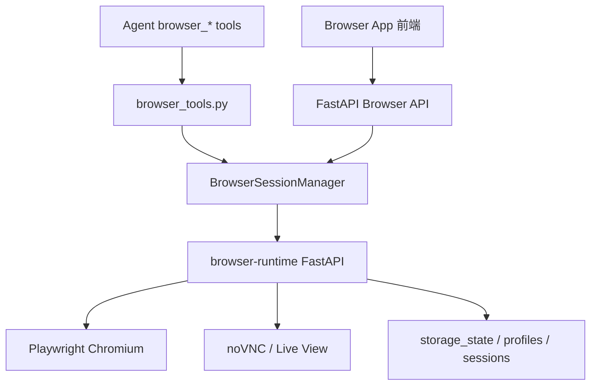

#### 12.1.1 Runtime 进程启动链

当前代码里的 browser-runtime 不是一个抽象服务，而是一组进程协同：

1. `infra/browser-runtime/entrypoint.sh` 清理旧的 Xvfb lock/socket。
2. 启动 `Xvfb :99`，给 headed Chromium 提供虚拟显示器。
3. 启动 `x11vnc`，把 `:99` 显示器暴露成 VNC。
4. 启动 `websockify`，把 VNC 转成浏览器可连接的 WebSocket/noVNC。
5. 启动 `server.py`，提供 Browser Runtime REST API。
6. `server.py` 在 startup 中启动 `async_playwright`，创建 BrowserContext/Page。

```mermaid
sequenceDiagram
  participant Entry as entrypoint.sh
  participant X as Xvfb :99
  participant V as x11vnc
  participant W as websockify/noVNC
  participant S as server.py FastAPI
  participant P as Playwright
  participant C as Chromium

  Entry->>X: start virtual display
  Entry->>V: bind VNC to :99
  Entry->>W: expose noVNC websocket
  Entry->>S: uvicorn server.py
  S->>P: async_playwright().start()
  P->>C: launch headed Chromium on :99
  C-->>X: render pixels
  V-->>W: stream display
```

这一版实现和早期计划里的“API 后端 connect_over_cdp 到容器 Chromium”不同：当前 API 后端只通过 HTTP 调 runtime，Playwright 控制逻辑收敛在 runtime 进程内。这样部署边界更清晰，API 服务不用直接持有浏览器进程句柄。

### 12.2 前端 Browser App 的两种控制方式

Browser App 有两条路径：

1. 用户直接点按钮：前端调用 `/browser/sessions/{id}/navigate`、`click`、`type` 等 API。
2. AI 自动化：前端先抽取页面状态，再调用 `completeOnce` 让模型生成下一步 action JSON，之后前端执行这个 action。

AI 浏览器动作 schema 大致是：

```json
{
  "status": "continue|done|need_user",
  "reply": "给用户看的中文说明",
  "action": {
    "action": "navigate|click|type|type_text|press|wait_for|wheel",
    "url": "可选",
    "selector": "可选",
    "text": "可选",
    "key": "可选",
    "timeout_ms": 10000,
    "delta_x": 0,
    "delta_y": 900,
    "press_enter": false
  }
}
```

### 12.3 Browser Runtime 内部数据结构

`infra/browser-runtime/server.py` 中的核心结构：

- `BrowserRuntime`
  - `playwright`
  - `sessions: dict[str, BrowserSession]`
- `BrowserSession`
  - `id`
  - `browser`
  - `context`
  - `tabs`
  - `active_tab_id`
  - `status`
  - `takeover_reason`
  - `resume_event`
  - `action_log`
- `BrowserTab`
  - page 引用
  - title/url 等状态

### 12.4 创建 Session 的过程

```mermaid
sequenceDiagram
  participant FE as Browser App
  participant API as FastAPI /browser
  participant C as BrowserSessionManager
  participant R as browser-runtime
  participant P as Playwright

  FE->>API: POST /browser/sessions
  API->>C: create_session
  C->>R: POST /sessions
  R->>P: chromium.launch
  R->>P: browser.new_context(options)
  R->>P: context.new_page
  R->>R: attach_tab + wire_context
  R-->>C: session detail
  C-->>API: session detail
  API-->>FE: session detail
```

Runtime 创建 context 时设置：

- viewport / screen。
- locale / timezone。
- Accept-Language。
- ignore_https_errors。
- accept_downloads。
- storage_state。

这让浏览器行为更接近真实用户浏览器。

### 12.5 页面状态抽取

Runtime 的 `get_state` 会从页面中抽取：

- 标题、URL。
- headings。
- inputs。
- 可交互元素列表。
- 每个元素的 text、placeholder、aria-label、name、type、href、selector、坐标和尺寸。

其中 selector 生成逻辑优先：

1. `#id`
2. `text=按钮文本`
3. `placeholder`
4. `aria-label`
5. `name`
6. `input[type=...]`
7. tag name

这就是 AI Browser 自动化能让模型选择 `text=登录` 或 `input[placeholder*=搜索]` 的原因。

### 12.6 点击与输入

点击不是简单调用一次 `locator.click`。Runtime 的 `_click_with_retries` 会：

1. 等待元素 visible。
2. scroll into view。
3. 尝试 click。
4. 如果失败，等待 domcontentloaded 和短暂 timeout。
5. 重试一次。

这是为了应对动态站点布局抖动。

输入分两类：

- `type(selector, text, press_enter)`：定位元素后 fill。
- `type_text(text)`：向当前 focused element 键盘输入。

这两类分别适合“明确选择输入框”和“用户/前一步已经聚焦”的场景。

### 12.7 人工接管

人工接管通过 `resume_event` 实现：

```mermaid
flowchart LR
  ai["AI 操作遇到登录/验证码"] --> request["request-human"]
  request --> status["session.status = human_takeover"]
  status --> user["用户在 live view 中手动操作"]
  user --> resume["POST /resume"]
  resume --> event["resume_event.set"]
  event --> ai2["AI 继续后续步骤"]
```

这是浏览器自动化非常重要的边界：复杂登录、验证码、二次验证不强行自动化，而是把控制权交给用户。

### 12.8 Browser 与 Knowledge 的联动

Browser 的“保存页面到知识库”流程：

1. Browser App 调用 `/browser/sessions/{id}/extract` 抽取当前页文本。
2. 前端或 API 确保 Knowledge 已初始化。
3. 调用 `/browser/sessions/{id}/save-page` 或 Knowledge API。
4. 页面标题、URL、正文进入 KnowledgeManager。
5. 后台 chunk、embedding、Qdrant upsert。
6. 后续 AI Chat 可通过 `retrieve_knowledge` 检索这页内容。

### 12.9 Browser Persistence：登录态、历史会话和细粒度操作

浏览器模块现在包含一层持久化能力，关键代码是：

- `apps/api/app/core/browser_persistence.py`
- `apps/api/app/models/browser.py`
- `apps/api/app/api/v1/browser.py`
- `apps/web/src/apps/browser/Browser.tsx`

#### 登录态保存与应用

`BrowserLoginProfile` 保存的是某个站点过滤后的 storage state，而不是整个浏览器全量状态。

```mermaid
flowchart LR
  session["当前 Browser Session"] --> export["export_storage_state"]
  export --> filter["filter_storage_state_for_site"]
  filter --> profile["BrowserLoginProfile"]
  profile --> list["/browser/profiles"]
  profile --> apply["/sessions/{id}/profiles/apply"]
  apply --> import["import_storage_state"]
  import --> context["新 BrowserContext"]
```

过滤逻辑在 `filter_storage_state_for_site()` 中完成：

- Cookie 按 domain 与目标 host 匹配。
- origins 按 origin host 匹配。
- 这样保存 GitHub 登录态时，不会把其他站点的 storage state 一并塞进 Profile。

#### 历史会话

`BrowserSessionRecord` 会保存：

- session id
- status
- current_url / current_title
- tab_count
- takeover_reason
- last_error
- action_log
- created_at / updated_at / closed_at

这让 Browser App 可以在“资料库”里展示历史 Session，并支持：

- 切回仍活跃的历史会话。
- 根据历史 URL 重新打开一个新会话。
- 查看之前的动作日志和错误。

#### 细粒度操作矩阵

| 操作 | Runtime API | 适用场景 |
| --- | --- | --- |
| 选择器点击 | `/click` | 普通按钮、链接、输入框。 |
| 坐标点击 | `/click-at` | 选择器不稳定或 canvas/复杂控件。 |
| 鼠标按下/移动/抬起 | `/mouse-down`, `/mouse-move`, `/mouse-up` | 拖动、滑块、画布操作。 |
| 拖拽 | `/drag` | 需要连续鼠标轨迹的交互。 |
| 滚轮 | `/wheel` | 页面滚动、嵌套滚动容器。 |
| 焦点输入 | `/type-text` | 已经由用户或 AI 聚焦的输入框。 |
| storage state | `/storage-state` | 登录态导入导出。 |
| Cookie | `/cookies` | 快速注入某站点 Cookie。 |
| 截图 | `/screenshot` | 视觉确认、后续多模态扩展。 |

分享时可以强调：Browser 模块不是“拿网页 HTML 做解析”，而是控制真实浏览器进程；也不是“让 AI 强行自动登录”，而是在登录、验证码、二次认证时把控制权交给用户，之后再从同一页面状态继续执行。

## 13. MCP 和 Skill：扩展系统如何接入 Agent

关键代码：

- `apps/api/app/core/app_registry.py`
- `apps/api/app/core/mcp_manager.py`
- `apps/api/app/core/extension_registry.py`
- `apps/api/app/core/tools.py`
- `apps/web/src/apps/settings/components/AppManager.tsx`
- `apps/web/src/apps/settings/components/SkillManager.tsx`

### 13.1 三个概念的边界

| 概念 | 给谁用 | 存在哪里 | 职责 |
| --- | --- | --- | --- |
| App Manifest | 系统和前端 | `apps_registry/*/manifest.json` 或 `mcp.json` | 描述应用、权限、工具、MCP transport。 |
| SKILL.md | Agent | App 目录或用户 Skill 目录 | 描述何时使用、如何使用、行为边界。 |
| MCP Server | Tool Runtime | 本地 stdio 或远程 HTTP | 暴露标准化工具。 |

### 13.2 MCP stdio 生命周期

```mermaid
sequenceDiagram
  participant UI as Extension Center
  participant AR as AppRegistry
  participant MM as MCPManager
  participant P as MCP Process
  participant A as Agent

  UI->>AR: 安装/启用 MCP app
  AR->>AR: 写入 AI_NATIVE_OS_HOME/mcp.json
  UI->>MM: activate app
  MM->>P: subprocess.Popen(command,args)
  MM->>P: initialize JSON-RPC
  P-->>MM: protocolVersion / capabilities
  MM->>P: notifications/initialized
  MM->>P: tools/list
  P-->>MM: tool schemas
  A->>MM: tools/call
  MM->>P: tools/call JSON-RPC
  P-->>MM: result
```

### 13.3 MCP HTTP 生命周期

HTTP/streamable MCP 不启动本地进程，而是：

1. 保存 url 和 headers。
2. 发送 JSON-RPC `initialize`。
3. 记录 `MCP-Session-Id`。
4. `tools/list` 分页拉取工具。
5. `tools/call` 调用远程工具。

### 13.4 工具别名和缓存

外部 MCP 工具进入 Agent 前会被转换成 function schema。为了避免每轮都扫 DB 和远程服务，`tools.py` 中有 30 秒 TTL 的 MCP route cache。

这带来一个取舍：

- 优点：降低每轮 Agent 请求延迟。
- 缺点：刚启用/禁用服务后需要 invalidate cache，代码中安装、删除、激活相关路径会触发缓存失效。

### 13.5 AppRegistry 的职责

AppRegistry 不只是读 manifest，它还负责：

- 同步内置 App manifest 到数据库。
- 管理外部 MCP app 配置。
- 迁移和清理历史外部 app。
- 激活/停用 app。
- 调用 app tool。
- 扫描用户 Skills。
- 解析 Skill frontmatter。
- 保存 Skill API Key。
- 在执行 Skill 时临时注入环境变量。

## 14. 文件系统：虚拟路径到真实磁盘

关键代码：

- `apps/api/app/core/file_manager.py`
- `apps/api/app/api/v1/files.py`
- `apps/web/src/apps/file-manager`

### 14.1 为什么做虚拟路径

前端和 Agent 不应该直接处理 `C:\Users\...` 这类 OS 路径。项目使用虚拟路径：

- Windows 根 `/` 表示“此电脑”。
- `/C/foo.txt` 表示 `C:\foo.txt`。
- `/Notes`、`/Documents`、`/Whiteboards` 映射到用户 Documents 下的 AI Web OS 子目录。
- 非 Windows 下 `/` 映射到 `FS_ROOT` 沙箱。

```mermaid
flowchart LR
  vpath["虚拟路径 /Notes/a.md"] --> normalize["normalize_path"]
  normalize --> map{"是否特殊根？"}
  map -- 是 --> special["~/Documents/AI Web OS/Notes/a.md"]
  map -- 否 --> win{"Windows 盘符？"}
  win -- 是 --> drive["C:\\..."]
  win -- 否 --> sandbox["FS_ROOT/..."]
  special --> check["路径穿越检查"]
  drive --> check
  sandbox --> check
  check --> op["真实文件 I/O"]
```

### 14.2 FileNode 和可逆 ID

真实文件会被包装成 `FileNode`：

- id
- name
- path
- parent_path
- kind
- mime_type
- size
- created_at
- updated_at

`id` 是虚拟路径的 URL-safe base64，可逆。这样前端可以用稳定 ID 调接口，同时后端仍能还原路径。

### 14.3 异步 API 与同步文件 I/O

Python 文件 I/O 本身是同步的。`file_manager.py` 用 `run_in_executor` 把同步 I/O 放到线程池，避免阻塞 FastAPI 事件循环。

## 15. Office Suite 的技术接入方式

Office 相关应用多数是前端富交互 + Files API 保存。

### 15.1 Notes

实现方式：

- 文件目录：`/Notes`。
- 内容格式：Markdown。
- 列表通过 Files API 读取。
- 保存通过 `PUT /files/content`。
- AI 操作通过 `completeOnce` 调 `/agents/complete`，不是完整 WebSocket Agent loop。

适合讲的点：Notes 是“轻量 App + 文件系统”的典型。

### 15.2 Document Editor

实现方式：

- 前端 TipTap 编辑器。
- 文档保存在 `/Documents`。
- HTML/Markdown/plain text 之间做转换。
- AI rewrite/translate/expand 等通过 `completeOnce`。
- DOCX 导出走 `/office/document/export-docx`，后端用 `python-docx` 生成。
- PDF 导出通过浏览器 print。

技术取舍：

- 编辑体验放前端，导出 DOCX 交给后端。
- 文件所有权仍在用户本地虚拟文件系统中。

### 15.3 Spreadsheet Editor

实现方式：

- SheetJS 读取 `xlsx/xls/xlsm/ods/csv`。
- Univer 渲染和编辑 workbook。
- 保存时把 workbook 序列化为二进制，再调用 `/files/binary-content`。

关键点：这不是后端表格服务，而是前端解析和编辑，后端只作为文件存储层。

### 15.4 Calendar

实现方式：

- 后端 `calendar_events` 表。
- API：`GET/POST/PUT/DELETE /calendar/events`。
- 前端月/周/日视图。
- AI 日程助手调用 `completeOnce`，要求模型返回 JSON events。
- 前端解析 JSON 后逐条调用 Calendar API。

### 15.5 Mail

实现方式：

- 后端管理 IMAP/SMTP 账户。
- 账户、邮件、附件元数据进入 PostgreSQL。
- 同步逻辑在后端。
- 前端负责账户管理、列表、详情、草稿、发送、附件下载。
- AI 摘要和回复通过 `completeOnce`。

### 15.6 Whiteboard

实现方式：

- 白板保存为 `/Whiteboards` 下 JSON。
- 前端维护 nodes/edges。
- AI 生成结构图时，让模型返回 JSON layout。
- 前端 normalize 节点类型和坐标，再写回文件。

### 15.7 Terminal

关键代码：

- `apps/web/src/apps/terminal/Terminal.tsx`
- `apps/web/src/hooks/useStream.ts`
- `apps/web/src/lib/backend.ts`
- `apps/api/app/api/v1/files.py`
- `apps/api/app/core/file_manager.py`
- `apps/api/app/core/tools.py`

Terminal 的实现要特别强调一个边界：它不是浏览器里的真实系统 shell，也不会把用户输入直接传给后端执行系统命令。它是一个“终端风格的系统 App”，底层由两条路径组成：

1. 可确定、安全的文件命令在前端直接解析，然后调用 Files API。
2. 非内置命令进入 Agent 路径，由模型在 `terminal` App 上下文中回答或调用允许的工具。

```mermaid
flowchart TB
  input["用户输入命令"] --> trim["trim + 写入 commandHistory"]
  trim --> builtin["executeBuiltinCommand(command, currentPath)"]
  builtin --> matched{"是否命中内置命令？"}
  matched -- 是 --> files["调用 Files API"]
  files --> output["格式化输出为终端文本"]
  output --> ui["写入 Terminal messages"]
  ui --> cwd["必要时更新 currentPath"]

  matched -- 否 --> model_cfg{"已配置可用模型？"}
  model_cfg -- 否 --> err["输出 bash: error"]
  model_cfg -- 是 --> stream["streamChat(appId=terminal)"]
  stream --> harness["后端 Agent Harness"]
  harness --> tools["可调用文件/知识/MCP 等工具"]
  tools --> tool_log["前端展示 ToolLog"]
  harness --> token["流式 token 输出"]
  token --> ui
```

#### 15.7.1 前端状态模型

`Terminal.tsx` 维护的核心状态包括：

| 状态 | 作用 |
| --- | --- |
| `messages` | 终端历史输出，包含 user、assistant、error 和工具日志。 |
| `input` | 当前输入框内容。 |
| `loading` | AI 命令是否正在流式执行。 |
| `currentPath` | 当前虚拟工作目录，默认 `/`。 |
| `commandHistory` | 用户输入过的命令，用于上下键历史导航。 |
| `historyIndex` | 当前浏览到的历史命令位置。 |
| `historyDraftRef` | 用户按上键前正在编辑的草稿。 |

窗口聚焦时，Terminal 会自动 focus 输入框；每次 messages 或 loading 变化后，会滚动到底部。这些行为让它看起来像终端，但执行模型并不是 shell。

#### 15.7.2 内置命令如何执行

`sendCommand` 首先调用：

```ts
const builtinResult = await executeBuiltinCommand(command, currentPath);
```

如果返回结果，说明命中了前端内置命令，不会进入模型。

当前内置命令包括：

| 命令 | 实现方式 |
| --- | --- |
| `进入 C 盘` | 解析成 `/C`，调用 `GET /files?path=/C` 列目录，并把 `currentPath` 更新为 `/C`。 |
| `ls` / `ll` | 调用 `parseListCommand`，解析路径参数，再调用 `GET /files?path=...`。 |
| `cd <path>` | 通过 `resolveTerminalPath` 计算目标路径，再调用 `GET /files/resolve?path=...` 校验路径存在，成功后更新 `currentPath`。 |
| `pwd` | 直接输出当前 `currentPath`。 |

`ls` 和 `ll` 的参数解析很克制：忽略 `-la` 这类 flag，只取第一个非 flag token 作为路径。这样 UI 可以接受常见终端习惯，但不会假装完整实现 Bash。

```mermaid
flowchart LR
  cmd["ls /Notes"] --> parse["parseListCommand"]
  parse --> path["resolveTerminalPath"]
  path --> api["GET /files?path=/Notes"]
  api --> entries["FileEntry[]"]
  entries --> format["formatEntryLine"]
  format --> text["终端文本输出"]
```

#### 15.7.3 cwd 和虚拟路径解析

Terminal 的 `currentPath` 不是 OS 真实路径，而是 File Manager 的虚拟路径。

`resolveTerminalPath(input, currentPath)` 的规则：

- 空输入：保持当前目录。
- `~`：映射到虚拟根 `/`。
- `C` 或 `C:`：映射到 `/C`。
- 以 `/` 开头：认为已经是虚拟绝对路径。
- 其他输入：拼到 `currentPath` 后面，再 normalize。

这和后端 `file_manager.py` 的虚拟路径体系对齐：

- `/` 在 Windows 上表示“此电脑”。
- `/C/...` 映射到 `C:\...`。
- `/Notes`、`/Documents`、`/Whiteboards` 映射到用户 Documents 下的 `AI Web OS` 目录。
- 非 Windows 环境下 `/` 映射到 `FS_ROOT` 沙箱。

```mermaid
flowchart TB
  terminal["Terminal currentPath=/C/Users"] --> input["cd ../Documents"]
  input --> resolve["resolveTerminalPath"]
  resolve --> vpath["/C/Documents 或规范化后的虚拟路径"]
  vpath --> files_api["/files/resolve"]
  files_api --> fm["file_manager._to_real"]
  fm --> disk["真实磁盘路径"]
  disk --> ok{"存在且可访问？"}
  ok -- 是 --> update["setCurrentPath(nextPath)"]
  ok -- 否 --> error["bash: 执行失败"]
```

这个设计让 Terminal、File Manager、Notes、Document Editor 等 App 共用一套路径模型。用户在 Terminal 里 `cd /Notes`，本质上进入的是 Notes App 使用的同一个虚拟目录。

#### 15.7.4 AI 命令模式如何接入 Harness

如果命令没有命中内置解析，Terminal 会检查当前是否有可用模型配置：

```ts
const ctx = getActiveModelContext();
```

没有模型时，直接输出：

```text
bash: error: 请先在设置中配置并选择可用模型。
```

有模型时，它调用 `streamChat`，但参数和 AI Chat 有几个明显区别：

| 参数 | Terminal 设置 |
| --- | --- |
| `appId` | `terminal` |
| `conversationId` | 空字符串，不走普通会话标题管理。 |
| `enableMemory` | `false`，终端命令默认不写入长期记忆。 |
| `systemPrompt` | 要求终端风格、简洁、直接、纯文本，禁止 Markdown。 |
| `history` | 来自当前 Terminal messages，把 error 也映射成 assistant。 |

Terminal 的 system prompt 核心约束是：

- 你是 AI-Web OS 的终端 App。
- 文件系统相关任务优先使用工具。
- 输出保持终端风格。
- 不要聊天语气。
- 严禁 Markdown、反引号、代码块、星号、井号。

也就是说，Terminal 的 AI 模式不是让模型扮演 Bash，而是让模型在终端语境下调用系统工具或输出命令式解释。

```mermaid
sequenceDiagram
  participant T as Terminal.tsx
  participant WS as useStream
  participant BE as websocket.py
  participant SC as skill_context.py
  participant AH as agent_loop
  participant Tools as tools.py

  T->>T: 未命中 executeBuiltinCommand
  T->>WS: streamChat(appId=terminal, enableMemory=false)
  WS->>BE: agent_invoke
  BE->>SC: build_skill_augmented_system_prompt(requested_app_id=terminal)
  SC-->>BE: 注入 Terminal App Skill 和工具规则
  BE->>AH: agent_loop
  AH->>Tools: get_tools_for_model(skill_context.entry_app_id=terminal)
  Tools-->>AH: 文件、记忆、知识、MCP、Skill 等非 Browser 工具
  AH-->>T: token / tool_call / tool_result
  T->>T: 渲染终端输出和 ToolLog
```

注意：因为 `entry_app_id=terminal`，`get_tools_for_model` 不会加入 Browser tools。Browser 工具只在当前入口 App 是 `browser` 时暴露。这避免用户在 Terminal 里随便一句话就触发浏览器控制。

#### 15.7.5 工具日志如何展示

Terminal 的 AI 模式会接收 `tool_call` 和 `tool_result` 事件，并把它们挂在当前 assistant message 的 `toolCalls` 上。

UI 中的 `ToolLog` 会显示：

- 工具显示名。
- 工具参数摘要。
- running/done/error 状态。
- 折叠后的原始结果。

`getToolSummary` 对常见工具做了摘要：

- `list_files` 显示路径。
- `read_file` 显示路径。
- `write_file` 显示路径。
- `retrieve_knowledge` 显示 query。
- `fetch_url` 显示 URL。

这让 Terminal 保持“命令行输出”外观，同时仍然能看到 Agent 实际调用过哪些系统工具。

#### 15.7.6 为什么不直接暴露真实 shell

这是 Terminal 模块最重要的安全取舍。

如果直接把用户输入传给后端 shell，会带来：

- 任意命令执行风险。
- 文件删除和系统破坏风险。
- 环境变量、密钥、运行时目录泄漏风险。
- Windows/Linux 差异导致行为不可控。
- 很难和 App 权限、虚拟文件系统、HITL 机制统一。

现在的实现把 Terminal 限制在可控边界内：

- 确定性文件操作走 Files API。
- 路径使用虚拟路径，而不直接暴露真实 OS path。
- 未识别命令走 Agent Harness，而不是 `subprocess`。
- Agent 能调用的工具仍受 `get_tools_for_model`、Skill Context、ToolPolicyGuard、HITL 和结果校验约束。
- 需要真实代码执行时，系统有单独的 `python_exec` 工具，并由 Harness 管控，而不是 Terminal 任意执行 shell。

所以 Terminal 更准确的定位是：

> 一个带终端外观和少量内置命令的 AI 系统控制台，而不是完整 Bash/CMD 替代品。

## 16. Settings：本地配置和系统控制台

关键代码：`apps/web/src/apps/settings`

Settings 是很多系统能力的“控制面”：

| Tab | 实现重点 |
| --- | --- |
| API Keys | Provider、Key、Base URL、模型拉取、连接测试、本地 localStorage 保存。 |
| Memory | 调 Memory API，展示 Markdown 路径、候选记忆、dreaming 状态。 |
| Knowledge | 初始化 KnowledgeManager、上传文档、搜索、删除。 |
| Extensions | 管理 MCP app、Skill、权限、健康检查。 |
| Channels | QQ Bot 配置和重启。 |
| Avatar | Live2D 模型、人格、位置、大小。 |
| About | 本地配置导入导出和数据所有权说明。 |

### 16.1 Provider 配置为什么放前端

`settingsStore` 把 API Key、Base URL、启用模型、Embedding 配置放在 localStorage。每次请求时前端把当前 Key 带给后端。

这样做的优点：

- 用户 Key 不需要长期存后端数据库。
- 换 Provider 不需要后端重启。
- 多 Provider UI 灵活。

代价：

- 换浏览器或清理站点数据会丢配置。
- 多设备同步需要额外导入导出。

### 16.2 SOUL.md 与当前人格能力的边界

`ARCHITECTURE.md` 里有 SOUL.md 人格系统设计，但对照当前代码，更准确的分享口径是：

- 当前已经落地的是 Settings 中的模型/Provider/记忆/渠道/Avatar 配置，以及 Avatar Store 中的人格预设和情绪状态。
- Agent 的行为人格主要来自 system prompt、App Skill、Memory Recall 和用户配置，而不是一个完整独立的 SOUL.md 路由/API 模块。
- 因此 SOUL.md 可以作为早期架构设计或未来方向提到，但不要把它当成当前已完整实现的核心功能。

## 17. External Channels：QQ Bot 复用 AgentTurnRunner

关键代码：

- `apps/api/app/api/v1/channels.py`
- `apps/api/app/core/channel_runtime.py`
- `apps/api/app/core/channel_hub.py`
- `apps/api/app/channels/qqbotpy_adapter.py`
- `apps/api/app/core/agent_runner.py`

外部渠道没有重新实现一套 AI 逻辑，而是复用 `AgentTurnRunner`。

```mermaid
flowchart LR
  qq["QQ Bot 消息"] --> adapter["qqbotpy_adapter"]
  adapter --> hub["ChannelHub"]
  hub --> runner["AgentTurnRunner"]
  runner --> skill["Skill Context"]
  runner --> memory["Memory Recall"]
  runner --> loop["agent_loop"]
  loop --> tools["Tools"]
  loop --> reply["回复内容"]
  reply --> adapter
```

这样 QQ Bot 和 Web AI Chat 可以共享：

- 模型调用。
- Memory。
- Skill。
- Tools。
- 会话保存。
- 工具策略。

差异只是入口和消息适配层。

## 18. Avatar Pet 的实现方式

关键代码：

- `apps/web/src/components/avatar`
- `apps/web/src/stores/avatarStore.ts`
- `apps/api/app/api/v1/avatar.py`

Avatar Pet 是桌面层的浮动 companion：

- 状态保存在 `avatarStore`。
- Live2D 模型可以来自 URL、本地 zip 或预设。
- zip 上传到后端后，后端保存并提供 `/avatar/assets/...` 访问。
- 对话时使用 avatar 专用或默认模型。
- 模型输出中的 emotion 标记映射到 Live2D expression。

从架构上看，Avatar 是桌面 Shell 与 AI Chat 的轻量变体：它也使用模型能力，但交互形态是“桌面伙伴”。

## 19. 数据和运行时架构

```mermaid
flowchart TB
  api["FastAPI"] --> pg["PostgreSQL"]
  api --> redis["Redis"]
  api --> minio["MinIO"]
  api --> qdrant["Qdrant"]
  api --> home["AI_NATIVE_OS_HOME"]
  api --> docs["用户 Documents/AI Web OS"]
  api --> br["browser-runtime"]

  pg --> pgdata["会话、消息、设置、知识元数据、邮件、日历、渠道"]
  minio --> raw["知识库原始文件"]
  qdrant --> vectors["知识库向量"]
  home --> memory["Markdown Memory"]
  home --> mcpjson["mcp.json"]
  home --> skills["skills/user"]
  docs --> files["Notes/Documents/Whiteboards"]
  br --> browserdata["浏览器 Session/Profile/Storage State"]
```

### 19.1 数据所有权

| 数据 | 位置 | 说明 |
| --- | --- | --- |
| API Key 和模型配置 | 浏览器 localStorage | 前端随请求传后端。 |
| 会话和消息 | PostgreSQL | 后端保存，用于历史会话。 |
| Memory | `AI_NATIVE_OS_HOME/memory` | Markdown 是源文件。 |
| Knowledge 文档元数据 | PostgreSQL | 状态、标题、chunk 信息。 |
| Knowledge 原文 | MinIO | 上传文件原始内容。 |
| Knowledge 向量 | Qdrant | dense + sparse。 |
| MCP 配置 | `AI_NATIVE_OS_HOME/mcp.json` | 外部服务本地配置。 |
| User Skills | `AI_NATIVE_OS_HOME/skills/user` | 用户技能目录。 |
| 办公文件 | `~/Documents/AI Web OS` | Notes、Documents、Whiteboards。 |

## 20. 部署时各服务如何协同

Docker Compose 包含：

- web
- api
- browser-runtime
- postgres + pgvector
- redis
- minio
- qdrant

```mermaid
flowchart LR
  web["Web 13000"] --> api["API 18000"]
  api --> pg["Postgres 15432"]
  api --> redis["Redis 16379"]
  api --> minio["MinIO 19000/19001"]
  api --> qdrant["Qdrant 16333/16334"]
  api --> br["Browser Runtime 18100"]
  web --> novnc["Browser Live 16080"]
```

本地开发时：

```bash
cd apps/api
uv run uvicorn app.main:app --reload --host 0.0.0.0 --port 8000
```

```bash
cd apps/web
pnpm dev
```

## 21. 可观测性和失败处理

### 21.1 前端可观察

用户可以看到：

- status 文本。
- reasoning 内容。
- tool_call 和 tool_result。
- workflow_plan 和 workflow_summary。
- subagent_token 和 subagent_result。
- usage_estimate。
- 确认弹窗。

### 21.2 后端可观察

后端记录：

- Agent traffic metrics。
- Tool policy events。
- Tool validation events。
- Workflow summary。
- Knowledge job status。
- Memory dreaming status。
- Browser action_log。
- MCP health status。

### 21.3 指标闭环：从一次请求到可评估数据

一次 Agent 请求结束后，系统会留下几类不同粒度的证据：

```mermaid
flowchart TB
  turn["一次 Agent Turn"] --> events["streaming events"]
  turn --> graph["graph_node checkpoint"]
  turn --> traffic["AgentTrafficRecord"]
  turn --> trace["Phoenix / LangSmith trace"]
  turn --> usage["usage_estimate"]

  events --> ui["前端时间线"]
  graph --> state["节点状态诊断"]
  traffic --> api["/api/v1/agents/metrics/traffic"]
  trace --> llm["LLM / tool 调用链"]
  usage --> cost["Token 本地估算"]

  api --> optimize["优化工具描述、委派规则和 fallback policy"]
  state --> optimize
  trace --> optimize
```

`AgentTrafficRecord` 会记录：

- `conversation_id`
- provider/model
- tool call 数量
- route checks / correct routes
- 是否发生 delegate
- 是否完成
- error 类型

`agent_multi_eval_metrics.py` 则面向离线 eval，关注：

- delegationAccuracy：Lead Agent 是否把任务拆给了正确角色。
- subagentToolSuccessRate：子 Agent 工具调用是否成功。
- taskCompletionRate：端到端任务是否完成。

这套指标体系的价值在于：项目不只是在 UI 上展示“Agent 正在做什么”，还把过程压成可比较的数据。后续换模型、改工具描述、调整 fallback policy，都能通过 eval 和真实流量指标验证效果。

### 21.4 失败处理路径

| 失败类型 | 处理方式 |
| --- | --- |
| 缺 API Key | WebSocket 返回 `agent_error`。 |
| 工具被策略拦截 | 生成工具结果并注入模型上下文。 |
| 用户拒绝确认 | 工具不执行，模型得到拒绝结果。 |
| 工具执行异常 | 转成字符串结果，标记 error。 |
| 工具结果不合格 | `validate_tool_result` + fallback hint。 |
| Knowledge 处理失败 | document status 标记 `error`，保存 error_msg。 |
| Browser 操作失败 | session.last_error + action_log。 |
| MCP 初始化失败 | active server 标记 error/unhealthy。 |
| 子 Agent 超出并发 | 返回 skipped subagent_result。 |

## 22. 一条复杂任务的完整例子

假设用户说：

> 帮我打开浏览器搜索某个技术主题，把网页保存到知识库，再结合我的记忆总结成一份笔记。

实际链路会是：

```mermaid
flowchart TB
  user["用户请求"] --> chat["AI Chat"]
  chat --> ws["WebSocket agent_invoke"]
  ws --> skill["Skill Context: 当前 AI Chat + App 目录"]
  ws --> memory["Memory Recall"]
  ws --> harness["Agent Harness"]
  harness --> plan["生成 workflow_plan"]
  harness --> browser{"需要 Browser？"}
  browser --> browser_tool["browser_* 工具"]
  browser_tool --> runtime["browser-runtime 控制真实浏览器"]
  runtime --> extract["抽取网页文本"]
  extract --> kb["Knowledge API 入库"]
  kb --> qdrant["Embedding + Qdrant"]
  harness --> note["write_file / save_note"]
  note --> files["/Notes 保存 Markdown"]
  harness --> answer["总结执行结果"]
```

在这个例子中，几个模块同时出现：

- Skill Context 决定工具边界。
- Memory Recall 提供个性化上下文。
- Browser Runtime 获取真实网页内容。
- Knowledge Base 保存可复用资料。
- File Manager/Notes 保存产物。
- Harness 负责把这些步骤串起来并可视化。

## 23. 技术分享现场建议打开的代码

如果现场要演示代码，建议按这个顺序打开：

1. `apps/web/src/apps/ai-chat/AiChat.tsx`  
   看前端如何构建 history 和处理 tool/subagent/status 事件。

2. `apps/web/src/hooks/useStream.ts`  
   看 WebSocket requestId、事件派发、心跳和 idle timeout。

3. `apps/api/app/api/websocket.py`  
   看后端如何注入 Skill、Memory、HITL callback，并转发 Agent 事件。

4. `apps/api/app/core/llm_provider.py`  
   看 `agent_loop` 如何构建工具、调用模型、执行工具和校验。

5. `apps/api/app/core/tools.py`  
   看工具 schema、execute_tool、多来源工具聚合。

6. `apps/api/app/core/subagent.py`  
   看多 Agent 如何并行执行并合并事件流。

7. `apps/api/app/core/markdown_memory.py`  
   看 Markdown Memory 如何召回和写候选。

8. `apps/api/app/core/knowledge.py`  
   看 chunk、embedding、Qdrant dense/sparse hybrid search。

9. `infra/browser-runtime/server.py`  
   看真实浏览器控制、页面状态抽取、点击重试和人工接管。

10. `apps/api/app/core/mcp_manager.py`  
    看 stdio/HTTP MCP 的 initialize、tools/list、tools/call。

## 24. 这套架构的关键取舍

### 24.1 App-first，而不是 Chat-first

优点：

- AI 可以绑定业务上下文。
- 用户工作流更自然。
- 多应用协同空间更大。

代价：

- 前端状态和窗口管理复杂。
- App 与 Agent 上下文需要额外桥接。

### 24.2 Markdown Memory，而不是纯向量库 Memory

优点：

- 用户可读、可审计、可迁移。
- 长期记忆有明确源文件。
- 索引可以重建。

代价：

- 需要 Markdown 解析、候选状态和整理机制。
- 检索能力需要额外打分或索引增强。

### 24.3 Browser Runtime 独立进程

优点：

- Playwright 和浏览器状态与 API 解耦。
- 支持真实浏览器和 live view。
- 易于容器化。

代价：

- 多一个服务和端口。
- 需要处理 runtime 不可用、session 丢失、storage state 同步。

### 24.4 Harness 约束模型

优点：

- 工具调用更可控。
- 失败路径更可解释。
- 多 Agent 和工作流可观察。

代价：

- Agent loop 复杂度提升。
- 需要维护策略、校验、fallback 和上下文压缩。

### 24.5 MCP/Skill 双扩展

优点：

- MCP 适合标准工具生态。
- Skill 适合本地知识、脚本和工作流说明。
- 两者都能进入 Agent 工具面。

代价：

- 安全边界更重要。
- stdio MCP 和脚本 Skill 都依赖后端运行环境。

## 25. 分享结尾总结

AI Native OS 的技术核心可以归纳为一句话：

> 它用 Web Desktop 组织用户工作流，用 Agent Harness 管控模型执行，用 Markdown Memory 和 Knowledge Base 沉淀上下文，用 MCP/Skill/Browser Runtime 扩展行动能力。

从工程实现看，项目最有价值的不是某个单点功能，而是这些能力之间的组合：

- 前端桌面让 AI 有了工作场景。
- WebSocket 流式协议让 Agent 执行过程可见。
- Harness 让工具调用从“模型自由发挥”变成“受控工作流”。
- Memory 让系统记住用户。
- Knowledge 让系统引用用户资料。
- Browser Runtime 让系统能操作真实网页。
- MCP/Skill 让能力可以持续扩展。

如果团队后续继续演进，最值得投入的方向是：

- 更强的工具权限模型和审计。
- 更稳定的 Browser selector/视觉定位。
- Memory 的更智能整理和冲突解决。
- Knowledge 的增量更新和更强 rerank。
- 多 Agent 的任务规划质量和失败恢复。
- App 与 Agent 之间更标准的上下文协议。
