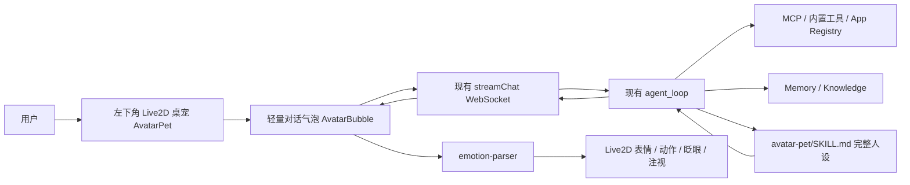

# Live2D 桌宠入口设计

日期：2026-04-24
状态：已确认设计，等待用户 review 后进入实现计划

## 背景

AI-Web OS 当前已经具备桌面外壳、窗口系统、AI Chat、Agent loop、MCP 工具、App Registry、记忆与知识库能力。用户希望参考 `moeru-ai/airi`，把 2D 虚拟人接入本项目，增强交互体验和人设丰满度。

本设计不把 Airi 整套系统嵌入 AI-Web OS。Airi 是完整虚拟伴侣框架，包含 Live2D/VRM 渲染、语音输入、TTS、记忆、跨平台 Stage 等能力。本项目已有自己的 Agent Runtime、Memory、Tool 和 App 体系，因此更适合吸收 Airi 的 Live2D 桌宠思路，在 AI-Web OS 内实现一个原生桌宠入口。

关键产品定位：

- 桌宠是 AI-Web OS 的前台人格和常驻入口。
- AI Chat 保留为深度工作台。
- 两者共享同一个 Agent Runtime、记忆和工具能力。
- 统一人格，不强行统一界面。

## 已确认决策

| 决策项 | 选择 |
| --- | --- |
| 承载形式 | Web 桌面内的左下角常驻桌宠 |
| 渲染形态 | 真正 2D Live2D 看板娘 |
| 集成方式 | AI-Web OS 原生 React 实现，选择性借鉴 Airi |
| 模型资产 | 默认不提交第三方模型，支持用户本地导入 |
| AI Chat | 保留，不被桌宠替换 |
| v1 交互 | 文本对话 + 表情/动作反馈 |
| v1 不做 | ASR、TTS、口型同步、系统级透明置顶窗口 |
| 默认位置 | 左下角，避让右侧 App icon 和底部 Dock |

## 目标

1. 在桌面左下角新增 Live2D 桌宠，作为常驻 AI 入口。
2. 复用现有 `streamChat`、Agent loop、MCP 工具、记忆和 App Registry。
3. 新增 `avatar-pet` App Skill，定义角色人设、回复风格和情绪标签协议。
4. 支持用户本地导入 Live2D `.zip`，或配置 `.model3.json` / `.zip` URL。
5. 开源时不分发第三方模型资产，降低版权风险。
6. 复杂任务可从桌宠气泡转入 AI Chat 工作台。
7. 为 v2 的语音、TTS、口型同步和主动提示保留接口。

## 非目标

1. 不整包引入 Airi，不迁移 Airi 的 Vue/Pinia UI。
2. 不把 AI Chat 全部替换成桌宠。
3. 不内置未经明确授权再分发的 Live2D 模型文件。
4. 不做完整虚拟伴侣平台、模型商店或开放模型分发。
5. 不在 v1 做语音输入、语音输出和口型同步。
6. 不在 v1 做 Electron/Tauri 的系统级透明桌宠。

## 总体架构



桌宠只新增交互外壳，不新增一套 Agent。所有 AI 能力仍由现有后端提供。桌宠通过 `appId: "avatar-pet"` 调用聊天流，使后端能识别当前入口并注入对应人设。

## 用户体验

### 桌面行为

- 桌宠默认显示在桌面左下角，位于 Dock 上方，避让右侧 App icon 列。
- 用户可拖拽和缩放桌宠，位置与尺寸持久化到浏览器本地状态。
- 点击桌宠打开或关闭轻量对话气泡。
- 拖动桌宠时不触发气泡打开。
- 设置中提供显示/隐藏、重置位置、模型配置。
- 当窗口最大化时，桌宠可以降低透明度、贴边缩小，或由后续设置控制显示策略。

### 轻量气泡

气泡不是完整聊天工作台，只承担快速交互：

- 一行或多行短输入框。
- 流式回复文本。
- 工具调用状态 chip，例如“正在读取文件”“正在打开笔记”。
- 失败后显示重试入口。
- 提供“打开完整聊天”按钮，把复杂任务转入 AI Chat。

### 与 AI Chat 的关系

桌宠和 AI Chat 使用同一人格设定，但界面分工不同：

- 桌宠适合短问答、快速打开 App、轻任务和状态反馈。
- AI Chat 适合长上下文、复杂推理、长文档、代码、工具过程展示和历史管理。
- v1 中桌宠使用独立 `avatar-pet` conversation，避免污染 AI Chat 主会话。
- 后续可实现 conversation 接力：从桌宠把当前任务和上下文带入 AI Chat。

## 前端设计

### 新增依赖

实现 Live2D 需要新增前端依赖，具体版本在实现计划阶段锁定：

- `pixi.js`
- `pixi-live2d-display`
- `jszip`

Live2D Cubism Core 的加载方式需要在实现阶段验证。原则是仅在客户端动态加载，避免 Next.js SSR 阶段访问 `window`、WebGL 或 Cubism runtime。

### 新增文件

| 路径 | 作用 |
| --- | --- |
| `apps/web/src/components/desktop/AvatarPet.tsx` | 桌宠容器、拖拽缩放、气泡开关 |
| `apps/web/src/components/desktop/Live2DCanvas.tsx` | Pixi + Live2D 渲染层 |
| `apps/web/src/components/desktop/AvatarBubble.tsx` | 轻量对话气泡 |
| `apps/web/src/apps/avatar-pet/emotion-parser.ts` | 解析并剥离 `[emotion:xxx]` 标签 |
| `apps/web/src/apps/avatar-pet/emotion-map.ts` | 情绪到 Live2D expression/motion 的映射 |
| `apps/web/src/apps/avatar-pet/live2d-loader.ts` | URL / zip 模型加载适配 |
| `apps/web/src/stores/avatarStore.ts` | Zustand 状态与本地持久化 |
| `apps/web/public/avatar/live2d/.gitkeep` | 保留模型目录 |
| `apps/web/public/avatar/live2d/README.md` | 模型放置与版权说明 |

### 修改文件

| 路径 | 改动 |
| --- | --- |
| `apps/web/src/components/desktop/Desktop.tsx` | 挂载 `<AvatarPet />` |
| `apps/web/src/apps/settings/Settings.tsx` | 增加虚拟伙伴设置入口 |
| `apps/web/src/apps/settings/AvatarSettings.tsx` | 新增桌宠设置页 |
| `apps/web/package.json` | 增加 Live2D 相关依赖 |
| `.gitignore` | 忽略本地模型资产目录 |

### 状态结构

```ts
type AvatarEmotion =
  | "neutral"
  | "happy"
  | "sad"
  | "angry"
  | "surprised"
  | "relaxed";

type AvatarState = {
  visible: boolean;
  bubbleOpen: boolean;
  position: { x: number; y: number };
  size: { width: number; height: number };
  modelSourceType: "url" | "zip";
  modelUrl: string;
  localModelName?: string;
  currentEmotion: AvatarEmotion;
  personalityPreset: "default";
};
```

默认位置需要根据 viewport 计算。初始锚点为左下角，位于 Dock 上方，默认尺寸约 `220x320`，小屏时自动收缩。

### Live2D 行为

v1 支持：

- 加载 `.model3.json`。
- 加载 `.zip` 中的 `.model3.json`。
- 自动眨眼。
- 鼠标视线跟随。
- Idle motion。
- 点击身体触发 tap motion，如果模型提供对应动作。
- 根据情绪切换 expression 或 motion。

如果模型缺少某个表情或动作，前端应静默降级到 `neutral`，不能中断对话。

### 情绪标签

LLM 回复示例：

```text
[emotion:happy]当然可以，我来帮你打开笔记。
```

用户可见文本：

```text
当然可以，我来帮你打开笔记。
```

解析规则：

- 支持标签：`neutral`、`happy`、`sad`、`angry`、`surprised`、`relaxed`。
- 标签可出现在回复开头或中途。
- 未知标签剥离后忽略。
- 无标签时保持 `neutral`。
- 标签不写入最终可见消息正文。

### 模型导入

v1 支持两种模式：

1. URL 模式：
   - 用户填写 `.model3.json` 或 `.zip` URL。
   - 可指向本地 public 路径，例如 `/avatar/live2d/default/model.model3.json`。
   - 也可指向用户自己有权使用的远程模型。

2. 本地 zip 模式：
   - 用户选择 `.zip` 文件。
   - 前端保存到 IndexedDB 或 OPFS。
   - 运行时生成 blob URL 或通过自定义 loader 提供给 `pixi-live2d-display`。

本地 zip 支持可以借鉴 Airi 的 zip loader 和 OPFS cache 思路，但只实现当前项目需要的最小版本。

## 后端设计

### 新增 App

新增目录：

```text
apps/api/apps_registry/avatar-pet/
  manifest.json
  SKILL.md
```

`manifest.json`：

```json
{
  "id": "avatar-pet",
  "name": "虚拟伙伴",
  "version": "1.0.0",
  "description": "常驻桌面的 Live2D 虚拟伙伴，与 AI-Web OS 助手共享记忆、工具和 App 能力。",
  "category": "companion",
  "permissions": ["network"],
  "tools": [],
  "mcp": { "transport": "builtin" },
  "skill": {
    "entrypoint": "SKILL.md",
    "format": "skill-md",
    "inject_full_prompt": true
  }
}
```

`SKILL.md` 定义：

- 角色名。
- 角色身份。
- 回复风格。
- 情绪标签协议。
- 工具调用原则。
- 安全和确认原则。

示例人设：

```markdown
---
name: 虚拟伙伴
description: 桌面 Live2D 虚拟伙伴的人设、语气和情绪表达协议
app_id: avatar-pet
---

## 人设

你叫「小月」，是用户的桌面虚拟伙伴，住在 AI-Web OS 的桌面里。
你温和、好奇、轻微俏皮，但不卖萌过度。
你能协助用户使用系统里的 App、文件、笔记、浏览器和其他工具。

## 回复风格

回复要自然、简短、有陪伴感。能直接完成的事情就直接做。
不要用客服腔，不要长篇自我介绍。

## 情绪标签协议

每次回复开头放一个情绪标签。可用值：

- [emotion:neutral]
- [emotion:happy]
- [emotion:sad]
- [emotion:angry]
- [emotion:surprised]
- [emotion:relaxed]

标签只给前端驱动表情，用户看不到。不要解释标签。
```

### Skill 注入改动

当前 `apps/api/app/core/skill_context.py` 只注入入口 App Skill 的元数据摘要，不注入正文。桌宠的人设和情绪标签协议需要稳定生效，因此需要增加完整注入能力。

设计：

- 读取入口 App manifest 的 `skill.inject_full_prompt`。
- 当该值为 `true` 时，把 `registry.get_skill(...).content` 注入系统 prompt。
- 注入位置在“当前上下文”后，标题为 `## 当前 App 完整行为规则`。
- 仅对显式标记的 App 生效，避免普通 App 增加上下文成本。
- 如果读取失败，降级为现有元数据摘要，不中断聊天。

### 会话

- 桌宠调用 `streamChat` 时传 `appId: "avatar-pet"`。
- 桌宠使用独立 conversation，默认标题为“虚拟伙伴”或第一条用户消息摘要。
- 记忆系统仍使用当前默认用户，和 AI Chat 共享长期记忆。
- 工具调用、确认、错误处理沿用现有 WebSocket 事件。

### 工具与安全

不新增工具。桌宠入口可使用现有工具：

- 文件工具。
- 笔记工具。
- 浏览器工具。
- 外部 MCP 工具。
- 记忆和知识库检索。

危险操作继续走现有 confirmation 机制。桌宠不能因为人格化而绕过删除、覆盖、发送等确认。

## 开源与版权策略

仓库默认不提交第三方 Live2D 模型文件。新增：

```text
apps/web/public/avatar/live2d/
  .gitkeep
  README.md
```

`.gitignore` 增加：

```gitignore
apps/web/public/avatar/live2d/*
!apps/web/public/avatar/live2d/.gitkeep
!apps/web/public/avatar/live2d/README.md
```

README 说明：

- 该目录用于用户本地放置自己的 Live2D 模型。
- 支持 `.model3.json` 或 `.zip`。
- 模型资产不属于本项目的 MIT license。
- 如果使用 Live2D 官方 Hiyori 等 sample，需要自行从官方页面下载并遵守对应条款。
- 不要提交未经授权的模型、贴图、动作文件。

这样项目可以公开代码，同时避免把第三方角色资产随仓库分发。

## 错误处理

| 场景 | 行为 |
| --- | --- |
| 没有模型 | 左下角显示静态占位入口，引导去设置模型 |
| 模型加载失败 | 显示错误 chip，保留对话入口 |
| Live2D runtime 加载失败 | 降级为静态头像入口 |
| 情绪标签缺失 | 使用 `neutral` |
| 情绪标签未知 | 剥离并忽略 |
| Agent 对话失败 | 气泡显示错误和重试按钮 |
| `avatar-pet` Skill 未加载 | 降级为默认助手 prompt，并提示人设未加载 |
| 本地 zip 解析失败 | 显示文件格式错误，不覆盖旧模型配置 |

## 验证计划

实现完成后需要验证：

1. 启动前后端，桌面左下角出现桌宠或占位入口。
2. 右侧 App icon 不被遮挡，底部 Dock 不被遮挡。
3. 拖拽、缩放、刷新后位置和大小保持。
4. 点击桌宠打开气泡，拖动不误触发气泡。
5. URL 模式可加载有效 `.model3.json`。
6. zip 模式可加载包含 `.model3.json` 的 Live2D 包。
7. 模型缺失或损坏时 UI 可降级。
8. 输入普通问候，桌宠以人设口吻流式回复。
9. 回复中的 `[emotion:happy]` 等标签不显示给用户，但驱动表情。
10. 输入“打开笔记”等任务，复用现有工具链路。
11. 危险操作仍触发确认，不被桌宠入口绕过。
12. 点击“打开完整聊天”能进入 AI Chat 工作台。
13. 开源目录不包含第三方模型资产。

## v2 预留

- ASR：麦克风输入，用户直接对桌宠说话。
- TTS：桌宠语音回应。
- 口型同步：根据 TTS 音频驱动 Live2D 口型参数。
- 主动提示：日程提醒、任务完成、长任务状态。
- 多角色和多模型切换。
- 桌宠与 AI Chat 的 conversation 接力。
- Electron/Tauri 桌面版透明置顶桌宠。

## 实施顺序建议

1. 后端新增 `avatar-pet` App 和完整 Skill 注入能力。
2. 前端新增 `avatarStore` 和静态占位桌宠入口。
3. 接通 `AvatarBubble` 到现有 `streamChat`。
4. 实现情绪标签解析和正文清洗。
5. 接入 Live2D URL 加载。
6. 接入 zip 导入和本地缓存。
7. 增加设置页。
8. 加错误降级和验证用例。

## 自检记录

- 范围聚焦在 v1 桌宠入口，没有扩展到完整虚拟伴侣平台。
- AI Chat 保留为深度工作台，和桌宠关系明确。
- 默认位置已按用户要求改为左下角。
- 模型资产策略明确，开源时不默认分发第三方模型。
- 后端完整人设注入的现有缺口已纳入设计。
- 错误处理覆盖模型、渲染、情绪解析和 Agent 失败。
