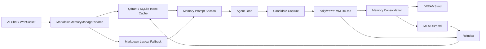

# Markdown 本地记忆系统设计

日期：2026-04-28
状态：设计草案，等待用户 review 后进入实现

## 背景

AI-Web OS 当前记忆实现以 `mem0 + Qdrant` 为主。聊天请求开始时，后端会从 mem0 搜索相关记忆并注入系统提示词；回复结束后，再把本轮用户消息和助手回复异步交给 mem0 抽取并写入长期记忆。

这套方案可以工作，但它的权威数据在向量库和 mem0 内部结构里，不够符合本项目已经形成的本地优先风格。项目的 Skills 已经采用类似 OpenClaw 的本地目录和 `SKILL.md` 文件模式，用户可以直接查看、编辑、备份和迁移。记忆系统也应该保持同样的产品哲学。

本设计参考 OpenClaw 当前公开仓库中 `memory-core` 和 `Dreaming` 的思路：长期记忆、短期每日记录、梦境整理报告分离；向量索引只是加速层；真正的长期记忆晋升需要经过可解释的整理流程。

参考来源：

- `https://github.com/openclaw/openclaw/tree/main/docs/concepts/dreaming.md`
- `https://github.com/openclaw/openclaw/tree/main/docs/concepts/memory.md`
- `https://github.com/openclaw/openclaw/tree/main/docs/cli/memory.md`
- `https://github.com/openclaw/openclaw/tree/main/docs/reference/memory-config.md`

## 已确认决策

| 决策项 | 选择 |
| --- | --- |
| 权威记忆源 | 本地 Markdown 文件 |
| 默认数据根目录 | `AI_NATIVE_OS_HOME`，默认 `~/.ai-web-os` |
| 默认记忆目录 | `~/.ai-web-os/memory` |
| 向量库角色 | 可重建索引缓存，不再作为记忆本体 |
| mem0 角色 | 迁移期兼容或事实抽取辅助，不再作为长期主存储 |
| 梦境能力 | 先做手动触发的记忆沉淀，再接自动调度 |
| UI 方向 | 管理本地记忆文件的结构化视图，而不是管理黑盒数据库记录 |

## 目标

1. 把长期记忆迁移到用户可见、可编辑、可备份的 Markdown 文件。
2. 让 `MEMORY.md` 成为长期记忆唯一权威源。
3. 用 `daily/YYYY-MM-DD.md` 保存短期候选记忆和当天观察，避免直接污染长期记忆。
4. 用 `DREAMS.md` 保存记忆整理报告，让系统的“为什么记住 / 为什么没记住”可读、可审计。
5. 保留现有聊天体验：用户无需理解底层变化，记忆仍会自动检索和注入。
6. 保留现有 API 兼容性，尽量少动 AI Chat 前端调用。
7. 支持从 Markdown 重建索引，Qdrant 或 SQLite 索引损坏时不丢记忆。
8. 为后续自动梦境整理、手动审批、回滚和多 Agent 记忆隔离留下接口。

## 非目标

1. v1 不做完整的自动 cron 调度，先提供手动整理接口和 UI 入口。
2. v1 不做复杂知识图谱、实体关系图或 Memory Wiki。
3. v1 不把完整聊天 transcript 默认写入磁盘，只记录抽取后的候选记忆和必要来源摘要。
4. v1 不删除现有 Qdrant/mem0 数据，迁移采用只读导入和备份策略。
5. v1 不要求用户手写严格 YAML 或 JSON，Markdown 可自然编辑；机器元数据尽量放在隐藏 HTML 注释或 `.dreams` 辅助状态里。

## 总体架构



核心原则：

- Markdown 是源数据。
- 索引可以删除重建。
- 整理报告不反向进入长期记忆。
- 长期记忆的写入必须可解释。
- 用户手动编辑 Markdown 后，系统应能重新扫描并恢复一致状态。

## 文件结构

默认路径：

```text
~/.ai-web-os/
  memory/
    README.md
    MEMORY.md
    DREAMS.md
    daily/
      2026-04-28.md
    .dreams/
      state.json
      candidates.json
      promotions.json
      index-manifest.json
      locks/
      backups/
      migrations/
```

未来多 profile / 多 agent 扩展：

```text
~/.ai-web-os/
  memory/
    profiles/
      default/
        MEMORY.md
        DREAMS.md
        daily/
      default__agent_research/
        MEMORY.md
        DREAMS.md
        daily/
```

v1 默认只暴露 `default` profile。底层路径解析保留 `profile_id` 参数，避免后续支持多用户、多 Agent 时重构。

## Markdown 格式

### MEMORY.md

`MEMORY.md` 保存稳定长期记忆。它只包含经过显式记住或沉淀晋升的内容。

示例：

```markdown
---
schema: ai-web-memory.v1
profile: default
updated_at: 2026-04-28T21:30:00+08:00
---

# Memory

长期记忆用于保存稳定事实、偏好、长期目标和用户明确要求记住的信息。

## 用户偏好

- 用户偏好使用中文沟通，喜欢直接、清晰、少废话的说明。 <!-- memory:id=mem_20260428_8f31a9; source=daily/2026-04-28.md; confidence=0.92; updated=2026-04-28T21:30:00+08:00 -->

## 项目与长期目标

- AI-Web OS 的扩展和记忆系统应坚持本地优先，关键资产优先落在可编辑的本地 Markdown 文件中。 <!-- memory:id=mem_20260428_c42d18; source=manual; confidence=1.0; updated=2026-04-28T21:31:00+08:00 -->

## 事实与背景

## 不应记住

- 临时闲聊、一次性任务细节、未确认的猜测和工具中间输出不应进入长期记忆。
```

解析规则：

- frontmatter 可选；缺失时按 `schema=ai-web-memory.v1` 兼容解析。
- 顶层标题和 section 名允许用户修改，但系统优先识别推荐 section。
- 每条长期记忆是一条 Markdown bullet。
- 隐藏注释中的 `memory:id` 是稳定 ID。
- 用户手动添加没有 ID 的 bullet 时，重建索引会根据文本和行号生成派生 ID。
- 用户删除 bullet 即表示删除该长期记忆。

### daily/YYYY-MM-DD.md

每日文件保存短期候选记忆和当天上下文，不直接等同长期记忆。

示例：

```markdown
---
schema: ai-web-daily-memory.v1
date: 2026-04-28
profile: default
---

# Daily Memory - 2026-04-28

## 候选记忆

- 用户倾向让 AI-Web OS 的记忆、Skills、扩展都采用本地可编辑文件。 <!-- candidate:id=cand_20260428_1a72b0; conversation=conv_xxx; confidence=0.86; status=pending -->

## 对话观察

- 用户在讨论 OpenClaw 的 Dreaming 实现后，确认希望参考其 `.md` 本地文件风格。

## 明确记住

- 用户明确确认：Markdown 文件作为权威记忆源，Qdrant/数据库只是可重建索引缓存。 <!-- candidate:id=cand_20260428_7ab412; explicit=true; status=promotable -->

## 已处理

- cand_20260428_7ab412 promoted to MEMORY.md on 2026-04-28.
```

解析规则：

- `候选记忆` 是沉淀流程的主要输入。
- `明确记住` 优先级最高，可以快速晋升到长期记忆。
- `对话观察` 只辅助 Dream 报告，默认不直接晋升。
- `已处理` 用于人类可读追踪，机器状态仍以 `.dreams/promotions.json` 为准。

### DREAMS.md

`DREAMS.md` 是人类可读的整理报告，不作为事实来源参与二次晋升。

示例：

```markdown
---
schema: ai-web-dreams.v1
profile: default
updated_at: 2026-04-28T22:00:00+08:00
---

# Dreams

## 2026-04-28 记忆整理

### Light

- 扫描 daily/2026-04-28.md，发现 3 条候选记忆。
- 合并 1 组重复候选。

### REM

- 今天反复出现的主题是：本地优先、可编辑文件、扩展系统一致性。

### Deep

晋升到长期记忆：

- AI-Web OS 的记忆系统应以本地 Markdown 作为权威源。

暂不晋升：

- “OpenClaw 的梦境文案很有味道”更像临时评价，不进入长期记忆。
```

安全边界：

- `DREAMS.md` 不进入长期记忆候选池。
- `DREAMS.md` 可以被 UI 展示和搜索，但搜索结果必须标记为 `dream_report`，不能当作事实注入长期记忆区。

## .dreams 机器状态

`.dreams` 下的 JSON 是机器状态和缓存，不是权威记忆。

`state.json`：

```json
{
  "schema": "ai-web-memory-state.v1",
  "profile": "default",
  "lastIndexedAt": "2026-04-28T22:00:00+08:00",
  "lastConsolidatedAt": "2026-04-28T22:00:00+08:00",
  "dailyCursor": "2026-04-28",
  "lock": null
}
```

`candidates.json`：

```json
{
  "schema": "ai-web-memory-candidates.v1",
  "items": [
    {
      "id": "cand_20260428_1a72b0",
      "text": "用户倾向让 AI-Web OS 的记忆、Skills、扩展都采用本地可编辑文件。",
      "sourcePath": "daily/2026-04-28.md",
      "sourceLine": 10,
      "confidence": 0.86,
      "status": "pending",
      "createdAt": "2026-04-28T21:20:00+08:00"
    }
  ]
}
```

如果 JSON 与 Markdown 冲突，Markdown 胜出。系统可以通过重新扫描 Markdown 重建 JSON。

## 记忆生命周期

### 1. 召回

聊天请求进入 WebSocket 后：

1. 解析 `user_id` 和 `active_agent`，得到 `profile_id`。
2. 调用 `MarkdownMemoryManager.search(query, profile_id)`。
3. 优先查询索引缓存。
4. 索引不可用时，退回到 Markdown 关键词扫描。
5. 只把 `MEMORY.md` 中的长期记忆和最近 `daily` 中高置信候选注入 prompt。
6. 注入内容带来源标记，便于调试和降低幻觉。

注入示例：

```markdown
## 关于用户的已知信息（来自本地记忆）

- 用户偏好使用中文沟通，喜欢直接、清晰、少废话的说明。 Source: MEMORY.md:12
- 当前项目倾向本地优先，记忆和 Skills 都应保持可编辑文件形态。 Source: MEMORY.md:16
```

### 2. 捕获

助手回复完成后：

1. 使用轻量抽取器从本轮 `user + assistant` 中提取候选记忆。
2. 候选默认写入 `daily/YYYY-MM-DD.md`。
3. 如果用户明确说“记住”、“以后都”、“我的偏好是”，候选标记为 `explicit=true`。
4. 临时任务、工具中间结果、一次性查询默认不写入。
5. 写入使用原子文件替换，避免并发写坏 Markdown。

v1 抽取器可先复用当前 LLM 配置和现有 prompt 思路，不继续依赖 mem0 作为存储。

### 3. 索引

索引层负责把 Markdown 变成可检索结构。

索引输入：

- `MEMORY.md`
- 最近 N 天 `daily/*.md`
- 可选：`DREAMS.md`，但仅作为 `dream_report` 搜索类型，不进入事实注入

索引字段：

- `id`
- `profile_id`
- `kind`: `long_term | candidate | daily_observation | dream_report`
- `text`
- `source_path`
- `start_line`
- `end_line`
- `created_at`
- `updated_at`
- `confidence`
- `metadata`

v1 索引实现建议：

- 保留 Qdrant 作为向量索引，collection 按 embedding 模型和维度命名。
- 增加一个轻量 SQLite 或 JSON manifest 保存 `path -> hash -> indexed_at`。
- 没有 embedding 配置时，仍可使用 Markdown 关键词 fallback。

### 4. 沉淀

沉淀流程对应 OpenClaw Dreaming 的简化版。

阶段：

| 阶段 | 作用 | 是否写 MEMORY.md |
| --- | --- | --- |
| Light | 扫描 daily，归一化候选，去重，更新候选池 | 否 |
| REM | 总结近期主题和反复出现的方向，写入 DREAMS.md | 否 |
| Deep | 给候选打分，晋升稳定记忆到 MEMORY.md | 是 |

Deep 初版评分：

| 信号 | 权重 | 说明 |
| --- | --- | --- |
| explicitness | 0.30 | 用户是否明确要求记住 |
| recurrence | 0.25 | 是否多次出现在不同日期或不同会话 |
| confidence | 0.20 | 抽取器置信度 |
| long_term_value | 0.15 | 是否属于偏好、身份、长期项目、稳定规则 |
| recency | 0.10 | 近期出现加分 |

晋升规则：

- `explicit=true` 且非敏感、非临时内容，可直接晋升或进入“建议晋升”。
- 普通候选需要 `score >= 0.75`。
- 与现有长期记忆高度重复时，合并而不是追加。
- 与现有长期记忆冲突时，不自动覆盖，写入 DREAMS.md 的“需要确认”。
- 晋升前重新读取 daily 原文，确保候选仍存在，没有被用户手动删除。

### 5. 回滚和删除

- 删除长期记忆：移除 `MEMORY.md` 对应 bullet，并记录到 `.dreams/promotions.json`。
- 拒绝候选：把 daily 中候选标记为 `status=rejected` 或移动到 `已处理`。
- 回滚一次沉淀：根据 `.dreams/promotions.json` 删除本次新增的长期记忆，并在 `DREAMS.md` 追加回滚记录。
- 用户手动编辑 Markdown 始终有效，下一次 reindex 按文件现状为准。

## 后端设计

### 新增核心模块

| 文件 | 作用 |
| --- | --- |
| `apps/api/app/core/memory_paths.py` | 解析 `AI_NATIVE_OS_HOME`、profile 目录、路径安全 |
| `apps/api/app/core/markdown_memory.py` | Markdown 读写、解析、原子更新、候选追加 |
| `apps/api/app/core/memory_index.py` | 索引缓存接口，Qdrant/关键词 fallback |
| `apps/api/app/core/memory_consolidation.py` | Light/REM/Deep 沉淀流程和评分 |
| `apps/api/app/core/memory_prompts.py` | 召回结果渲染为系统 prompt |

### 保留兼容模块

`apps/api/app/core/memory.py` 继续存在，但内部从 `MemoryManager` 过渡到 `MarkdownMemoryManager`。对外保留：

- `ensure_memory_manager`
- `get_memory_manager`
- `search`
- `add_async`
- `get_all`
- `delete`
- `delete_all`
- `metadata`

这样 `websocket.py` 和现有前端可以小步迁移。

### API 设计

保留现有 API：

| 方法 | 路径 | 行为 |
| --- | --- | --- |
| `POST` | `/api/v1/memory/init` | 初始化本地记忆目录和索引配置 |
| `GET` | `/api/v1/memory` | 返回解析后的长期记忆列表 |
| `GET` | `/api/v1/memory/search?q=` | 搜索长期记忆和候选记忆 |
| `DELETE` | `/api/v1/memory/{memory_id}` | 删除 MEMORY.md 中对应条目 |
| `DELETE` | `/api/v1/memory` | 清空当前 profile 的 MEMORY.md，保留备份 |

新增 API：

| 方法 | 路径 | 行为 |
| --- | --- | --- |
| `GET` | `/api/v1/memory/status` | 返回目录、索引状态、候选数量、最近整理时间 |
| `GET` | `/api/v1/memory/files` | 返回 `MEMORY.md`、`DREAMS.md`、daily 文件概览 |
| `GET` | `/api/v1/memory/files/{kind}` | 读取某类 Markdown 原文，`kind=memory|dreams|daily` |
| `PUT` | `/api/v1/memory/files/{kind}` | 保存 Markdown 原文，保存前创建备份 |
| `GET` | `/api/v1/memory/candidates` | 返回候选记忆列表 |
| `POST` | `/api/v1/memory/candidates/{id}/promote` | 手动晋升候选 |
| `POST` | `/api/v1/memory/candidates/{id}/reject` | 拒绝候选 |
| `POST` | `/api/v1/memory/consolidate` | 手动运行 Light/REM/Deep |
| `POST` | `/api/v1/memory/reindex` | 从 Markdown 重建索引 |
| `POST` | `/api/v1/memory/import/mem0` | 从旧 mem0 记忆只读导入到 Markdown |

## WebSocket 集成

当前 `websocket.py` 逻辑保持大体不变：

1. 仍读取 `enableMemory`。
2. 仍读取前端传入的 `embeddingConfig`。
3. `ensure_memory_manager` 不再要求 embedding 配置完整才启用记忆；没有 embedding 时启用 Markdown fallback。
4. 搜索结果仍按 `memory` 字段返回，兼容现有注入逻辑。
5. 回复完成后 `add_async` 不再写入 mem0，而是追加候选到 daily。

需要调整的行为：

- 当前“未配置 embedding 就 memory disabled”要改掉。Markdown 记忆不应依赖 embedding。
- 搜索分数阈值 `0.45` 对 fallback 不适用，需要由 manager 统一返回可比较分数。
- 注入内容应优先长期记忆，候选记忆只注入最近且高置信内容。

## 前端设计

当前 `MemoryManager.tsx` 继续作为设置里的记忆入口，但展示逻辑调整为本地文件体系。

建议 UI 区块：

1. 记忆位置
   - 显示 `~/.ai-web-os/memory`
   - 显示当前 profile
   - 提供“重新扫描”和“打开文件夹说明”

2. 长期记忆
   - 展示 `MEMORY.md` 解析出的条目
   - 支持搜索、删除、手动新增
   - 提供“编辑 Markdown”折叠面板

3. 候选记忆
   - 展示从 daily 解析出的候选
   - 支持“记住”和“忽略”
   - 显示来源日期和置信度

4. 记忆整理
   - 按钮：“整理今天的记忆”
   - 显示本次晋升、跳过、冲突
   - 展示 `DREAMS.md` 最近报告

5. 索引状态
   - 显示 embedding 是否启用
   - 显示索引是否最新
   - 没有 embedding 时提示“正在使用本地关键词检索”

v1 可以先保持界面朴素，重点是语义正确和数据可信。

## 迁移策略

### 现有 mem0 数据

迁移入口使用显式操作，不自动删除旧数据。

流程：

1. 用户点击“从旧记忆导入”。
2. 后端尝试读取当前 mem0 manager 的 `get_all(user_id)`。
3. 写入 `MEMORY.md` 的 `## 从旧版记忆导入` section。
4. 原始导入结果保存到 `.dreams/migrations/mem0-import-YYYYMMDD-HHMMSS.json`。
5. 触发 reindex。
6. 旧 Qdrant collection 不删除。

如果 mem0 未初始化或 Qdrant 不可用，返回可读提示，不影响新的 Markdown 记忆系统启用。

### 前端兼容

`MemoryManager.tsx` 当前依赖 `/memory/init` 和 `/memory`。v1 后端保持响应字段：

```ts
interface Memory {
  id: string;
  memory: string;
  created_at?: string;
  score?: number;
}
```

新增字段不破坏旧 UI：

```ts
type MarkdownMemory = Memory & {
  kind: "long_term" | "candidate" | "daily_observation" | "dream_report";
  sourcePath: string;
  line?: number;
  confidence?: number;
  status?: string;
};
```

## 安全和一致性

路径安全：

- 所有记忆路径必须位于 `AI_NATIVE_OS_HOME/memory` 下。
- `profile_id` 只允许 `[a-zA-Z0-9._-]`，其他字符 slug 化。
- API 不接受任意磁盘路径。

写入安全：

- 保存前写入 `.tmp` 文件，再原子 replace。
- 覆盖用户可编辑文件前，写入 `.dreams/backups`。
- 并发写入同一 profile 使用 asyncio lock。

内容安全：

- 默认不保存完整 transcript。
- 明确敏感内容，例如密码、API key、身份证、银行卡，不写入候选。
- 工具结果默认不进入候选，除非用户明确要求记住总结。

一致性：

- JSON 状态可由 Markdown 重建。
- 索引可由 Markdown 重建。
- Markdown 手动编辑优先于机器状态。

## 测试计划

后端测试：

- `test_markdown_memory_paths.py`
  - 默认路径解析
  - `AI_NATIVE_OS_HOME` 覆盖
  - profile slug 安全

- `test_markdown_memory_parser.py`
  - 解析 `MEMORY.md`
  - 解析 daily candidates
  - 缺失 frontmatter 兼容
  - 缺失 ID 时生成稳定派生 ID

- `test_markdown_memory_manager.py`
  - 初始化目录
  - 追加候选
  - 搜索 fallback
  - 删除长期记忆
  - 原子写入备份

- `test_memory_consolidation.py`
  - explicit 候选晋升
  - 重复候选合并
  - 冲突候选进入 DREAMS 而非覆盖 MEMORY
  - 删除的 daily 候选不会晋升

- `test_memory_api.py`
  - 兼容旧 `/memory` 响应
  - 新 status/files/candidates/consolidate API

前端验证：

- 遵守用户约定，只跑 `pnpm --dir apps/web exec tsc --noEmit`。
- 如改动复杂交互，可额外跑对应 Vitest，但不跑 build。

## 实现分阶段

### Phase 1：Markdown 基础层

- 新增路径解析和目录初始化。
- 新增 `MEMORY.md`、`DREAMS.md`、daily 模板。
- 新增 Markdown parser/renderer。
- 保留旧 API 响应形状。

验收标准：

- 启动后自动创建 `~/.ai-web-os/memory`。
- `/api/v1/memory` 能从 `MEMORY.md` 返回条目。
- 没有 Qdrant/embedding 时，记忆仍可用。

### Phase 2：聊天写入 daily

- `add_async` 改为候选写入 daily。
- 明确记忆和普通候选分流。
- WebSocket 召回改用 Markdown manager。

验收标准：

- 聊天后 daily 文件出现候选记忆。
- 下一轮聊天可以从 `MEMORY.md` 召回长期记忆。
- 未配置 embedding 时不再显示 memory disabled。

### Phase 3：手动沉淀

- 实现 `POST /api/v1/memory/consolidate`。
- 写入 `DREAMS.md`。
- 晋升候选到 `MEMORY.md`。
- 支持冲突和重复处理。

验收标准：

- 明确记住的候选能晋升。
- 普通候选按分数晋升或跳过。
- DREAMS 报告解释本次整理。

### Phase 4：设置页 UI

- 改造 `MemoryManager.tsx`。
- 展示记忆目录、长期记忆、候选记忆、整理报告、索引状态。
- 支持手动整理、重新扫描、删除、手动晋升。

验收标准：

- 用户能在设置页理解本地文件结构。
- 用户能看到哪些记忆是长期，哪些还是候选。
- UI 文案不出现开发计划口吻。

### Phase 5：索引和迁移

- 从 Markdown 重建 Qdrant 索引。
- mem0 只读导入。
- 索引 manifest。

验收标准：

- 删除索引后可重建。
- 旧 mem0 数据可导入到 `MEMORY.md`。
- 导入不会删除旧数据。

## 风险和取舍

| 风险 | 处理 |
| --- | --- |
| Markdown 手动编辑导致格式不标准 | parser 宽松解析，缺失元数据自动补齐 |
| 频繁写 Markdown 产生冲突 | profile 级写锁 + 原子 replace |
| 关键词 fallback 没有向量检索准 | 保证可用，embedding 配好后自动增强 |
| LLM 抽取候选可能误记 | 先写 daily 候选，不直接进长期记忆 |
| DREAMS 被二次吸入导致污染 | 明确禁止 DREAMS 作为晋升来源 |
| 迁移旧 mem0 数据质量不均 | 只读导入到独立 section，用户可删改 |

## 后续可选增强

1. 自动夜间整理，接 APScheduler 或应用启动后的后台任务。
2. `memory_get` / `memory_search` 工具化，让 Agent 能主动查本地记忆文件。
3. 记忆审批 inbox，所有非 explicit 记忆必须用户确认。
4. 多 profile UI，例如 Lead Agent、研究 Agent、写作 Agent 分开记忆。
5. Memory Wiki 层，把长期记忆编译成带证据和冲突检测的知识库。

## 推荐实现顺序

先实现 Phase 1 到 Phase 3，确保后端记忆语义正确；再做 Phase 4 UI。原因是 UI 很容易被当前数据结构绑死，先把文件源、解析、候选和晋升跑通，设置页就只是可靠数据的展示。

第一轮实现建议范围：

- `apps/api/app/core/memory_paths.py`
- `apps/api/app/core/markdown_memory.py`
- `apps/api/app/core/memory_consolidation.py`
- 改造 `apps/api/app/core/memory.py`
- 扩展 `apps/api/app/api/v1/memory.py`
- 增加后端单元测试

第二轮再做：

- `apps/web/src/apps/settings/MemoryManager.tsx`
- `apps/web/src/types/memory.ts`
- 前端 tsc 验证
